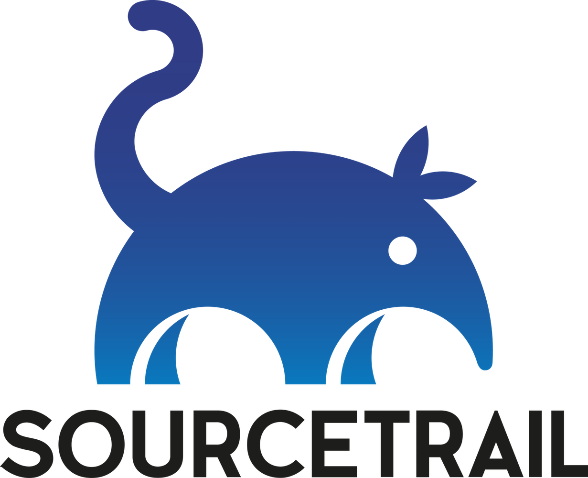

Documentation for version 2021.4

# Welcome

This document is the official documentation of Sourcetrail and explains everything you need to know about working with the software.

## Overview

Sourcetrail is an interactive source explorer that simplifies navigation in existing source code by indexing your code and gathering data about its structure. Sourcetrail then provides a simple interface consisting of three interactive views, each playing a key role in helping you obtain the information you need:

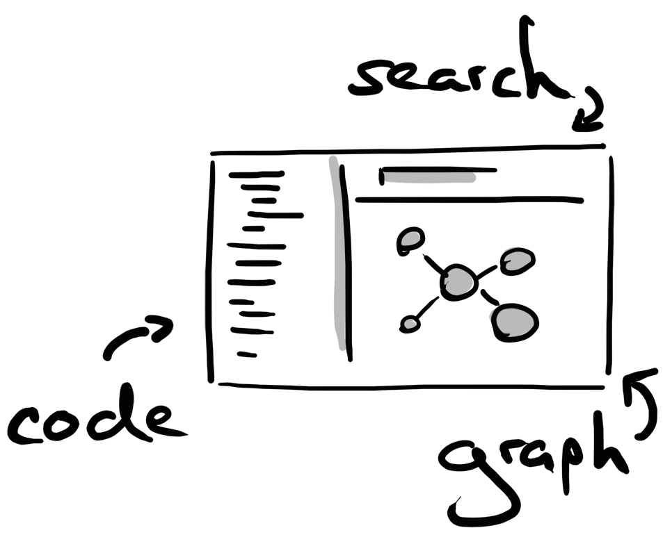

* **Search:** Use the search field to quickly find and select indexed symbols in your source code. The autocompletion box will instantly provide an overview of all matching results throughout your codebase.
* **Graph:** The graph displays the structure of your source code. It focuses on the currently selected symbol and directly shows all incoming and outgoing dependencies to other symbols.
* **Code:** The Code view displays all source locations of the currently selected symbol in a list of code snippets. Clicking on a different source location allows you to change the selection and dig deeper.

Note: Sourcetrail currently supports the languages C/C++, Java and Python. Much of the UI design is therefore based on these languages and might change as soon as other languages are supported. For more information have a look at [supported languages](#supported-languages).

## Supported Languages

### C

C support is powered by [Clang 11.0.0](https://clang.llvm.org/). For issues loading C code, please have a look at [Clang language compatibility](https://clang.llvm.org/compatibility.html) or report a bug in our [bug tracker](https://github.com/CoatiSoftware/SourcetrailBugTracker).

### C++

C++ support is powered by [Clang 11.0.0](https://clang.llvm.org/). For more Information please visit [Clang C++ Status](https://clang.llvm.org/cxx_status.html). For issues loading C++ code, please have a look at [Clang language compatibility](https://clang.llvm.org/compatibility.html) or report a bug in our [bug tracker](https://github.com/CoatiSoftware/SourcetrailBugTracker).

### Java

Sourcetrail includes support for Java 12 and lower which is powered by [Eclipse JDT](https://github.com/eclipse/eclipse.jdt.core). If you encounter any issues while using Sourcetrail on a Java project, please let us know by providing a minimal example in our [bug tracker](https://github.com/CoatiSoftware/SourcetrailBugTracker).

### Python

Sourcetrail includes support for Python 2 and Python 3 which is powered by our open-source [SourcetrailPythonIndexer](https://github.com/CoatiSoftware/SourcetrailPythonIndexer). If you encounter any issues while using Sourcetrail on a Python project, please let us know by providing a minimal example in our [bug tracker](https://github.com/CoatiSoftware/SourcetrailPythonIndexer/issues).


# Getting Started

This short introduction will briefly guide you through the project setup and the user interface of Sourcetrail. The bullet point lists will provide you with the next steps to take:

## Starting Up Sourcetrail

Once you've [downloaded](https://github.com/CoatiSoftware/Sourcetrail/releases) Sourcetrail successfully you are ready to run the application. For assistance wth installation, visit the [installation](#installation) section.

> **Tasks:**
> * Launch Sourcetrail.

After launching Sourcetrail you will see the [Start Window](#start-window). From here you can create your own project or choose a pre-indexed one.

> **Tasks:**
> * Click **New Project** to create a new project.
> * or select one from the **Recent Projects** _(ex: TicTacToe)_ and continue with the [UI Intro](#ui-intro)

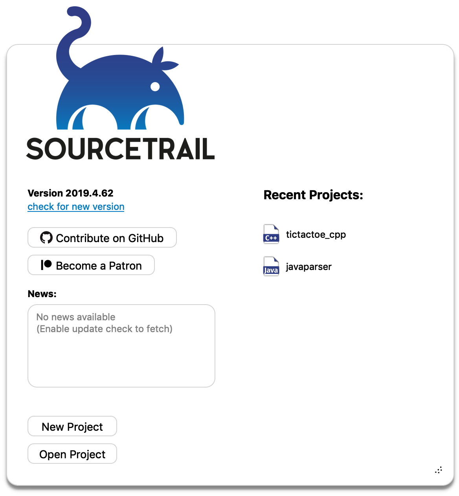

## Creating a New Project

When creating a new Sourcetrail project you will use the [Project Setup Wizard](#project-setup-wizard). This wizard splits the setup process into several subsequent steps. Depending on your project's structure and the used build system, there are different types for project setup. Choosing the correct setup method is important and can make the setup process a lot easier.

> **Tasks:**
> * Give your project a **Name** and select a **Location** for your Sourcetrail project to live.
> * Click **Add Source Group** to add source files to the project.

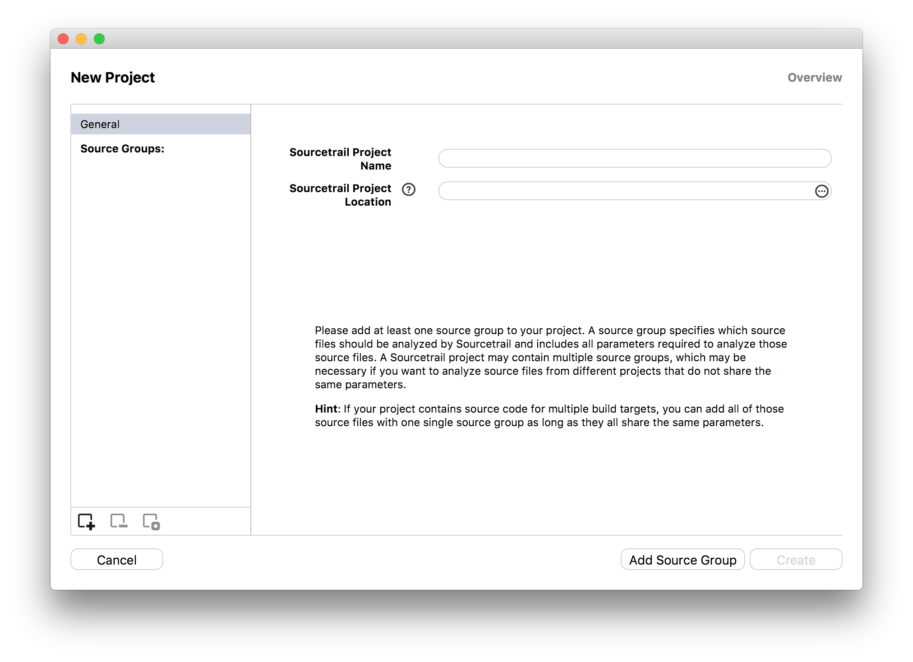

### Add Source Group

Sourcetrail projects consist of multiple *Source Groups*. Each Source Group uses a certain language, a set of files, and all configurations to index these files. There are different types of Source Groups for each supported programming language. In addition, creating a single Source Group is sufficient for most projects.

Scroll past the image for detailed instructions on setting this up.

> **Tasks:**
> * Select your chosen **Source Group** setup type and come back here as soon as the project is created.

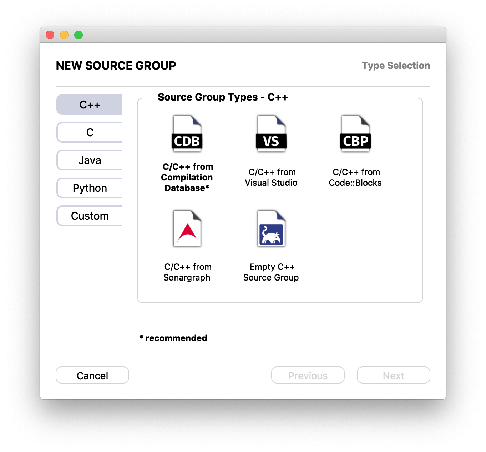

#### Source Group Setup for C/C++

The Source Group setup types for C & C++ are the same.

**Are you using CMake, Make or Qt Creator?**

If you are using [CMake](https://cmake.org/) or [Make](https://www.gnu.org/software/make/) as build environment you can export a [clang JSON Compilation Database](https://clang.llvm.org/docs/JSONCompilationDatabase.html) as `compile_commands.json` file. A Compilation Database holds all information necessary for building the project, such as source files, include paths and compiler flags. Having a Compilation Database makes project setup within Sourcetrail a lot easier. We recommend using this approach if possible.

Exporting a Compilation Database:
* From **CMake** by defining the `CMAKE_EXPORT_COMPILE_COMMANDS` flag. (not supported on for Visual Studio CMake generators)
* For **Make** projects use [Bear](https://github.com/rizsotto/Bear). Bear generates a `compile_commands.json` file during a simulated build process. Bear has been tested on FreeBSD, GNU/Linux and OS X.
* From **Qt Creator since version 4.8** by selecting the "Generate Compilation Database" from the "Build" menu.

If you managed to export a `compile_commands.json` file, then please continue at [Create a Source Group from Compilation Database](#create-a-project-from-compilation-database) and come back after you finished creating the project.

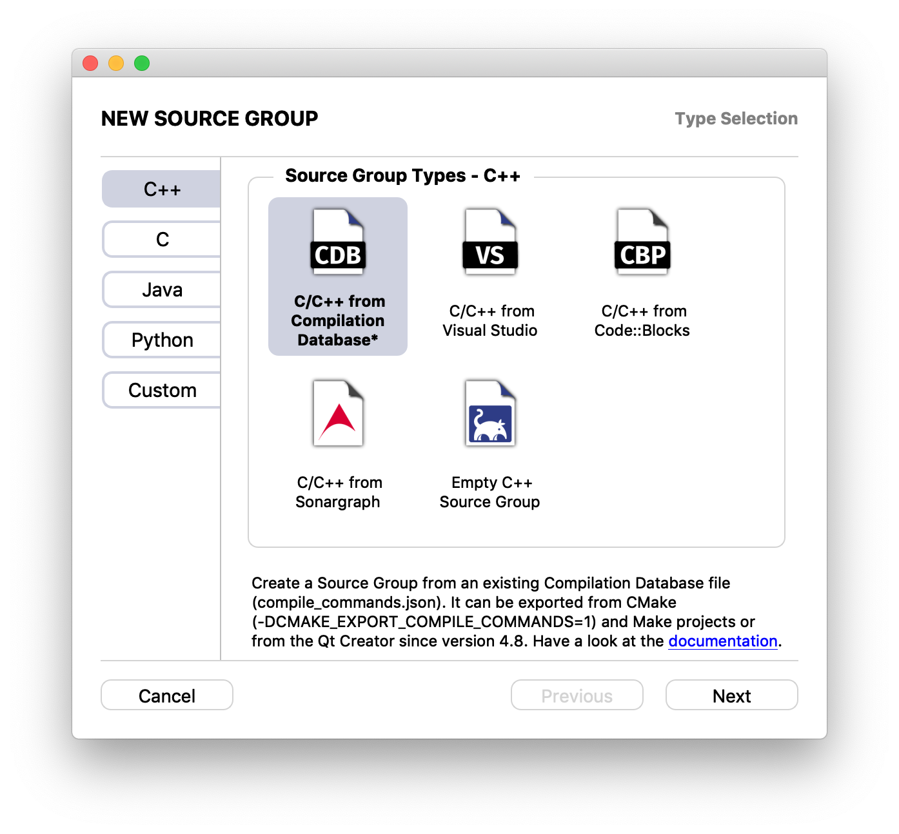

**Are you using Visual Studio?**

If you are using Visual Studio you can continue at [Source Group creation from Visual Studio](#create-a-project-from-visual-studio) and export a Compilation Database with our [Visual Studio Plugin](#visual-studio).

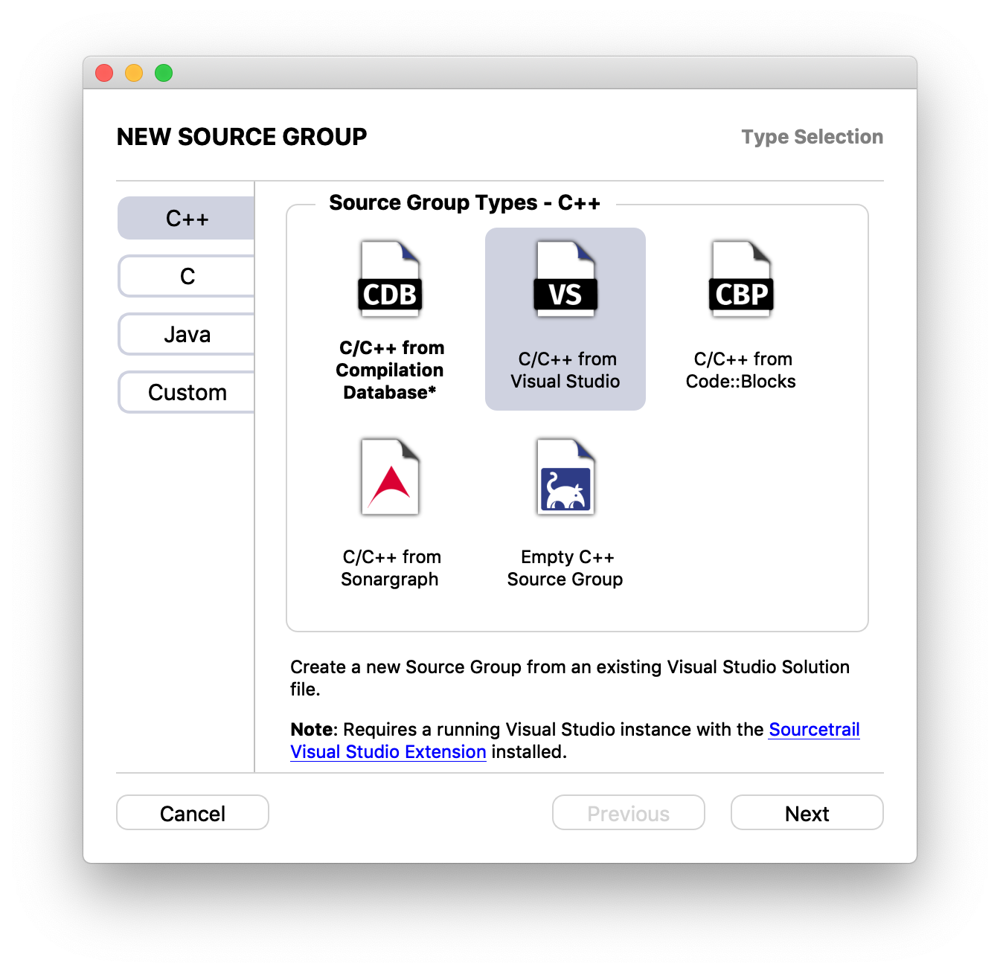

**Create Empty**

If neither of the above options apply to your project, please continue at [create an empty C/C++ Source Group](#create-an-empty-cxx-project) and return here once the project is created.


#### Source Group Setup for Java

**Are you using Gradle?**

If you are using Gradle you can continue at [Source Group creation from Gradle](#create-a-project-from-gradle-configuration) to automatically setup your Source Group using your Gradle build configuration.


**Are you using Maven?**

If you are using Maven please continue at [Source Group creation from Maven](#create-a-project-from-maven-configuration) to automatically setup your Source Group using your Maven build configuration.


**Create Empty**

If you do not have your project configured using Gradle or Maven, please continue at [Create an Empty Java Source Group](#create-an-empty-java-project) and come back here as soon as the project is created.


#### Source Group Setup for Python

**Create empty**

If you want to browse your Python source code with Sourcetrail, please continue at [Create an Empty Python Source Group](#create-an-empty-python-project) and come back here as soon as the project is created.


## Source Indexing

After the project is created, Sourcetrail will ask you whether you want to start indexing. Click **Start** and wait for the indexing to complete. This may take a bit of time. The [Indexing Dialog](#indexing-dialogs) and the [Status Bar](#status-bar) will give you information about the progress. Otherwise the UI will be empty. Sourcetrail indexes all named symbols and their relationships throughout the provided source files.

> **Tasks:**
> * Click **Start** when asked whether to start indexing.
> * Wait until the indexing of your source files has finished.
> * or Click **Stop** or press ESC to stop indexing (Sourcetrail will provide all information gathered so far and the indexing can be continued later by [refreshing](#refresh)).


After indexing is completed, Sourcetrail will show an overview of all indexed symbols in the [graph view](#graph-view) and some statistics in the [code view](#code-view).

#### Troubleshooting Errors

If the indexing yields errors, the status view will be shown with a list of errors. You can click on the errors label on the right side of the status bar or on one of the errors in the table to see their location.

> **Tasks:**
> * Fix your errors and [refresh](#refresh) to re-index the files with errors (Open Issue: As long as there was no change in the specific file, Sourcetrail won't reindex it, use the **Force Refresh** option from the [Edit Menu](#edit)).
> * or ignore them and continue with an incomplete index.

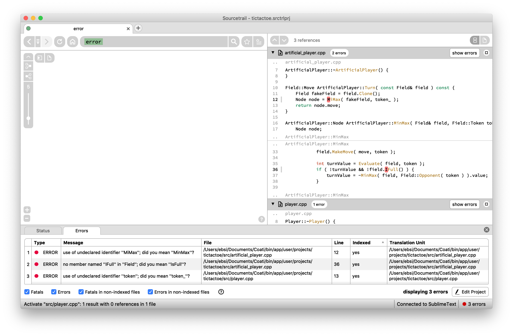

## User Interface

As mentioned earlier, Sourcetrail's user interface is split into three main views. Their arrangement can be adjusted as preferred and can also be detached from the main window and split into different screens (see [Window Widgets](#widget-windows)).

All three views display information about the currently selected symbol:

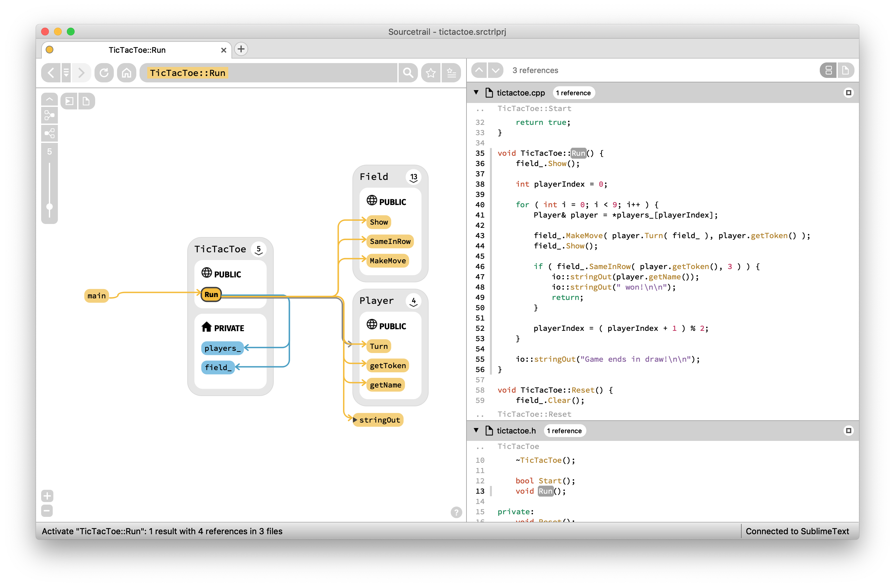

### 1. Search Field

The [Search Field](#search-bar) allows for easy access to all indexed symbols. Use it to find all classes and functions you wish to investigate. In addition, it also holds the UI buttons for navigating [back & forward](#back-&-forward) as well as [refreshing](#refresh).

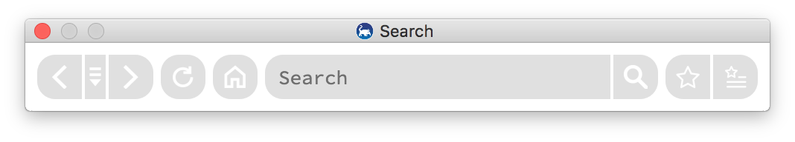

When entering a search query, the [autocompletion popup](#autocompletion-popup) will provide you with a concise list of all matching symbols. Note that Sourcetrail uses a fuzzy matching algorithm, that allows you to skip characters while entering a query.

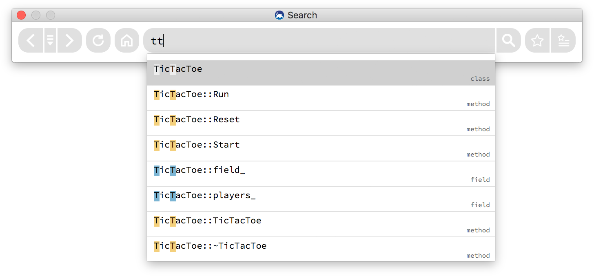

### 2. Graph Visualization

The [graph visualization](#graph-view) displays the currently selected symbol in an active state and all the other symbols it shares a relationship with. The visualization is made up of nodes and edges.

* **Nodes:** All named symbols in your source code will be displayed as different [nodes](#nodes), such as `functions`, `classes` or `files`. Nodes with members (like `classes`) can be expanded to show all their contents, the number at the expansion arrow shows how many members are hidden. Clicking a node will activate it and update all the views to the new selection. Dragging a node can be used to change its position.
* **Edges:** The relationships between the symbols are displayed as different [edges](#edges), such as `type use`, `function call` or `file include`. Sometimes edges get bundled together and are displayed as `bundled edges` that show a number of how many edges are contained. Clicking an edge will highlight its source location in the code view.


#### Colors:
The different node and edge types are also displayed using different colors. The default color scheme uses this convention:

| Color | Node | Edge
| --- | --- | ---
| gray | types and classes | type use
| yellow | functions and methods | calls
| blue | variables and fields | variable access

#### Hatching:
Nodes displayed with a striped hatching, are nodes that were used within your indexed source files, but were not defined. Clicking them shows all locations where they are used, without providing their declaration.

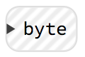

#### Legend:

For a full list on all existing nodes and edges take a look at the integrated [Graph Legend](#graph-legend) by clicking the `?`-button in the bottom right corner of the [Graph View](#graph-view).

### 3. Code View

The [code view](#code-view) displays all locations of the currently active symbol within the indexed source files. It does not allow for editing the source code. Syntax highlighting is used to increase readability. Source locations that are surrounded by a box when hovered can be clicked to activate the respective symbol. Active source locations are highlighted.

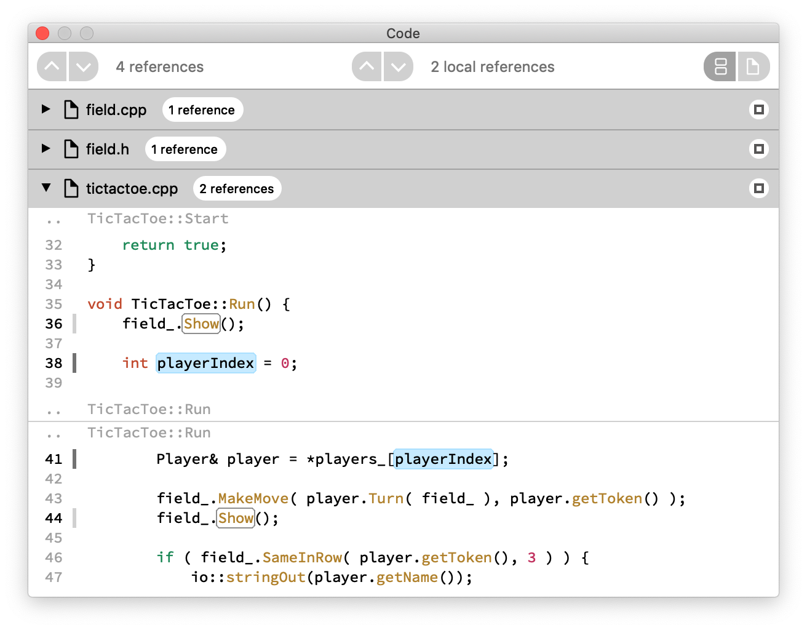

The source locations are displayed as code snippets, containing the line of interest and extra lines added to the top and bottom to give information about its context. Code snippets are then bundled together into files.

**Note:** A file can be selected as active symbol by clicking its name in the title bar. By clicking the title bar or the icon on the right hand side of the title bar, the file can switch between 3 different states:

* **Minimized:** The file does not show any content


* **Snippets:** The file displays the snippets containing active locations separated by lines.

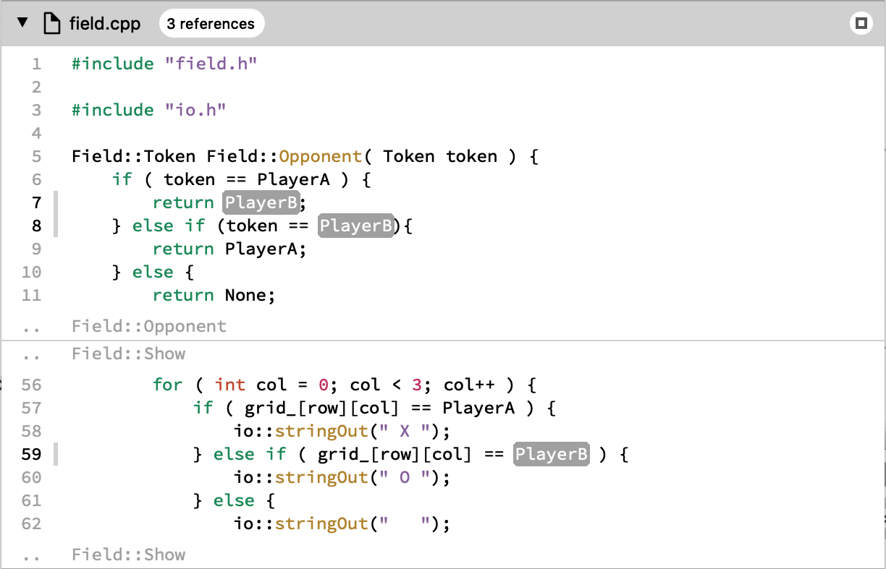

* **Maximized:** The [code view](#code-view) switches to [single file mode](#single-file-mode) and the whole content of the file is visible.

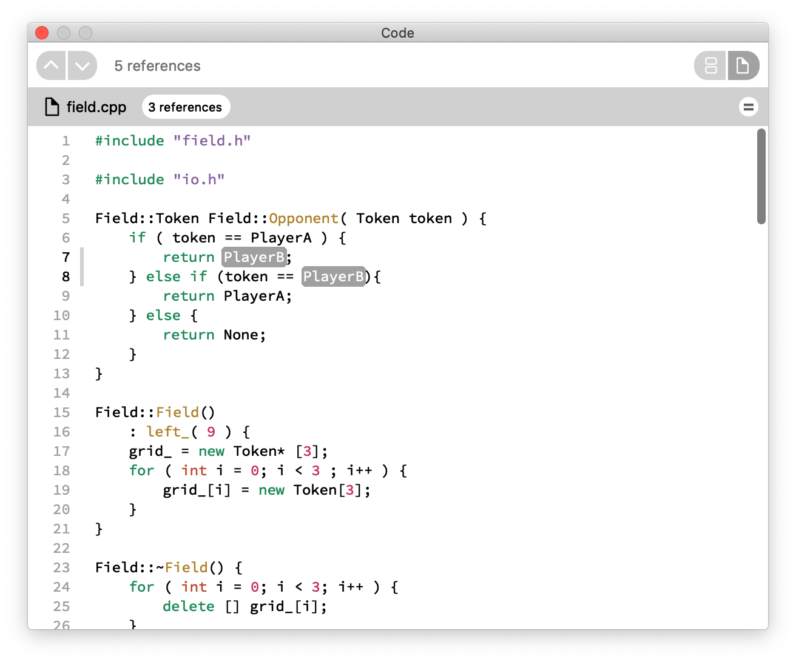

For more information, please visit the [Code View Files](#files) section.

## Start Exploring!

At this point, you should have an understanding of the basics of Sourcetrail's user interface and can begin exploring your codebase. Sourcetrail will allow you to see your source code from a whole new perspective, by giving you a concise overview of its parts and a faster way of drilling down to its internals, while always maintaining the connection to the implementation details of the actual source code.

Please take look at the much more extensive instruction manual below for detailed information.

The Sourcetrail team wishes you a good start with our product, lots of saved time, increased productivity and much cleaner code.

> **Tasks:**
> * Start exploring and have fun!


# Installation

## Windows

Download and open the zip file and extract its contents into a temporary folder of your choice. Run the `setup.exe` and go through the wizard. You can now launch Sourcetrail from your start menu.

## macOS
Download and open the Sourcetrail.dmg file and drag Sourcetrail.app into the applications folder. You can now launch Sourcetrail from your Applications.

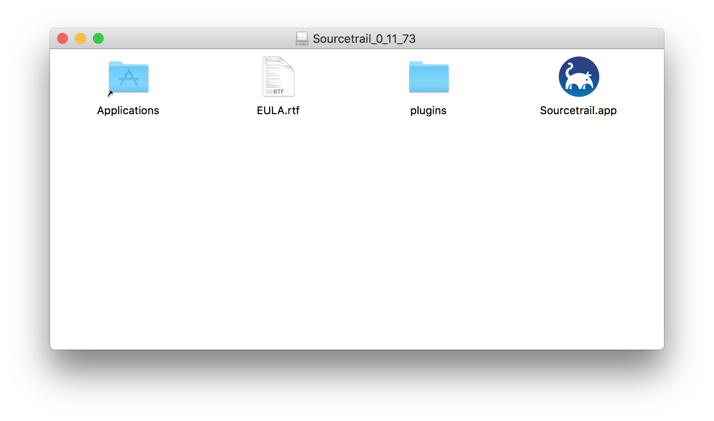

## Linux

### Tarball

Download the `.tar.gz` file and extract it. To start Sourcetrail run the `Sourcetrail.sh` script. Sourcetrail creates a folder `~/.config/sourcetrail` at the first run, this is the folder for Sourcetrail settings.

#### Install
To install Sourcetrail run the `install.sh` script with `sudo`. It will install Sourcetrail to `/opt/sourcetrail` and create the `/usr/bin/sourcetrail` symlink.

#### Uninstall
To uninstall Sourcetrail run the `/opt/sourcetrail/uninstall.sh` script with `sudo`.

### AppImage

Download the `.AppImage` file. Give it permission to execute with `chmod a+x` or via the context menu. To start Sourcetrail double click it or execute it from the Terminal. Sourcetrail creates a folder `~/.config/sourcetrail` at the first run, this is the folder for Sourcetrail settings.

For more information on AppImages please visit [appimage.org](https://appimage.org/).

## Data folder

The data folder holds certain files that are used by Sourcetrail to run the program. After following the [installation instructions](#installation) the data folder should be located in the following locations on your platform.

| Platform | Location
| --- | ---
| Windows | `C:/Users/You/AppData/Local/Coati Software/Sourcetrail` _(used for dynamic data and settings)_ `install_directory/Coati Software/Sourcetrail/data` _(used for static app data)_
| macOS | `~/Library/Application Support/Sourcetrail`
| Linux | `~/.config/sourcetrail`

## Finding System Header Locations

### Windows

These files usually ship with your compiler. For the Visual Studio IDE the system headers can be found at:
`<path_to_visual_studio>/VC/include/`
If you don't use the Visual Studio IDE you can also try to find your system headers in a subdirectory of:
`C:/Program Files (x86)/Windows Kits/`

### macOS

Run this command in your terminal:
`gcc -x c++ -v -E /dev/null`
You will find the header search paths your compiler uses in the output between these two lines:

```
#include <...> search starts here:
.
.
.
End of search list.
```

### Linux

`gcc -x c++ -v -E /dev/null`
or
`clang -x c++ -v -E /dev/null`
You will find the header search paths your compiler uses in the output between these two lines:

```
#include <...> search starts here:
.
.
.
End of search list.
```


## Finding Java Runtime Library Location

The current version of Sourcetrail requires an installation of the Java 8 runtime environment to index any Java project. Make sure that Sourcetrail and your JRE share the same kind or architecture (a 32 bit Sourcetrail requires a 32 bit JRE). To locate the required library file, please refer to the applicable description below.

### Windows

The Java Runtime Library (called `jvm.dll`) can be found inside of your JRE install folder and looks like this:
`<path_to_jre>/bin/client/jvm.dll`

### macOS

The Java Runtime Library (called `libjli.dylib`) can be found inside of your JDK install folder. Run the following command in your terminal to find the location of your default Java installation:
`/usr/libexec/java_home`

This should give you a path looking like this:
`/Library/Java/JavaVirtualMachines/<jdk_version>/Contents/Home`

The `"libjli.dylib"` should be available at:
`/Library/Java/JavaVirtualMachines/<jdk_version>/Contents/MacOS/libjli.dylib`

Insert the full path to `libjli.dylib` into the **Java Path** setting in the [Preferences Window](#preferences-window).

### Linux

The Java Runtime Library (called `libjvm.so`) can be found inside of your JRE install folder and looks like this:
`<path_to_jre>/lib/<arch>/server/libjvm.so`

# Interface

## Main Window

### Subwindows

Sourcetrail's three views are organized into subwindows, which can be freely arranged within the Main Window or detached from it. Each subwindow has a title bar displaying its name and 2 buttons for closing the subwindow and for detaching it from the Main Window.

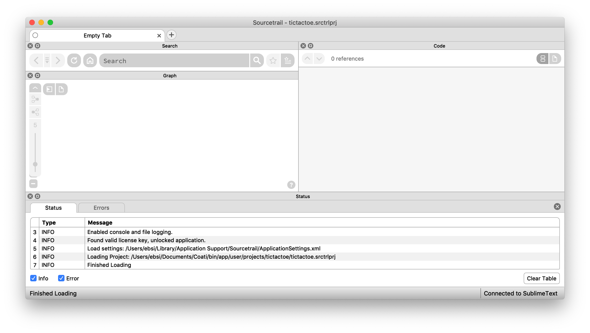

**Interactions:**

* Drag the subwindow at the title bar to rearrange it within the Main Window, detach it or attach it again.
* Press the "x" icon to close the subwindow. They can be reopened from the [View Menu](#view).
* Press the "□" icon to detach the subwindow from the Main Window.

### Tab Bar

The Tab Bar is located at the top of the [Main Window](#main-window) and is used to open multiple symbols in parallel.


**Interactions:**

* Click on the `+` icon to open a new tab or use the [New Tab Shortcut](#shortcuts).
* Click on a tab to activate it and show it's content or use the [Next/Previous Tab Shortcuts](#shortcuts).
* Click on the `x` icon on the right of each tab to close it or use the [Close Tab Shortcut](#shortcuts).
* Click and drag a tab to change it's position.

### Status Bar

The Status Bar is located on the bottom of the [Main Window](#main-window) and is used to convey information about Sourcetrail's status and currently running processes to the user

It displays:

* The most recent status message.
* The current status of the [Code Editor Plugin](#code-editor-plugins) connection
* Error Count if the currently loaded project has errors.
* Indexing progress bar while indexing.


**Interactions:**

* Click on the status message count to display the (Status Tab](#status-tab).
* Click on the error count to display the error locations in the [Code View](#code-view).
* Click on the indexing progress bar to display the [Indexing Dialogs](#indexing-dialogs) if they were hidden.

### On-Screen Search Bar

The On-Screen Search Bar is used to search visible contents of the [Graph View](#graph-view) and [Code View](#code-view). It gets displayed at the bottom of the [Main Window](#main-window) when using the [Find On-Screen](#shortcuts) action.


**Interactions:**

* Enter a search query to search in contents of the [Graph View](#graph-view) and [Code View](#code-view).
* Click the arrow buttons next to the search field to iterate the matched locations.
* Use the checkboxes right of the search field to define which view contents will be matched.
* Click the `x` icon on the right to close the On-Screen Search Bar or press `ESC`.

## Windows

### Start Window

On every start of Sourcetrail you are shown the start window. It allows for creating new projects or opening existing ones.


**Interactions:**

* Clicking `New Project` will lead you to [Project Setup](#project-setup-wizard).
* Clicking `Open Project` will let you open an existing Sourcetrail project by choosing from a file dialog.
* Clicking on one of the `Recent Projects` will open this project. The list shows a maximum of 7 items ordered by recent first.
* Pressing `ESC` will close the window.
* Click `Check for new version` to connect to [https://sourcetrail.com](https://sourcetrail.com) and check if a new version is available.


### Path List Box

The Path List Box is a user interface element that is used within the [Preferences Window](#preferences-window) and the [Project Setup Wizard](#project-setup-wizard). It allows for entering a list of file and directory paths.
If you want to use environment variables you can use either of the following notations.
`${VARIABLE_NAME}` or `%VARIABLE_NAME%`


**Interactions:**

* Click the "+" icon to add a new path line.
* Click the "-" icon to remove a selected path line.
* Click a path line to select it.
* Enter the path by typing on your keyboard
* Click "..." within the path line to open a file dialog for choosing a file or directory path.
* Directly add multiple paths into the box by dropping elements from your filesystem.
* Click the pen icon in the bottom right corner to edit the list as plain text.

#### Plain Text Editing

By pressing the pen icon in the bottom right corner you can open the plain text edition dialog. It allows you to edit the whole list within a text field. Each line will be one list item.

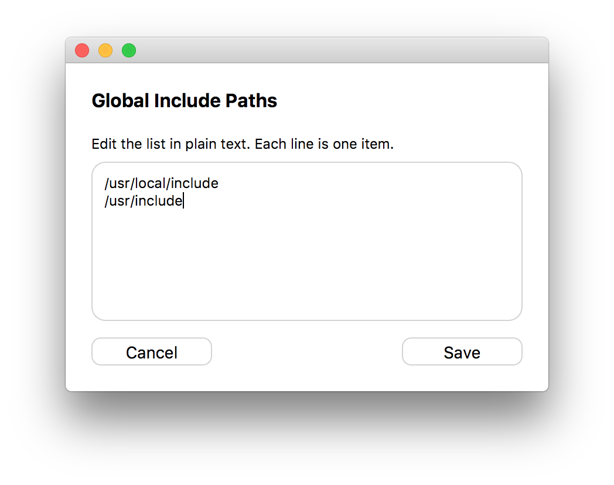

**Interactions:**

* Add and remove list items through keyboard interaction.
* Click `Cancel` to cancel plain text editing.
* Click `Save` to save your changes to the list.

### Preferences Window

The Preferences window lets you define settings for all projects. You can open the Preferences from the menu via [Edit/Preferences](#edit).


| Setting | Description
| --- | ---
| Font Face | Define the font face used throughout the UI
| Font Size | Set the font size used throughout the UI. It can also be changed with the actions in the [View Menu](#view)
| Tab Width | Define the space width of tabs in the code view.
| Text Encoding | Define the Text Encoding used for displaying your source code.
| Color scheme | Choose which color scheme Sourcetrail should display. The color schemes are located in [data](#datafolder)/color_schemes/
| Animations | Define if animations are used within the user interface.
| Built-In Types | Define whether built-in types such as int or bool are shown when referenced in the graph view.
| Directory in File Title | Enable display of the parent directory of a code file relative to the project file.
| Auto Scaling to DPI | **(Linux only)** Define if automatic scaling to screen DPI resolution is active. This setting manipulates the environment flag `QT_AUTO_SCREEN_SCALE_FACTOR` of the Qt framework. Choose 'system' to stick to the setting of your current environment.
| Scale Factor | **(Linux only)** Define a screen scale factor for the user interface of the application. This setting manipulates the environment flag `QT_SCALE_FACTOR` of the Qt framework. Choose 'system' to stick to the setting of your current environment.
| Scroll Speed | Define a multiplyer for the default scroll speed. Values smaller than 1 slow down scrolling while values greater than 1 increase the scroll speed.
| Graph Zoom | Switch the default mouse wheel behavior in the graph between scrolling and zooming.
| Logging | Ticking this box enables logging to console and to a log file. This option is disabled by default to speed up Sourcetrail. If you encounter problems while running Sourcetrail, we recommend to enable this option so you have somewhere to start looking for a cause.
| Indexer Logging | When enabled Sourcetrail will log detailed information during indexing. This log data can help us fix issues.
| Automatic Update Check | Check to automatically check whether a new version of Sourcetrail is available once every day.
| Sourcetrail Port | Port number that Sourcetrail uses to listen for incoming messages from plugins.
| Plugin Port | Port number that Sourcetrail sends outgoing messages to.
| Indexer threads | Define how many parallel threads are used during indexing. Setting this value to `default` will cause Sourcetrail to detect the ideal number of threads based on the CPU and use as many threads for indexing.
| Multi process C/C++ indexing | Enable C/C++ indexer threads to run in a different process. This prevents the application from crashing due to unforeseen exceptions while indexing.
| Java Path | If you want to use Sourcetrail on Java source code, please specify a path to your Java 8 runtime library. Please keep in mind that a 32 bit Sourcetrail requires a 32 bit version of Java while a 64 bit Sourcetrail requires a 64 bit Java to be working correctly. You can either use the button below for automatic detection or add the path manually. For instructions on how to find your Java runtime path see (Finding Java Runtime Library Location](#finding-java-runtime-library-location).
| JRE System Library | Add the jar files of your JRE System Library. These jars can be found inside your JRE install directory. You can either use the button below for automatic detection or add the paths manually.
| Maven Path | Only required for indexing projects using Maven. Provide the location of your installed Maven executable. You can also use the auto detection.
| Post Processing | Enable a post processing step to solve unsolved references after the indexing is done. These references will be marked "ambiguous" to indicate that some of these edges may never be encountered during runtime of the indexed code because the post processing only relies on symbol names and types.
| Global Include Paths | Set header search paths that are used for **all** of your projects (e.g. std headers). An option for automatic detection of these paths is available for Clang, GCC and the Visual Studio compiler. For instructions on how to add paths manually see [Path List Box](#path-list-box). For instructions on how to find the system header paths see [Finding System Header Locations](#finding-system-header-locations).
| Global Framework Search Paths | **(macOS only)** Define the search paths for `.framework` files for all of your projects. An option for automatic detection of these paths is available for Clang and GCC. <br />For instructions on how to add paths see [Path List Box](#path-list-box).

### Project Setup Wizard
The Project Setup Wizard lets you create a new Sourcetrail project. It allows for defining name and location of your project Sourcetrail and adding several **Source Groups**, that define which source files will be indexed. There are several ways to create Source Groups. It is sufficient to add only one Source Group for most projects.

For detailed information continue at [PROJECT SETUP](#project-setup).


### Indexing Dialogs

These dialogs will be used while Sourcetrail indexes your project. The whole user interface will be frozen as long as these dialogs are visible.

#### Start Indexing Dialog

This dialog displays the number of files for indexing and clearing before indexing starts. There are different refresh modes:


* **Updated files:** Reindexes all files that were modified since the last indexing, all files depending on those and new files.
* **Incomplete & updated files:** Reindexes all files that had errors during last indexing, all files depending on those and all updated files.
* **All files:** Deletes the previous index and reindexes all files.


**Shallow Python Indexing**

For Python projects a checkbox **Shallow Python Indexing** is additionally displayed. When checked, references within your code base (calls, usages, etc.) are resolved by name, which is imprecise but much faster than in-depth indexing. Use this option for a quick first indexing pass and start browsing the code base while running a second pass for in-depth indexing.


**Interactions:**

* Switch indexing mode by clicking a different option.
* Clicking `Cancel` will abort indexing.
* Clicking `Start` will start the file clearing and indexing.

#### Progress Dialog

This dialog shows that Sourcetrail is currently doing processing that can't be interrupted.

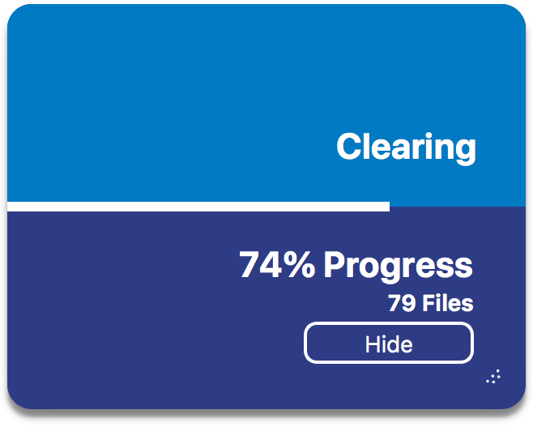

**Interactions:**

* Clicking `Hide` will hide the dialog. You can display it again by clicking on the indexing progress bar in the [status bar](#status-bar) or [refreshing](#refresh).

#### Indexing Dialogs

This dialog shows the indexing progress of your project, by displaying the number of already indexed files, the last file that was started indexing, the number of errors and a progress estimate in percent.


**Interactions:**

* Clicking `Stop` or pressing ESC will interrupt indexing. Sourcetrail will still wait for the already running indexer threads to finish. You can continue indexing later by [refreshing](#refresh).
* Clicking `Hide` will hide the dialog. You can display it again by clicking on the indexing progress bar in the [status bar](#status-bar) or [refreshing](#refresh).

#### Finished Indexing Dialog

This dialog is shown after indexing finished, giving you information about indexed files, duration and errors.


#### Interrupted Indexing Dialog

This dialog is shown after indexing was stopped, giving you information about indexed files, duration and errors. You can choose to either use the new index or continue using the old one.


**Interactions:**

* Clicking `Discard` will discard the new index.
* Clicking `Keep` will switch your project to the new index and discard the old one.

## Menu

### Project

* **New Project**
    * Shortcut: [New Project](#shortcuts)
    * Opens the [New Project](#project-setup-wizard) Dialog to define a new project and loads it after creation.
* **Open Project**
    * Shortcut: [Open Project](#shortcuts)
    * Opens a file dialog to choose an existing Sourcetrail project file from your system's hard drive.
* **Recent Projects**
    * Opens a submenu to choose recent opened Sourcetrail projects.
* **Edit Project**
    * Opens the [Edit Project Dialog](#project-setup-wizard) prefilled with your project settings and allows for changing them.
* **Exit**
    * Quits Sourcetrail.

### Edit

* **Refresh**
    * Shortcut: [Refresh](#shorcuts)
    * Refresh will check all indexed source files for updates and reindex the ones that changed and their depending ones.
* **Full Refresh**
    * Shortcut: [Full Refresh](#shorcuts)
    * Full Refresh will reindex the whole project.
* **Find Symbol**
    * Shortcut: [Find Symbol](#shorcuts)
    * This option will put the focus into the search field, so you can start typing your search query. Alternatively you can click the search field.
* **Find Text**
    * Shortcut: [Find Text](#shorcuts)
    * This option will put the focus into the search field and start a new full text search query
* **Find On-Screen**
    * Shortcut: [Find On-Screen](#shorcuts)
    * Display the [On-Screen Search Bar](#on-screen-search-bar) to search visible contents of the [Graph View](#graph-view) and [Code View](#code-view)
* **Next Reference**
    * Shortcut: [Next Reference](#shorcuts)
    * Use this option to iterate to the next source location of the active symbol in the code view.
* **Previous Reference**
    * Shortcut: [Previous Reference](#shorcuts)
    * Use this option to iterate to the previous source location of the active symbol in the code view.
* **Next Local Reference**
    * Shortcut: [Next Local Reference](#shorcuts)
    * Use this option to iterate to the next source location of the active local symbol or edge in the code view.
* **Previous Local Reference**
    * Shortcut: [Previous Local Reference](#shorcuts)
    * Use this option to iterate to the previous source location of the active local symbol or edge in the code view.
* **To overview**
    * Shortcut: [To overview](#shorcuts)
    * This option will display the overview of the project.
* **Preferences**
    * Shortcut: [Preferences](#shorcuts)
    * Opens the [Preferences Window](#preferences-window).

### View

* **New Tab**
    * Opens a new tab.
* **Close Tab**
    * Closes the current tab.
* **Select Next Tab**
    * Switch to the tab to the right of the current tab.
* **Select Previous Tab**
    * Switch to the tab to the left of the current tab.
* **Show Start Window**
    * Shows the [Start Window](#start-window).
* **Show Title Bars**
    * Toggle the visibility of the bars above each [Window Widget](#widget-windows).
* **Reset window layout**
    * Resets all the dock widgets to their original layout.
* **Search Window**
    * Toggle the visibility of the Search Window. This can also be done by closing the Search Window on clicking the "x" icon in it's title bar. (See [Window Widgets](#widget-windows))
* **Graph Window**
    * Toggle the visibility of the Graph Window. This can also be done by closing the Graph Window on clicking the "x" icon in it's title bar. (See [Window Widgets](#widget-windows))
* **Code Window**
    * Toggle the visibility of the Code Window. This can also be done by closing the Code Window on clicking the "x" icon in it's title bar. (See [Window Widgets](#widget-windows))
* **Status Window**
    * Toggle the visibility of the Status Window. This can also be done by closing the Status Window on clicking the "x" icon in it's title bar. (See [Window Widgets](#widget-windows))
* **Larger Font**
    * Shortcut: [Larger Font](#shortcuts)
    * Increase the font size within the Main Window's user interface.
* **Smaller Font**
    * Shortcut: [Smaller Font](#shortcuts)
    * Decrease the font size within the Main Window's user interface.
* **Reset font size**
    * Shortcut: [Reset font size](#shortcuts)
    * Resets the font size to the original size.

### History

* **Back**
    * Shortcut: [Back](#shortcuts)
    * Undoes the last navigation action.
* **Forward**
    * Shortcut: [Forward](#shortcuts)
    * Redoes an undone navigation action.
* **Recently Active Symbols**
    * List the history of active symbols in chronologic order.

### Bookmarks

* **Bookmark Active Symbol**
    * Shortcut: Bookmark Active Symbol](#shortcuts)
    * Opens the [Bookmark Creator](#bookmark-creator) dialog create a new bookmark.
* **Bookmark Manager**
    * Shortcut: Bookmark Manager](#shortcuts)
    * Opens the [Bookmark Manager](#bookmark-manager) dialog for viewing all bookmarks.
* **Recent Bookmarks**
    * List of recently added bookmarks for quick activation.

### Help

* **About**
    * Shows copyright information about Sourcetrail.
* **Keyboard Shortcuts**
    * Shows table of keyboard shortcuts for Sourcetrail.
* **Documentation**
    * Opens this documentation of Sourcetrail in your web browser by URL.
* **Changelog**
    * Opens the [changelog](https://github.com/CoatiSoftware/SourcetrailBugTracker#changelog) of Sourcetrail in your web browser by URL.
* **Bug Tracker**
    * Opens Sourcetrail's bug tracker in your web browser by URL.
* **License**
    * Opens a window containing the Sourcetrail license and all 3rd party licenses.
* **Show Data Folder**
    * Opens the file explorer showing the [data folder](#datafolder).
* **Show Log Folder**
    * Opens the file explorer in the directory [data](#datafolder)/logs where all log files are saved to. You can enable file logging in the [Preferences Window](#preferences-window).


### Shortcuts

#### General

| Shortcut | Windows | macOS | Linux
| --- | --- | --- | ---
| Switch Focus Between Graph/Code Views | `Tab` | `Tab` | `Tab`
| Preferences | `Ctrl + ,` | `Cmd + ,` | `Ctrl + ,`
| New Project | `Ctrl + N` | `Cmd + N` | `Ctrl + N`
| Open Project | `Ctrl + O` | `Cmd + O` | `Ctrl + O`
| Close Window | `Alt + F4` | `Cmd + W` | `Ctrl + W`
| Hide Window |  | `Cmd + H` |
| Refresh | `F5` | `Cmd + R` | `F5`
| Full Refresh | `Shift + F5` | `Cmd + Shift + R` | `Shift + F5`
| Back | `Z` / `Alt + Left` / `Backspace` | `Z` / `Cmd + [` / `Backspace` | `Z` / `Alt + Left` / `Backspace`
| Forward | `Shift + Z` / `Alt + Right` | `Shift + Z` / `Cmd + ]` | `Shift + Z` / `Alt + Right`
| Find Symbol | `Ctrl + F` | `Cmd + F` | `Ctrl + F`
| Find Text | `Ctrl + Shift + F` | `Cmd + Shift + F` | `Ctrl + Shift + F`
| Find On-Screen | `Ctrl + D` | `Cmd + D` | `Ctrl + D`
| To overview | `Ctrl + Home` | `Cmd + Home` / `Cmd + Up` | `Ctrl + Home`
| New Tab | `Ctrl + T` | `Cmd + T` | `Ctrl + T`
| Close Tab | `Ctrl + W` | `Cmd + W` | `Ctrl + W`
| Select Next Tab | `Ctrl + Tab` | `Ctrl + Tab` | `Ctrl + Tab`
| Select Previous Tab | `Ctrl + Shift + Tab` | `Ctrl + Shift + Tab` | `Ctrl + Shift + Tab`
| Larger Font | `Ctrl + +` | `Cmd + +` | `Ctrl + +`
| Smaller Font | `Ctrl + -` | `Cmd + -` | `Ctrl + -`
| Reset Font Size | `Ctrl + 0` | `Cmd + 0` | `Ctrl + 0`
| Bookmark Active Symbol | `Ctrl + S` | `Cmd + S` | `Ctrl + S`
| Bookmark Manager | `Ctrl + B` | `Cmd + B` | `Ctrl + B`

#### Graph View

| Shortcut | Windows | macOS | Linux
| --- | --- | --- | ---
| Move Focus Within Nodes | `WASD` / `HJKL` / `Arrows` | `WASD` / `HJKL` / `Arrows` | `WASD` / `HJKL` / `Arrows`
| Move Focus Within Edges | `Shift + WASD` / `Shift + HJKL` / `Shift + Arrows` | `Shift + WASD` / `Shift + HJKL` / `Shift + Arrows` | `Shift + WASD` / `Shift + HJKL` / `Shift + Arrows`
| Activate Node/Edge | `Enter` / `E` | `Enter` / `E` | `Enter` / `E`
| Activate Node in New Tab | `Ctrl + Shift + Enter` / `Ctrl + Shift + E` | `Cmd + Shift + Enter` / `Cmd + Shift + E` | `Ctrl + Shift + Enter` / `Ctrl + Shift + E`
| Expand/Collapse Node | `Shift + Enter` / `Shift + E` | `Shift + Enter` / `Shift + E` | `Shift + Enter` / `Shift + E`
| Pan | `Ctrl + Arrows` | `Cmd + Arrows` | `Ctrl + Arrows`
| Zoom In | `Ctrl + Shift + Up` / `Ctrl + Mouse Wheel Up` | `Cmd + Shift + Up` / `Cmd + Mouse Wheel Up` | `Ctrl + Shift + Up` / `Ctrl + Mouse Wheel Up`
| Zoom Out | `Ctrl + Shift + Down` / `Ctrl + Mouse Wheel Down` | `Cmd + Shift + Down` / `Cmd + Mouse Wheel Down` | `Ctrl + Shift + Down` / `Ctrl + Mouse Wheel Down`
| Reset Zoom | `0` | `0` | `0`
| Open Custom Trail Dialog | `Ctrl + U` | `Cmd + U` | `Ctrl + U`

#### Code View

| Shortcut | Windows | macOS | Linux
| --- | --- | --- | ---
| Next Reference | `Ctrl + G` | `Cmd + G` | `Ctrl + G`
| Previous Reference | `Ctrl + Shift + G` | `Cmd + Shift + G` | `Ctrl + Shift + G`
| Next Local Reference | `Ctrl + T` | `Cmd + T` | `Ctrl + T`
| Previous Local Reference | `Ctrl + Shift + T` | `Cmd + Shift + T` | `Ctrl + Shift + T`
| Move Focus Within Code | `WASD` / `HJKL` / `Arrows` | `WASD` / `HJKL` / `Arrows` | `WASD` / `HJKL` / `Arrows`
| Move Focus to Closest Reference | `Shift + WASD` / `Shift + HJKL` / `Shift + Arrows` | `Shift + WASD` / `Shift + HJKL` / `Shift + Arrows` | `Shift + WASD` / `Shift + HJKL` / `Shift + Arrows`
| Activate Location | `Enter` / `E` | `Enter` / `E` | `Enter` / `E`
| Activate Location in New Tab | `Ctrl + Shift + Enter` / `Ctrl + Shift + E` | `Cmd + Shift + Enter` / `Cmd + Shift + E` | `Ctrl + Shift + Enter` / `Ctrl + Shift + E`
| Scroll | `Ctrl + Arrows` | `Cmd + Arrows` | `Ctrl + Arrows`

## Graph View
The graph view visualizes the currently selected symbol and all its relationships to other symbols as an interactive graph visualization. You can also display whole call graphs, inheritance chains or include trees by using the toolbar in the top left. Read more about that at [Custom Trail](#custom-trail).


#### Interactions:

**Buttons:**

* Use the trail navigation in the top left to create [Custom Trails](#custom-trail).
* Use the grouping buttons in the top left to enable [Node Grouping](#node-grouping) by namespace/package or file.
* Press the `+` and `-` buttons in the lower left corner to change the zoom level.
* Press the `?` button in the bottom right corner to show the [Graph Legend](#graph-legend).

**Panning:**

* Drag the background area with the mouse.
* Scroll left-right and up-down on the mouse pad.
* Use the keys `W` `A` `S` `D`.


**Zooming:**

* Hold `Ctrl/Cmd` and scroll with mouse wheel or mouse pad.
* Press `Shift + W` or `Shift + S`.
* Press `0` to reset zoom.


**Context Menu:**

* **Open in New Tab:** Opens a new Tab with the node under the mouse cursor as active symbol.
* **Back:** Go back in history.
* **Forward:** Go forward in history.
* **Show Definition:** Show the definition of the node under the mouse cursor in the [Code View](#code-view).
* **Show Definition in IDE:** Show the definition of the node under the mouse cursor using the connected [Code Editor Plugin](#code-editor-plugin).
* **Expand Node:** Expand node under mouse cursor.
* **Collapse Node:** Collapse node under mouse cursor.
* **Hide Node:** Hide node under mouse cursor.
* **Hide Edge:** Hide edge under mouse cursor.
* **Bookmark Node:** Create a bookmark for node under mouse cursor.
* **Save As Image:** Export current graph as image file. Possible formats are `PNG`, `JPEG`, `BMP` and `SVG`.
* **Save To Clipboard:** Save current graph as `PNG` image to clipboard.
* **Copy Name:** Copy name for node under mouse cursor to clipboard.
* **Copy Full Path:** Copy file path for file node under mouse cursor to clipboard.
* **Open Containing Folder:** Show the file in your file explorer for file node under mouse cursor.


### Nodes
Colors are corresponding to the default color scheme.

| Node Type | Image
| --- | ---
| **File**: Non-indexed files are files that are not part of any source group and therefore have not been indexed by Sourcetrail's indexer. Incomplete files produced errors during indexing or where part of an indexer run with errors. | 
| **Macro** | 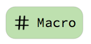
| **Namespace, Package & Module** | 
| **Class & Struct**: Display their members nested, and separated by access type: public, protected, private. By default only members with edges are shown. The arrow icon allows to expand and collapse them. The number tells how many nodes are hidden. | 
| **Type** | 
| **Typedef** | 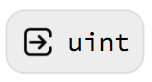
| **Variable & Field** | 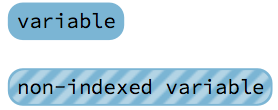
| **Function & Method** | 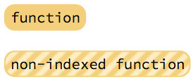
| **Enum & Enum Constant** | 
| **Bundle**: A bundle node combines multiple nodes to reduce the size of the graph visualization. The name describes what kind of nodes are bundled. The number tells how many nodes are bundled. | 
| **Group: A group node shows that all contained nodes share something in common e.g. same file or namespace. | 

**Interactions:**

* Click a node to activate it.
* Drag a node to change its position.
* Click the arrow icon in class nodes to expand and collapse it.
* Click a bundle node to expand it.
* Hover a node to see a tooltip that displays the node’s type.

### Edges
Colors are corresponding to the default color scheme.

| Edge Type | Image
| --- | ---
| **File Include** | 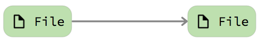
| **Type Use** | 
| **Variable Use** | 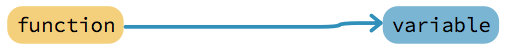
| **Function Call** | 
| **Inheritance** | 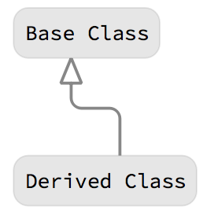
| **Method Override** | 
| **Template Specialization & Template Argument Use** | 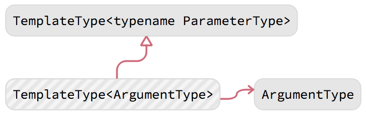
| **Template Member Specialization** | 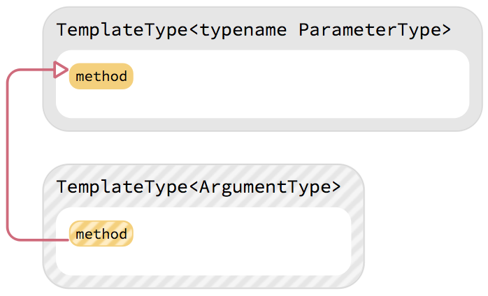
| **Bundled Edges**: Bundles multiple edges between the child nodes of the 2 nodes. The thickness gives an impression of how many edges are bundled. Hover the edge to get the number of bundled edges. | 

**Interactions:**

* Click an edge to see its location in the [Code View](#code-view).
* Click a bundled edges to activate all its corresponding edges.
* Hover an edge to see a tooltip that displays the edge’s type.

### Custom Trail
Using the toolbar in the top left you can display whole call graphs, inheritance chains or include trees for the currently active symbol if the right symbol type is currently active. Or you can use the Custom Trail Dialog to display graphs based on custom criteria.


**Interactions:**

* Click the arrow button to expand/collapse the `Custom Trail` controls.
* Click the `Custom Trail Dialog` button to show the `Custom Trail Dialog`.
* Click the `Predefined Custom Trail` buttons to show a graph of depending/dependent nodes based on the currently active symbol.
* Change the slider position to change the maximum depth of the graph. Moving it to the top will use infinite depth.
* Click on a node to activate it.
* Click on an edge to show it's source location in the [Code View](#code-view).


#### Custom Trail Dialog
The Custom Trail Dialog can be accessed within the trail controls in the top left of the graph view. It allows to display Custom Trails based on certain criteria.

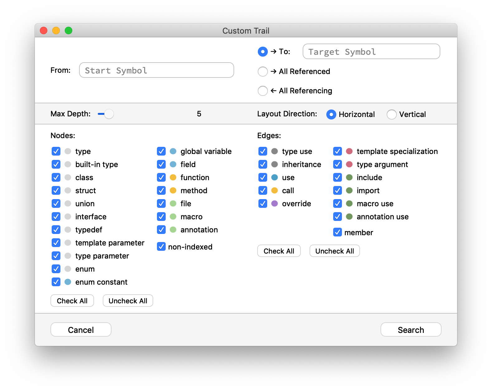

Every Custom Trail has a specific Start Symbol, then 1 of 3 different modes can be chosen:

| Mode | Description
| --- | ---
| **To Target Symbol** | Specify another target symbol. The graph will only contain paths from the origin to the target symbol.
| **All Referenced** | The graph will only contain nodes that are referenced by the origin symbol.
| **All Referencing** | The graph will only contain nodes that depend on the origin symbol.

Additional options allow defining which information should be shown:

| Setting | Description
| --- | ---
| **Maximum Depth** | Define the depth of the resulting graph. When searching paths from origin to target, all paths that are beyond this depth will not be found.
| **Layout Direction** | Define if the graph should be displayed vertically or horizontally.
| **Node Filters** | Define which node types will be part of the resulting graph. Only node types present in the loaded project are displayed. This setting is ignored for the origin and target nodes.
| **Edge Filters** | Define which edge types will be part of the resulting graph. Only node types present in the loaded project are displayed. The special edge "member" defines whether parent-child relations are considered as edge.

**Interactions:**

* Search for start and target symbols using a search field. The interactions are the same as in the main [Search Field](#search-bar).
* Drag the Max Depth slider to change the maximum depth of the resulting graph.
* Click the **Check All** and **Uncheck All** buttons to check all available node or edge filters.
* Click on Cancel to close the dialog.
* Click on Search to search for a Custom Trail using the selected options.

### Node Grouping

Using grouping buttons in the top left you can specify if nodes in the graph shall be grouped by either namespace/package or defining file.


#### Namespace/Package Grouping

All nodes that belong to the same namespace or package are grouped together in a separate group node.


#### File Grouping

All nodes defined in the same source or header file are grouped together in a separate group node.

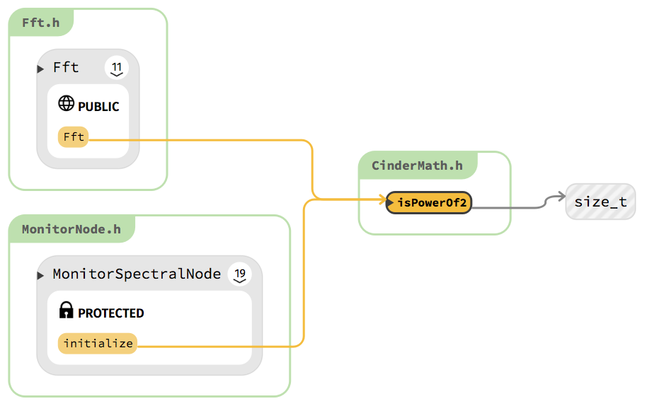

**Interactions:**

* Click on the group name to activate the corresponding namespace/package or file node.


### Graph Legend

Click the `?` button in the bottom right corner of the graph view or enter the keyword `legend` in the [search field](#search-bar) to show the graph legend. It gives you an overview on the different node and edge types and provides examples of graph layouts.


## Code View

The code view displays the corresponding source code of the currently selected symbols. The code view has two modes. In list mode it contains a list of one or more files. In single file mode it shows one full source file at a time.


**Interactions:**

* Iterate the references of the currently active symbol with the `reference` navigation in the upper left corner.
* Iterate local references of the currently selected local variable or multiple references of a symbol within a local scope with the `local reference` navigation in center.
* Switch between Snippet List and Single File mode with the `mode selection` in the upper right corner.
* Scroll up and down to see the different source files.

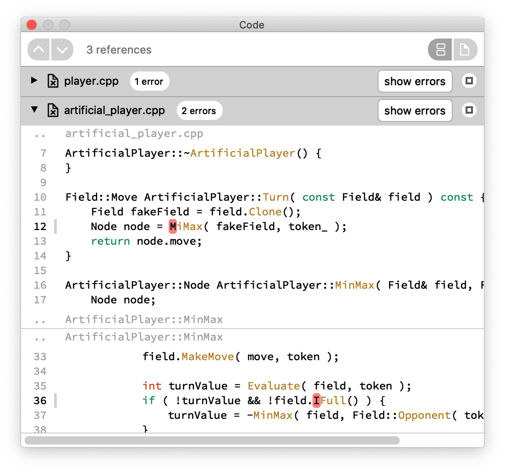

If a viewed file had errors during indexing, its file icon will contain an `x` and there is a `Show Errors`-button visible in the files title bar. Clicking one `Show Errors` will show you only the errors that cause this specific file to be incomplete in the [Errors Tab](#errors-tab).

### Snippet List Mode

In this mode the Code View will provide all references of the currently active symbol at once. The top most snippet will show the definition of the symbol if available.

#### Files

Each file has a title bar with the file's name. Clicking the title bar will change the display state. There are 2 different states:

* **Minimized:** The file does not show its content.


* **Snippets:** The file displays the snippets containing active locations separated by lines.


**Interactions:**

* Hover the title to see the full file path.
* Click the title to activate the file's corresponding node and switch to full file view.
* Click the title bar to minimize the file or show its snippets.
* Click the snippet button to switch to snippet or full file view, depending on the file node
* Click the maximize button to switch to [Single File Mode](#single-file-mode).

#### Snippets

A code snippet contains the lines of interest for the currently active symbol surrounded by some more lines to provide some context. Other symbols that were indexed by Sourcetrail are framed by a box when hovered. Here Sourcetrail distinguishes between local symbols and symbols that can be related to any other part of the code base. In case the snippet is part of a class, function or namespace, an additional line at the top of the snippet provides information about the snippet’s context (e.g. the surrounding scope).

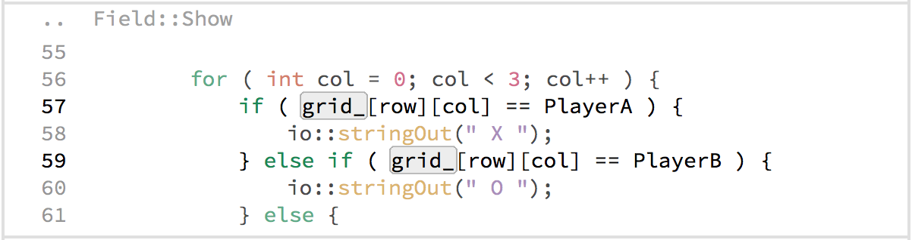

**Interactions:**

* Click the top line to show the whole scope around the snippet.
* Click a boxed symbol to activate it.
* Click a boxed local symbol to highlight all its usages in the visible code.

### Single File Mode

In single file mode you will only every have one file visible at a time. The first file shown is usually the file containing the definition of the active snippet if available. Other than that the user interface is the same as in [Snippet List Mode](#snippet-list-mode).


**Interactions:**

* Hover the title to see the full file path.
* Click the title to activate the file's corresponding node.
* Click the snippet button to switch to [Snippet List Mode](#snippet-list-mode).

## Search View

The Search View contains the search field and some other related user interface elements.


### Back, Forward and History

The left `Backward` button lets you undo your last navigation actions (see [Back](#back)) and the right `Forward` button lets you redo your undone navigation actions again (see [Forward](#forward)). Both buttons are only enabled when the respective actions are available at the moment.

The middle button shows a list of the recently active symbol stack. Select a symbol to activate it.


**Interactions:**

* Hover the buttons to see a tool tip.
* Press the buttons to execute the respective action.
* Press the history button to show the active symbol stack and click on an item to activate it.

### Refresh

The refresh button allows you to refresh the current project and reindex all updated, added and removed files. To reindex the whole project choose the **Force Refresh** option from the [Edit Menu](#edit).


**Interactions:**

* Hover the buttons to see a tooltip.
* Press the refresh button to refresh the project.

### Overview Button

Show the overview screen, which gives a summary of the loaded project. The overview screen is shown after the project was loaded. Alternatively use the shortcut [To overview](#shortcuts).


**Interactions:**

* Press the overview button to show the project overview.

### Search Bar

The search bar allows you to enter search requests to find one of Sourcetrail's indexed symbols. It doesn't allow for full text searching across all files so far. The search field allows for most text editing interactions common to text fields. When typing your request the [Autocompletion Popup](#autocompletion-popup) will show you search results matching to your entered string.


**Interactions:**

* Focus the search field by clicking it or using the [Find Symbol](#find-symbol) action.
* Enter your search request by typing on your keyboard.
* By pressing enter or clicking on the search icon on the right you send your request.
* The search field allows for most interactions known from other text fields such as moving the cursor, copy&paste and text selection.


### Autocompletion Popup

The Autocompletion Popup displays all [Nodes](#nodes) matching your search request within all indexed symbols. The match results are determined by a fuzzy matching algorithm, that allows you to skip characters. The popup shows which characters in the words are matching and displays their corresponding node color. The node type is displayed on the right.


**Interactions:**

* Use the up and down arrow keys to switch between search results.
* Pressing tab or clicking on the search result will insert it into the search field.
* Pressing enter will select the search result and send the search request.

### Keywords

Additionally the search view provides specific keywords that select a certain group of symbols.

| keyword | effect
| --- | ---
| **overview** | Shows an overview of all indexed symbols in the [graph view](#graph-view) and some statistics in the [code view](#code-view).
| **error** | Shows all errors in the [code view]().

### Full text search

Search for a certain string in all indexed files by putting `?` at the front of your search query. The default full text search is case-insensitive, use `??` to search case-sensitive.


**Interactions:**

* Start a query with `?` or use the [Find Text](#find-text) action to do a case-insensitive full text search.
* Start a query with `??` to do a case-sensitive full text search.

### Bookmarking Buttons

The `Bookmark Active Symbol` button on the left opens the [Bookmark Creator](#bookmark-creator) to create a new bookmark. The `Bookmark Manager` button on the right is used to display the [Bookmark Manager](#bookmark-manager) for activating and editing your bookmarks.


**Interactions:**

* Hover the buttons to see a tool tip.
* Press the buttons to execute the respective action.

### Bookmark Creator

Use the `Bookmark Creator` to create or edit bookmarks.


| Setting | Description
| --- | ---
| **Name** | The name of the bookmark. Initially the name of the node or edge is used.
| **Comment** | Add an optional comment to the bookmark.
| **Category** | Add the bookmark to a certain category. Bookmarks with the same category are grouped together in the [Bookmark Manager](#bookmark-manager).

**Interactions:**

* Press `Cancel` to close without changes.
* Press `Create/Save` to save the bookmark or apply the changes.

### Bookmark Manager

Use the `Bookmark Manager` to view and activate your bookmarks. Bookmarks are displayed as lines below their respective category. If a bookmark does not have a category it will be placed within the `default` category. The buttons for removing/editing categories or bookmarks are only visible when hovering the respective line. Bookmark information is stored within a separate `.srctrlbm` file next to your `.srctrlprj` project file.


**Interactions:**

* Activate bookmarks by clicking on the name.
* Open/Collapse the bookmark comment by clicking within the bookmark line.
* Click the `Edit` button to change the contents of the bookmark.
* Click the `Delete` button at a bookmark to remove the bookmark.
* Open/Collapse categories by clicking in their line.
* Click the `Delete` button at a category to remove the category and all bookmarks within.
* Change the `Show` filter to switch between display of nodes and/or edges.
* Change the `Sorting` to change the order of bookmarks within their categories.

## Status View

This view provides different tabs with information about your project. This
view is hidden by default.

**Interactions:**

* Click on the titles on top to switch between tabs.
* Click on the `x`-button in the top right corner to close the Status View.

### Status Tab

This table gives some information about status updates while running Sourcetrail. It can be helpful to figure out why something does not the way it's expected to.

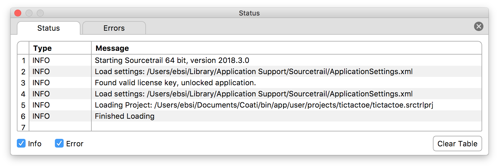

**Interactions:**

* Double click on a table cell to select the text for copy&paste.
* Use the checkboxes below to filter the shown messages by type.
* Click on `Clear Table` to remove all rows from the table.

### Errors Tab

This list shows errors occurred during indexing.


The following information is provided:

* **Type:** ERROR or FATAL. A FATAL error causes lots of missing information since the indexer had to stop at this error.
* **Error message**
* **File**
* **Line number**
* **Indexed:** Whether the file is within the indexed files.
* **Translation Unit:** The source file that produced this error while being indexed.

**Interactions:**

* Click on a error line to see the location of the error in the [Code View](#code-view).
* Click on the column headers to sort the error rows ascending or descending by this data.
* Double click on a table cell to select the text for copy&paste.
* Use the checkboxes below to filter the shown errors by certain criteria.
* Click on `Edit Project` to open the [Edit Project Dialog](#project-setup-wizard).

## Tooltips

Show information about hovered symbols in the [Graph View](#graph-view) and [Code View](#code-view)

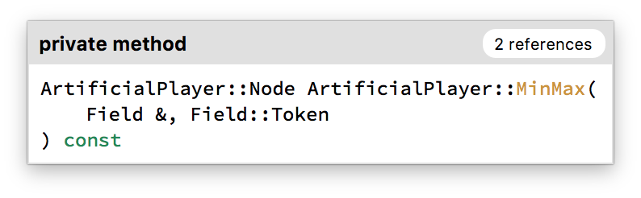

**The following information is provided:**

* Symbol type
* Visibility (e.g. public or private)
* Reference count
* Symbol name
* Clickable type name for global variables and fields.
* Full signatures with clickable return type name and parameter types names for functions and methods.

**Interactions:**

* Click on symbol names to activate them.

# Project Setup

Project Setup in Sourcetrail is done via the [Project Setup Wizard](#project-setup-wizard), which can be accessed on the [Start Window](#start-window) by clicking `New Project` or from the [Project Menu](#project) with the `New Project` action.

The Project Setup Wizard lets you create a new Sourcetrail project. It allows for defining name and location of your Sourcetrail project and adding several **Source Groups**, that define which source files will be indexed. There are several ways to create Source Groups. It is sufficient to add only one Source Group for most projects.

After you added Source Groups to your project this dialog allows you to edit their configurations, as well as removing or duplicating them.


| Setting | Description
| --- | ---
| Sourcetrail Project Name | The name of the project. This will also be the name of the `.srctrlprj` file generated by Sourcetrail.
| Sourcetrail Project Location | Choose the location of the project file from the dialog.

**Interactions:**

* Clicking `Cancel` or pressing `ESC` will close the window and abort the setup process.
* Clicking `Add Source Group` will take you to the creation of a new Source Group.
* Clicking `General` will take you to the name and location setting of the project.
* Clicking a `Source Group` will let you edit it's configuration and change it's name.
* Clicking `+` beneath the Source Group list will take you to the creation of a new Source Group.
* Clicking `-` beneath the Source Group list will delete the currently selected Source Group.
* Clicking `☐` beneath the Source Group list will duplicate the currently selected Source Group.
* Clicking `Create` will close this window and create the new project.

This window is also used when editing the project. You can select a Source Group from the list on the left and edit it's contents then. Additionally you can also set the `active` flag of certain Source Groups to false, so they won't get indexed when refreshing the project.

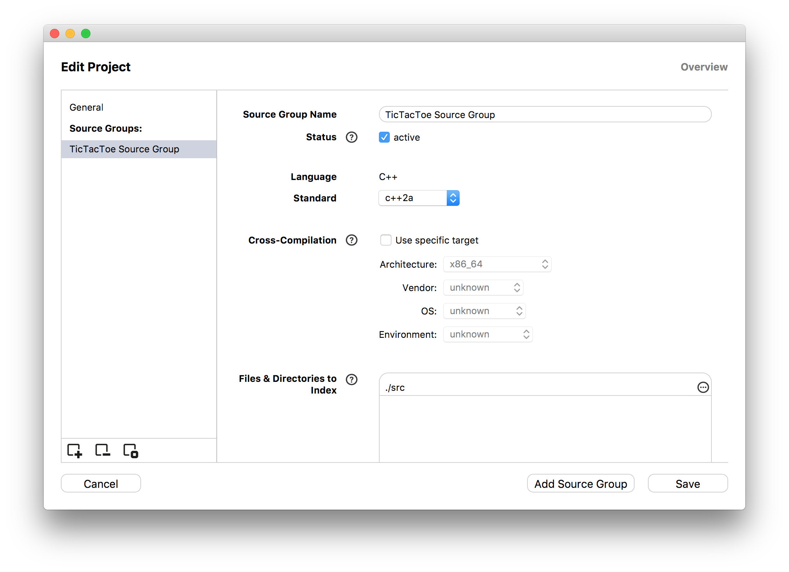

**Interactions:**

* Change the name of the Source Group.
* Activate/Deactivate the Source Group for indexing.
* Change any settings defined during Source Group setup.

## Choose a Source Group Type

When creating a new Source Group you can choose between different methods of setup depending on your project language. Please have a look at our [QUICK START GUIDE](#getting-started) section for help on choosing the right Source Group type.


**Interactions:**

* Select the language used in code project.
* Selecting a Source Group type will determine how you enter all the required information.
* Clicking `Cancel` or pressing `ESC` will close the window.
* Clicking `Next` will take you to the next step of the setup process.

## Empty C/C++ Source Group

Empty C/C++ Source Groups have the following configuration options:

| Setting | Description
| --- | ---
| Standard | Select the language standard that should be used for indexing your project. Usually the most recent language standard is preselected here. (See [Language Support](#supported-languages))
| Cross-compilation | Check **Use specific target** and then use the dropdown boxes to specify a certain target platform. Please have a look at the clang compiler documentation on [cross-compilation](https://clang.llvm.org/docs/CrossCompilation.html) for more information.
| Files & Directories to Index | These paths define the files and directories that will be indexed by Sourcetrail. Provide a directory to recursively add all contained source and header files. If your project's source code resides in one location, but generated source files are kept at a different location, you will also need to add that directory. You can make use of environment variables with `${ENV_VAR}`.<br /><br />For instructions on how to add paths see [Path List Box](#path-list-box).
| Excluded Files & Directories | These paths define the files and directories that will be left out from indexing.<br />Hints:<br /><ul><li>You can use the wildcard `*` which represents characters except `\` or `/` (e.g. `src/*/test.h` matches `src/app/test.h` but does not match `src/app/widget/test.h` or `src/test.h`)</li><li>You can use the wildcard `**` which represents arbitrary characters (e.g. `src**test.h` matches `src/app/test.h` as well as `src/app/widget/test.h` or `src/test.h`)</li><li>You can make use of environment variables with `${ENV_VAR}`<br /><br />For instructions on how to add paths see [Path List Box](#path-list-box).</li></ul>
| Source File Extensions | Define the valid extensions for source files including the dot e.g. `.cpp`. Sourcetrail will only try to index files that match one of these extensions.
| Include Paths | Include Paths are used for resolving #include directives in the indexed source and header files. These paths are usually passed to the compiler with the `-I` or `-iquote` flags. Add all paths #include directives throughout your project are relative to. If all #include directives are specified relative to the project's root directory, please add that root directory here. If your project also includes files from external libraries (e.g. boost), please add these directories as well (e.g. add `path/to/boost_home/include`). You can make use of environment variables with `${ENV_VAR}`.<br /><br />For instructions on how to add paths see [Path List Box](#path-list-box).
| Global Include Paths | The Global Include Paths will be used in all your projects in addition to the project specific Include Paths. These paths are usually passed to the compiler with the '-isystem' flag. Use them to add system header paths (See [Finding System Header Locations](#finding-system-header-locations) or use the auto detection below).<br /><br />For instructions on how to add paths see [Path List Box](#path-list-box).
| Framework Search Paths (macOS only) | These paths are used to find `.framework` files used by your project. (<br />For instructions on how to add paths see [Path List Box](#path-list-box).)
| Global Framework Search Paths (macOS only) | These Framework Search Paths will be used in all your projects. (<br />For instructions on how to add paths see [Path List Box](#path-list-box). For instructions on how to find the system header paths see [Finding System Header Locations](#finding-system-header-locations))
| Compiler Flags | Define additional compiler flags used during indexing including the dash (e.g. use `-DRELEASE` to add a `#define` for `RELEASE`).<br /><br />For instructions on how to add paths see [Path List Box](#path-list-box).
| Precompiled Header File | Select the path to the header file that should be used to generate a Precompiled Header File. The Precompiled Header File will be generated as pre-indexing step. If no path is supplied, no Precompiled Header File will be generated.
| Precompiled Header Flags | Define if the already supplied compiler flags should be used for Precompiled Header File generation and define additional flags for Precompiled Header File generation only.<br /><br />For instructions on how to add paths see [Path List Box](#path-list-box).

## C/C++ Source Group from Compilation Database

If you are using [CMake](https://cmake.org/) you can export compile commands by defining the `CMAKE_EXPORT_COMPILE_COMMANDS` flag and then use the exported `.json` file for Sourcetrail project setup.
For non-CMake projects you can use [Bear](https://github.com/rizsotto/Bear). Bear generates a `.json` file during the simulated build process. Bear has been tested on FreeBSD, GNU/Linux and OS X.
C/C++ Source Groups from Compilation Database offer the following configuration options:

| Setting | Description
| --- | ---
| Compilation Database | Select the compilation database file for the project. Sourcetrail will index your project based on the compile commands this file contains using all include paths and compiler flags of these compile commands. The project will stay up to date with changes in the compilation database on every refresh. You can make use of environment variables with ${ENV_VAR}.
| Header Files & Directories to Index | Your Compilation Database already specifies which source files are part of your project. But Sourcetrail still needs to know which header files to index as part of your project and which to skip. Choosing to skip indexing your system headers or external frameworks will significantly improve the overall indexing performance. Use this list to define which header files should be indexed by Sourcetrail. Provide a directory to recursively add all contained files. You can make use of environment variables with ${ENV_VAR}.<br />**Hint**: Just enter the root path of your project if you want Sourcetrail to index all contained headers it encounters.<br /><br />For instructions on how to add paths see [Path List Box](#path-list-box).
| Excluded Files & Directories | These paths define the files and directories that will be left out from indexing.<br />Hints:<br /><ul><li>You can use the wildcard `*` which represents characters except `\` or `/` (e.g. `src/*/test.h` matches `src/app/test.h` but does not match `src/app/widget/test.h` or `src/test.h`)</li><li>You can use the wildcard `**` which represents arbitrary characters (e.g. `src**test.h` matches `src/app/test.h` as well as `src/app/widget/test.h` or `src/test.h`)</li><li>You can make use of environment variables with `${ENV_VAR}`<br /><br />For instructions on how to add paths see [Path List Box](#path-list-box).</li></ul>
| Additional Include Paths | Include Paths are used for resolving #include directives in the indexed source and header files. These paths are usually passed to the compiler with the '-I' or '-iquote' flags. Add all paths #include directives throughout your project are relative to. If all #include directives are specified relative to the project's root directory, please add that root directory here. If your project also includes files from external libraries (e.g. boost), please add these directories as well (e.g. add 'path/to/boost_home/include'). You can make use of environment variables with ${ENV_VAR}.<br /><br />For instructions on how to add paths see [Path List Box](#path-list-box).
| Global Include Paths | The Global Include Paths will be used in all your projects in addition to the project specific Include Paths. These paths are usually passed to the compiler with the '-isystem' flag. Use them to add system header paths (See [Finding System Header Locations](#finding-system-header-locations) or use the auto detection below).<br /><br />For instructions on how to add paths see [Path List Box](#path-list-box).
| Framework Search Paths (macOS only) | These paths are used to find `.framework` files used by your project. (<br />For instructions on how to add paths see [Path List Box](#path-list-box).)
| Global Framework Search Paths (macOS only) | These Framework Search Paths will be used in all your projects. (<br />For instructions on how to add paths see [Path List Box](#path-list-box). For instructions on how to find the system header paths see [Finding System Header Locations](#finding-system-header-locations))
| Additional Compiler Flags | Define additional compiler flags used during indexing including the dash (e.g. use `-DRELEASE` to add a `#define` for `RELEASE`).<br /><br />For instructions on how to add paths see [Path List Box](#path-list-box).
| Precompiled Header File | Select the path to the header file that should be used to generate a Precompiled Header File. The Precompiled Header File will be generated as pre-indexing step. If no path is supplied, no Precompiled Header File will be generated.
| Precompiled Header Flags | Define if the already supplied compiler flags should be used for Precompiled Header File generation and define additional flags for Precompiled Header File generation only.<br /><br />For instructions on how to add paths see [Path List Box](#path-list-box).

## C/C++ Source Group from Visual Studio

If you are using Visual Studio you can export a Compilation Database with our [Visual Studio Plugin](#visual-studio) and use it to create a project with Sourcetrail.

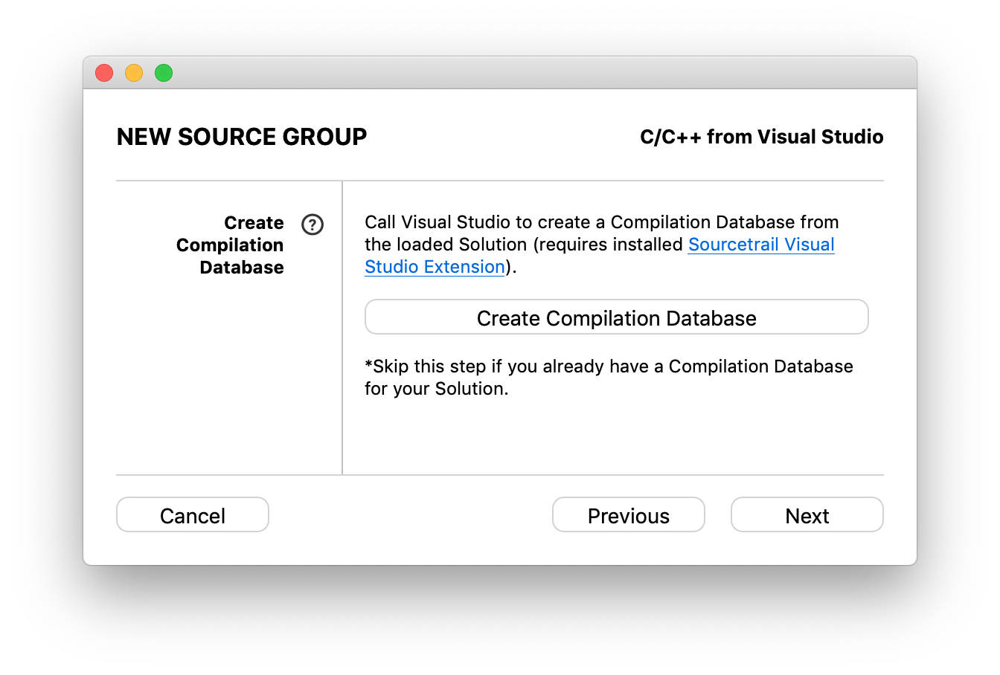

**Interactions:**

* Clicking `Create CDB` will communicate to the [Visual Studio Plugin](#visual-studio) that a project should be exported as Compilation Database. Please have a look at the [Visual Studio Plugin](#visual-studio) for more details on the steps within Visual Studio.

> After finishing the export process within Visual Studio the Source Group setup uses the same steps as creating a Source Group directly [from Compilation Database](#create-a-project-from-compilation-database).

## C/C++ Source Group from Code::Blocks

If you already have a working Code::Blocks project (`.cbp`) for your source code you can use it to create a project with Sourcetrail. Note that a `.cbp` file will be generated by the **QtCreator** if a CMakeLists file is imported.
C/C++ Source Groups from Code::Blocks offer the following configuration options:

| Setting | Description
| --- | ---
| C++ Standard | Select the language standard that should be used for indexing your project's C++ files. Usually the most recent language standard is preselected here. (See [Language Support](#supported-languages))
| C Standard | Select the language standard that should be used for indexing your project's C files. Usually the most recent language standard is preselected here. (See [Language Support](#supported-languages))
| Code::Blocks Project | Select the `.cbp` file for the project. Sourcetrail will index your project based on the settings specified by the Code::Blocks project file. Your Sourcetrail project will stay up to date with changes in the Code::Blocks project file on every refresh. You can make use of environment variables with ${ENV_VAR}.
| Header Files & Directories to Index | Your Code::Blocks project already specifies which source files are part of your project. But Sourcetrail still needs to know which header files to index as part of your project and which to skip. Choosing to skip indexing your system headers or external frameworks will significantly improve the overall indexing performance. Use this list to define which header files should be indexed by Sourcetrail. Provide a directory to recursively add all contained files. You can make use of environment variables with ${ENV_VAR}.<br />**Hint**: Just enter the root path of your project if you want Sourcetrail to index all contained headers it encounters.<br /><br />For instructions on how to add paths see [Path List Box](#path-list-box).
| Excluded Files & Directories | These paths define the files and directories that will be left out from indexing.<br />Hints:<br /><ul><li>You can use the wildcard `*` which represents characters except `\` or `/` (e.g. `src/*/test.h` matches `src/app/test.h` but does not match `src/app/widget/test.h` or `src/test.h`)</li><li>You can use the wildcard `**` which represents arbitrary characters (e.g. `src**test.h` matches `src/app/test.h` as well as `src/app/widget/test.h` or `src/test.h`)</li><li>You can make use of environment variables with `${ENV_VAR}`<br /><br />For instructions on how to add paths see [Path List Box](#path-list-box).</li></ul>
| Source File Extensions | Define the valid extensions for source files including the dot e.g. `.cpp`. Sourcetrail will only try to index files that match one of these extensions.
| Additional Include Paths | Include Paths are used for resolving #include directives in the indexed source and header files. These paths are usually passed to the compiler with the '-I' or '-iquote' flags. Add all paths #include directives throughout your project are relative to. If all #include directives are specified relative to the project's root directory, please add that root directory here. If your project also includes files from external libraries (e.g. boost), please add these directories as well (e.g. add 'path/to/boost_home/include'). You can make use of environment variables with ${ENV_VAR}.<br /><br />For instructions on how to add paths see [Path List Box](#path-list-box).
| Global Include Paths | The Global Include Paths will be used in all your projects in addition to the project specific Include Paths. These paths are usually passed to the compiler with the '-isystem' flag. Use them to add system header paths (See [Finding System Header Locations](#finding-system-header-locations) or use the auto detection below).<br /><br />For instructions on how to add paths see [Path List Box](#path-list-box).
| Framework Search Paths (macOS only) | These paths are used to find `.framework` files used by your project. (<br />For instructions on how to add paths see [Path List Box](#path-list-box).)
| Global Framework Search Paths (macOS only) | These Framework Search Paths will be used in all your projects. (<br />For instructions on how to add paths see [Path List Box](#path-list-box). For instructions on how to find the system header paths see [Finding System Header Locations](#finding-system-header-locations))
| Additional Compiler Flags | Define additional compiler flags used during indexing including the dash (e.g. use `-DRELEASE` to add a `#define` for `RELEASE`).<br /><br />For instructions on how to add paths see [Path List Box](#path-list-box).

## Empty Java Source Group

Choose this option if you want to index Java files using Sourcetrail.
Empty Java Source Groups offer the following configuration options:

| Setting | Description
| --- | ---
| Standard | Select the language standard that should be used for indexing your the Source Group. Usually the most recent language standard is preselected here. (See [Language Support](#supported-languages))
| Files & Directories to Index | These paths define the files and directories that will be indexed by Sourcetrail. Provide a directory to recursively add all contained source and header files. If your project's source code resides in one location, but generated source files are kept at a different location, you will also need to add that directory. You can make use of environment variables with ${ENV_VAR}.<br /><br />For instructions on how to add paths see [Path List Box](#path-list-box).
| Excluded Files & Directories | These paths define the files and directories that will be left out from indexing.<br />Hints:<br /><ul><li>You can use the wildcard `*` which represents characters except `\` or `/` (e.g. `src/*/test.h` matches `src/app/test.h` but does not match `src/app/widget/test.h` or `src/test.h`)</li><li>You can use the wildcard `**` which represents arbitrary characters (e.g. `src**test.h` matches `src/app/test.h` as well as `src/app/widget/test.h` or `src/test.h`)</li><li>You can make use of environment variables with `${ENV_VAR}`<br /><br />For instructions on how to add paths see [Path List Box](#path-list-box).</li></ul>
| Source File Extensions | Define the valid extensions for source files including the dot e.g. `.java`. Sourcetrail will only try to index files that match one of these extensions.
| Class Path | Enter all the .jar files your project depends on. If your project depends on uncompiled java code that should not be indexed, please add the root directory of those .java files here (the one where all the package names are relative to). You can make use of environment variables with ${ENV_VAR}.
| JRE System Library | Tick this box to use the JRE System library jars specified in your application settings. Disable this setting if you want to use another JRE System library for this project and add the respective jars to the project's Class Path.

## Java Source Group from Gradle

If you are using a Gradle configuration to manage and build your project use this approach to create a Sourcetrail Source Group.
Java Source Groups from Gradle offer the following configuration options:

| Setting | Description
| --- | ---
| Standard | Select the language standard that should be used for indexing your the Source Group. Usually the most recent language standard is preselected here. (See [Language Support](#supported-languages))
| Gradle Project File |  The path to the `build.gradle` file in the root folder of your Gradle project.
| Should Index Tests |  This checkbox indicates whether or not Sourcetrail indexes the test code that is part of your Gradle project.
| Intermediate Dependencies Directory | Directory where Sourcetrail stores all of the project's `.jar` dependencies.
| Excluded Files & Directories | These paths define the files and directories that will be left out from indexing.<br />Hints:<br /><ul><li>You can use the wildcard `*` which represents characters except `\` or `/` (e.g. `src/*/test.h` matches `src/app/test.h` but does not match `src/app/widget/test.h` or `src/test.h`)</li><li>You can use the wildcard `**` which represents arbitrary characters (e.g. `src**test.h` matches `src/app/test.h` as well as `src/app/widget/test.h` or `src/test.h`)</li><li>You can make use of environment variables with `${ENV_VAR}`<br /><br />For instructions on how to add paths see [Path List Box](#path-list-box).</li></ul>
| Source File Extensions | Define the valid extensions for source files including the dot e.g. `.java`. Sourcetrail will only try to index files that match one of these extensions.

## Java Source Group from Maven

If you are using a Maven configuration to manage and build your project use this approach to create a Sourcetrail Source Group.
Java Source Groups from Maven offer the following configuration options:

| Setting | Description
| --- | ---
| Standard | Select the language standard that should be used for indexing your the Source Group. Usually the most recent language standard is preselected here. (See [Language Support](#supported-languages))
| Maven Project File |  The path to the `pom.xml` file in the root folder of your Maven project.
| Should Index Tests |  This checkbox indicates whether or not Sourcetrail indexes the test code that is part of your Maven project.
| Intermediate Dependencies Directory | Directory where Sourcetrail stores all of the project's `.jar` dependencies.
| Excluded Files & Directories | These paths define the files and directories that will be left out from indexing.<br />Hints:<br /><ul><li>You can use the wildcard `*` which represents characters except `\` or `/` (e.g. `src/*/test.h` matches `src/app/test.h` but does not match `src/app/widget/test.h` or `src/test.h`)</li><li>You can use the wildcard `**` which represents arbitrary characters (e.g. `src**test.h` matches `src/app/test.h` as well as `src/app/widget/test.h` or `src/test.h`)</li><li>You can make use of environment variables with `${ENV_VAR}`<br /><br />For instructions on how to add paths see [Path List Box](#path-list-box).</li></ul>
| Source File Extensions | Define the valid extensions for source files including the dot e.g. `.java`. Sourcetrail will only try to index files that match one of these extensions.

## Empty Python Source Group

Choose this option if you want to index Python files using Sourcetrail.
Empty Python Source Groups offer the following configuration options:

| Setting | Description
| --- | ---
| Python Environment | Here you can specify the path to the directory or to the executable of the (virtual) Python environment that should be used to resolve dependencies within the indexed source code.<br />If you would run:<br />`$ cd c:\dev\python\envs`<br />`$ virtualenv py37`<br />you would set it to `C:\dev\python\envs\py37` or `C:\dev\python\envs\py37\Scripts\python.exe`.<br />Leave blank to use the default Python environment. You can make use of environment variables with `${ENV_VAR}`.
| Files & Directories to Index | These paths define the files and directories that will be indexed by Sourcetrail. Provide a directory to recursively add all contained source and header files. If your project's source code resides in one location, but generated source files are kept at a different location, you will also need to add that directory. You can make use of environment variables with ${ENV_VAR}.<br /><br />For instructions on how to add paths see [Path List Box](#path-list-box).
| Excluded Files & Directories | These paths define the files and directories that will be left out from indexing.<br />Hints:<br /><ul><li>You can use the wildcard `*` which represents characters except `\` or `/` (e.g. `src/*/test.h` matches `src/app/test.h` but does not match `src/app/widget/test.h` or `src/test.h`)</li><li>You can use the wildcard `**` which represents arbitrary characters (e.g. `src**test.h` matches `src/app/test.h` as well as `src/app/widget/test.h` or `src/test.h`)</li><li>You can make use of environment variables with `${ENV_VAR}`<br /><br />For instructions on how to add paths see [Path List Box](#path-list-box).</li></ul>
| Source File Extensions | Define the valid extensions for source files including the dot e.g. `.py`. Sourcetrail will only try to index files that match one of these extensions.

## Custom Command Source Group

In a Custom Command Source Group you can define a set of files and a command line call used to index each of these files. This Source Group type was introduced to integrate custom indexers written with [SourcetrailDB](https://github.com/CoatiSoftware/SourcetrailDB).

Custom Command Source Groups offer the following configuration options:

| Setting | Description
| --- | ---
| Custom Command | The command line call executed for each source file. You can pass different pre-defined parameters:<br /><ul><li>**%{SOURCE_FILE_PATH}**: The path to each source file in the source group (mandatory)</li><li>**%{DATABASE_FILE_PATH}**: The path to the database of the project</li><li>**%{DATABASE_VERSION}**: The database version of the used Sourcetrail instance</li><li>**%{PROJECT_FILE_PATH}**: The path to the project file</li></ul>
| Run in Parallel |  Whether files should be processed in parallel.
| Files & Directories to Index | These paths define the files and directories that will be indexed by Sourcetrail. Provide a directory to recursively add all contained source and header files. If your project's source code resides in one location, but generated source files are kept at a different location, you will also need to add that directory. You can make use of environment variables with ${ENV_VAR}.<br /><br />For instructions on how to add paths see [Path List Box](#path-list-box).
| Excluded Files & Directories | These paths define the files and directories that will be left out from indexing.<br />Hints:<br /><ul><li>You can use the wildcard `*` which represents characters except `\` or `/` (e.g. `src/*/test.h` matches `src/app/test.h` but does not match `src/app/widget/test.h` or `src/test.h`)</li><li>You can use the wildcard `**` which represents arbitrary characters (e.g. `src**test.h` matches `src/app/test.h` as well as `src/app/widget/test.h` or `src/test.h`)</li><li>You can make use of environment variables with `${ENV_VAR}`<br /><br />For instructions on how to add paths see [Path List Box](#path-list-box).</li></ul>
| Source File Extensions | Define the valid extensions for source files including the dot e.g. `.ext`. Sourcetrail will only try to index files that match one of these extensions. If no extension is defined, any file extension is valid.

# Code Editor Plugins

In order to make Sourcetrail the perfect partner for your development workflow you can connect Sourcetrail with different code editors. You can find more information on the plugins in Sourcetrail's download package located in the folder `/ide_plugins`. Have a look at the following list of supported code editors to find out what editors are currently supported.

The plugins are Opensource and available on [github](https://github.com/CoatiSoftware/).

**Supported Editors:**

* Atom
* CLion
* Eclipse
* Emacs
* IntelliJ IDEA (PyCharm, CLion, etc.)
* Qt Creator
* Sublime Text 2
* Sublime Text 3
* Vim
* Visual Studio Code
* Visual Studio 2012
* Visual Studio 2013
* Visual Studio 2015
* Visual Studio 2017

The communication between Sourcetrail and the code editor is achieved using a local TCP connection. Sourcetrail uses the port 6667 to listen for incoming messages. Outgoing messages will be sent to the port 6666. The port numbers can be edited in the [Preferences Window](#preferences-window).

Outgoing messages are in the form:
`moveCursor>>absolute/file_path>>line_number>>column_number<EOM>`
Incoming messages are in the form:
`setActiveToken>>absolute/file_path>>line_number>>column_number<EOM>`

## From Sourcetrail

If you want your editor to open a file at a specific location from within Sourcetrail, you can achieve this by either selecting the option `Set IDE Cursor` from the right-click menu in the <a href="#CodeView">Code View]() or by simply clicking into a line in the [Code View](#code-view) while holding down the `Ctrl` or `Cmd` key.


## To Sourcetrail

By using a Sourcetrail plugin for your code editor, you can select a location within a source file and Sourcetrail will show you all symbols found at this location. Please have look at the list below to see which plugins are currently available and how they are used.

### Atom

**Repo**: [https://github.com/CoatiSoftware/atom-sourcetrail](https://github.com/CoatiSoftware/atom-sourcetrail)

**Installation**

1. In Atom go to Settings with `Edit -> Preferences` or `Ctrl` + `,`
1. Go to Install and search for sourcetrail
1. Install atom-sourcetrail

**Use**

To start the Tcp Server got `Packages -> Sourcetrail -> Start Server`
To send a location to Sourcetrail, place the cursor and right-click and select `Send location to Sourcetrail`
or `Packages -> Sourcetrail -> Send location to Sourcetrail`

### CLion/IntelliJ IDEA

**Repo**: [https://github.com/CoatiSoftware/idea-sourcetrail](https://github.com/CoatiSoftware/idea-sourcetrail)

**Installation**

1. File | Settings... (or IntelliJ IDEA | Preferences... for macOS) to open the Settings
1. Go to Plugins
1. Click Marketplace tab
1. Search for idea-sourcetrail
1. Click Install for idea-sourcetrail plugin

**Use**

If you want IntelliJ IDEA/CLion to activate a certain element in Sourcetrail, right-click that element to
bring up the context menu and choose the “Sent Location” option.

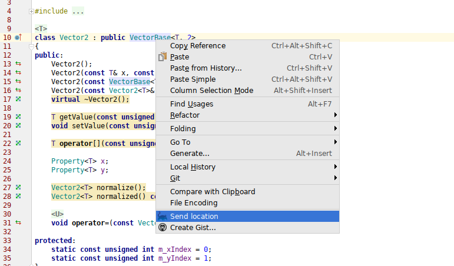

### Eclipse

**Repo**: [https://github.com/CoatiSoftware/eSourcetrail](https://github.com/CoatiSoftware/eSourcetrail)

**Installation**

* Updatesite:
	1. In Eclipse go in the menu to `Help -> Install new Software...`
	1. Add the Sourcetrail Updatesite
		* type [https://CoatiSoftware.github.io/eSourcetrail/updatesite](https://CoatiSoftware.github.io/eSourcetrail/updatesite) into the `Work with:` field
		* or press `Add...` and add the address above
	1. Select all and finish the next step.
	1. Eclipse needs to restart and can now communicate with Eclipse.
* Manually:
	1. Download this [eSourcetrail-gh-pages.zip](https://github.com/CoatiSoftware/eSourcetrail/archive/gh-pages.zip) and unzip it.
	1. In Eclipse go in the menu to `Help -> Install new Software...`
	1. Click the `Add...` Button
	1. Click the `Local...` Button select the updatesite folder in the unzipped folder
	1. Select all and finish the next step.
	1. Eclipse needs to restart and can now communicate with Eclipse.

**Use**

If you want Eclipse to activate a certain element in Sourcetrail, right-click that element to bring up the context menu and choose the “Set active Token” option.


### Emacs

**Repo**: [https://github.com/CoatiSoftware/emacs-sourcetrail](https://github.com/CoatiSoftware/emacs-sourcetrail)

**Installation**

* Manually
	1. Download the sourcetrail.el from [https://github.com/CoatiSoftware/emacs-sourcetrail](https://github.com/CoatiSoftware/emacs-sourcetrail)
	1. In Emacs press `M` + `x` and type in `package-install-file`
	1. Type in the path to the downloaded sourcetrail.el file
* Melpa
	1. Add Melpa to your package-archives
	1. Press `M` + `x` and type `list-packages`
	1. Search for sourcetrail and mark sourcetrail with `i` then press `x` and the confirm with yes

**Use**

If you want Emacs to activate a certain element in Sourcetrail, set your cursor to that element and
`M` + `x` and type in `sourcetrail-send-location`.
To get Location from Sourcetrail the sourcetrail-mode need to be active. To active the sourcetrail-mode
press `M` + `x` and type in `sourcetrail-mode`

### Qt Creator

**Repo**: [https://github.com/CoatiSoftware/qtc-sourcetrail](https://github.com/CoatiSoftware/qtc-sourcetrail)

**Installation**

1. Download the plugin for your system from [here](https://github.com/CoatiSoftware/qtc-sourcetrail/releases).
1. Copy the files into the plugin folder where the QtCreator is installed(eg. /usr/lib/qtcreator/plugins)
	* the plugin path can be found at Help -> System Information... -> PluginsPath

**Use**

If you want QtCreator to activate a certain element in Sourcetrail, click a location to place the cursor, right-click to bring up the context menu and choose the “Sourcetrail - Set active Token” option. Please note that the position of the cursor will be sent to Sourcetrail and not the position you opened the context menu at.

### Sublime Text

**Repo**: [https://github.com/CoatiSoftware/sublime-sourcetrail](https://github.com/CoatiSoftware/sublime-sourcetrail)

**Installation**

* Manually
	1. To install the Sourcetrail plugin for Sublime Text copy the SourcetrailPlugin folder located in your `ide_plugins/sublime_text` to your `SublimeText/Packages` folder
	1. restart Sublime
* Package Control
	1. If you don't have Package Control for Sublime go to https://packagecontrol.io and install it
	1. Open Command Palette  with `Ctrl` + `Shift` + `P`
	1. Select `Package Control: Install Package`
	1. Install `sourcetrail`

**Use**

If you want Sublime to activate a certain element in Sourcetrail, click a location to place the cursor, right-click to bring up the context menu and choose the “Sourcetrail - Set active Token” option. Please note that the position of the cursor will be sent to Sourcetrail and not the position you opened the context menu at.


### Vim

**Repo**: [https://github.com/CoatiSoftware/vim-sourcetrail](https://github.com/CoatiSoftware/vim-sourcetrail)

**Installation**

Please visit the [vim-sourcetrail](https://github.com/CoatiSoftware/vim-sourcetrail) repository on GitHub for details.

**Use**

If you want Vim to activate a certain element in Sourcetrail, go to the code location and use
`:SourcetrailActivateToken`, now Sourcetrail should display your the chosen location.
Use`:help sourcetrail.txt` get get more information about the plugin

### VS Code

**Repo**: [https://github.com/CoatiSoftware/vsce-sourcetrail](https://github.com/CoatiSoftware/vsce-sourcetrail)

**Installation**

1. In VS Code go to Extensions(`Ctrl` + `Shift` + `X`)
1. Search for sourcetrail in the marketplace
1. Install sourcetrail

**Use**

To start the Tcp Server go to the Command Palette(`Ctrl` + `Shift` + `P`) and type: `Sourcetrail: (Re)start server`
To send a location to Sourcetrail, place the cursor and right-click and select `Sourcetrail: Send Location`
or type in the Command Palette: `Sourcetrail: Send Location`

### Visual Studio

**Download, Reviews:**
[Visual Studio Marketplace](https://marketplace.visualstudio.com/items?itemName=vs-publisher-1208751.SourcetrailExtension)

**Repo**: [https://github.com/CoatiSoftware/vs-sourcetrail](https://github.com/CoatiSoftware/vs-sourcetrail)

**Installation**

1. open Visual Studio
1. from the menu bar select "Tools" -> "Extensions and Updates..."
1. in the "Extensions and Updates" dialog choose "Online" -> "Visual Studio Gallery"
1. press `Ctrl` + `E` and enter "Sourcetrail Extension" into the search bar
1. click the install button

**Use**

If you want Visual Studio to activate a certain element in Sourcetrail, right-click that element to bring up the context menu and choose the “Set active Token” option.


**Create a Clang Compilation Database from a VS Solution**

As a Clang based tool Sourcetrail supports the JSON Compilation Database format for simplified project setup. This extension enables you to generate a JSON Compilation Database from your Visual Studio projects and solutions. The great news is: This format is independent from the Sourcetrail tool, so you can also use the generated Compilation Database to run other Clang based tools.
The wizard for creating a Compilation Database is located in the Sourcetrail section in the VS menu bar. Note that the option is only useable if a solution containing at least one C/C++ project is loaded.

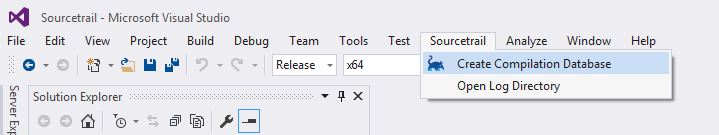

In the Compilation Database wizard you can select projects you want to include in the JSON file as well as the desired build target platform and configuration and a number of other options.

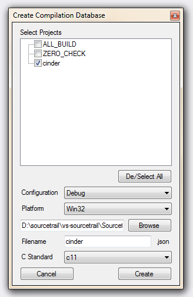

| Option | Description
| --- | ---
| Select Projects | The list of C/C++ projects in your solution. Check all projects you want to be included in the generated JSON Compilation Database file.
| De/Select All | Will select all projects if at least one project is not selected. If all projects are selected they will all be unselected.
| Configuration | A dropdown list of the available build configurations. The selected configuration affects include paths and compile flags for the Compilation Database.
| Platform | A dropdown list of the available target platforms. The selected platform affects include paths and compile flags for the Compilation Database.
| Browse | Opens a folder browser to select the directory where the Compilation Database will be created in. By default it is the directory of your solution. Instead of using the folder browser you can also paste a path into the adjacent text field.
| filename | This is the name for the Compilation Database file. By default it is the same name as your solution.
| C Standard | A dropdown list of all C standards supported by Sourcetrail. If your projects contain C files select the appropriate standard.
| Cancel | Aborts the process and closes the wizard.
| Create | Creates the Compilation Database using the specified options. Note that at least one project has to be selected to start creating.

Once the Compilation Database was successfully created it can be found in the specified target directory. From this Compilation Database you can create a Sourcetrail project as [described above](#create-a-project-from-compilation-database).

**Settings**
Network settings and logging options can be changed in the plugin's Tools/Options entry.


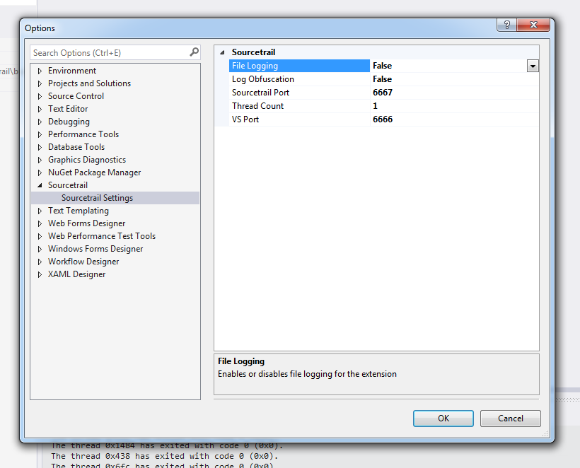

| Option | Description
| --- | ---
| File Logging | Enable log output for the plugin. Additionally to the output file, log messages will also be displayed in VS'
| Log Obfuscation | Obfuscate project names and file names as well as directories in the log output. Note that already logged data **will not be obfuscated retroactively**. A dictionary, mapping obfuscated names to original names, will be created in a separate file.
| Sourcetrail Port | The port on which Sourcetrail will receive messages. Note that this must match the port setting in Sourcetrail itself.
| Thread Count | The number of threads used during creation of the Compilation Database
| VS Port | The port on which Visual Studio will receive messages. Note that this must match the port setting in Sourcetrail itself.

**Logging**

The plugin offers optional file logging. Should you ever have issues with the plugin we recommend to turn logging on. This will help to pinpoint and resolve the root cause faster.
Logs will be created in `..\AppData\Local\Coati Software\Plugins\VS` folder. A new log file will be created every time you restart VS and logging is enabled.


Note that the logs will include project names and file names as well as directories specific to your project. If you wish to keep this information secret you can enable [log obfuscation](#vs-plugin-option-obfuscation).
Project- and file names as well as directories will be replaced by an alphanumeric sequence. The sequence has the form `a0, b0, c0,..., a1, b1, c1,...`. Note that after switching on obfuscation, already logged data **will not be obfuscated retroactively**. No log files will be send to Coati Software automatically. You can check any file you may want to send us for sensible information before sending it.
A dictionary, mapping obfuscated names to original names, will be created in your log folder if log obfuscation is switched on. When during the support process we refer to project items by their obfuscated name you can still make sense of it. **Do not send the dictionary to anybody else**.

Lastly, log messages are also displayed in the VS output window. This is tied to file logging and is not enabled or disabled separately.


## IDE Communication Protocol

Sourcetrail's IDE plugins communicate with Sourcetrail via sockets, using TCP. Sourcetrail implements a number of messages to provide an interface for the plugins.
This chapter explains the general structure of those messages, followed by a list of possible message types.

### Message Structure

The basic structure of the messages used by Sourcetrail plugins consists of a prefix to identify the message type, followed by no, one, or multiple parameters and ends with an 'end-of-message' token. Parameters and tokens are separated by a 'divider' token.

| Name | Token | Description
| --- | --- | ---
| messageType | [see below](#message-types) | A string that determines how the message will be interpreted by Sourcetrail or the plugin
| divider | `>>` | Separates the tokens of the message
| parameter | [see below](#message-types) | Typically an integer or string
| endOfMessage | `<EOM>` | Helps to determine the end of a message

Messages have the following form:

`messageType<<parameter<<...<<parameter<EOM>`

### Message Types

Sourcetrail does implement a number of message types that can be used by Sourcetrail plugins. In the following is a list of the messages that Sourcetrail may send to plugins and messages that may be sent by a plugin to Sourcetrail.

Note that you can chose which messages you want to implement. Sourcetrail will not make problems if you chose to ignore certain messages.

**Incoming messages**
These messages may be received by a plugin.

| Message | Parameters | Description
| --- | --- | ---
| `moveCursor` | `fileLocation: string`<br />`row: integer`<br />`column: integer` | Set the cursor of your editor or IDE to the given file location.<br />Note that fileLocation is the absolute path and name of the target file.
| `createCDB` |  | Sourcetrail may send this message to prompt your plugin to create a Compilation Database (CDB). Once the CDB is ready you may want to respond with a `createCDBProject` message.
| `ping` |  | Sourcetrail may send a ping to determine if anybody is listening. Respond with a ping message yourself. Sourcetrail will not respond to this message.

**Outgoing messages**
Your plugin may send these messages to Sourcetrail.

| Message | Parameters | Description
| --- | --- | ---
| `setActiveToken` | `fileLocation: string`<br />`row: integer`<br />`column: integer` | Tells Sourcetrail to shift focus to the token located at the given position. Note that fileLocation is the absolute path and name of the target file.
| `createCDBProject` | `cdbPath: string`<br />`headerPaths: string` | If your plugin can provide a Compilation Database this message can prompt Sourcetrail to import it and display an appropriate dialog for the user. headerPaths is a list of the base project's header include paths. Separate the single paths using the divider token. You can add as many paths as you need.
| `ping` |  | Your plugin may send this message to Sourcetrail to tell it it's listening.

# Frequently Asked Questions

### Can I use Sourcetrail on confidential source code?

Yes. Sourcetrail keeps the data completely offline and unless disabled, will only establish a connection to the internet to check if a more recent version is available.

### What happens to the indexed data?

Sourcetrail does two things with the data collected during indexing:

1. The data is stored in the `.srctrldb` file which is in the same directory as the `.srctrlprj` file. This database file is used by Sourcetrail to serve its purpose of letting you navigate your source code and also allowing Sourcetrail to re-open the project without re-indexing the source code each time.
1. If logging is enabled, some of the data gets logged into a log file saved in [data](#datafolter)/logs. These logs can be useful to us for fixing bugs. We may ask for log information on bug reports, but you should only provide it, if your source code is not confidential.

**Note:** The ` .srctrldb ` file is actually a ` .sqlite ` database file and can be inspected using the [DB Browser for SQLite](https://sqlitebrowser.org/).
