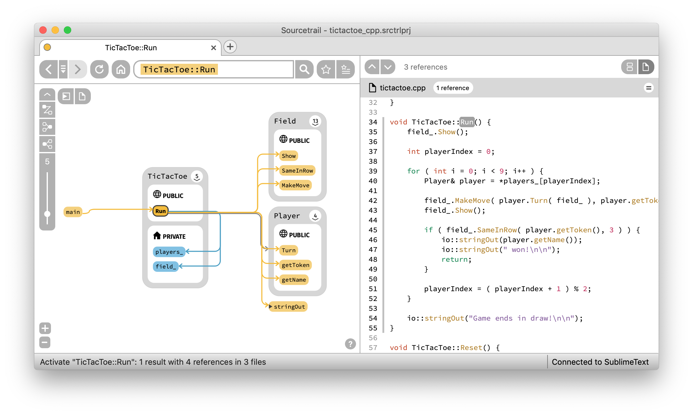

# Sourcetrail

[Sourcetrail](https://www.sourcetrail.com/) is a free and open-source cross-platform source explorer that helps you get productive on unfamiliar source code.

[](https://ci.appveyor.com/project/mlangkabel/sourcetrail/branch/master)


__Links__
* [Website](https://www.sourcetrail.com/)
* [Download](https://www.sourcetrail.com/downloads)
* [Quick Start Guide](https://www.sourcetrail.com/documentation/#QUICKSTARTGUIDE)
* [Documentation](https://www.sourcetrail.com/documentation)
* [Changelog](CHANGELOG.md)
* [Slack Channel](https://join.slack.com/t/sourcetrail/shared_invite/enQtNDc3MjcyOTk5MTc0LTNhOWZhZjAxZmU1NTM0YjhhMzRhZWE1NTQ2NjQyYjc1ODE2MzViOTliMWUwODBjN2NlMjkwMDc0MjAxMzJkY2E)
* [Mailing List](https://coati.us12.list-manage.com/subscribe/post?u=3dabab4e475b5ed577d1dcd0f&id=cf7301fc53)
* [Patreon](https://www.patreon.com/sourcetrail)



Sourcetrail is:
* free
* working offline
* operating on Windows, macOS and Linux
* supporting C, C++, Java and Python
* offering an SDK ([SourcetrailDB](https://github.com/CoatiSoftware/SourcetrailDB)) to write custom language extensions

## Support Sourcetrail via Patreon

The ongoing development and regular software releases are made possible entirely by the support of [these awesome patrons](SPONSORS.md)! If you'd like to join them, please consider [becoming a patron](https://www.patreon.com/sourcetrail) of Sourcetrail.

## Using Sourcetrail

Download the respective build for your operating system from our list of [Releases](https://www.sourcetrail.com/downloads) and install it on your machine. After that follow our [Quick Start Guide](https://www.sourcetrail.com/documentation/#QUICKSTARTGUIDE) to get to know Sourcetrail.

## How to Report Issues

You can post all your feature requests and bug reports on our [issue tracker](https://github.com/CoatiSoftware/Sourcetrail/issues).

### Reporting

Use the following template:

* platform version:
* Sourcetrail version:
* description of the problem:
* steps to reproduce the problem:


### Supporting

If you want to support a certain feature request or you have the same bug that another user already reported, please let us know:
* post a comment with "+1" to the issue
* or send an email to support@sourcetrail.com with the issue ID

## How to Contribute

* Please read and follow the steps in [CONTRIBUTING.md](CONTRIBUTING.md) file. 
* You may want to look out for issues labeled [good first issue](https://github.com/CoatiSoftware/Sourcetrail/issues?q=is%3Aopen+is%3Aissue+label%3A%22good+first+issue%22) to find some initial tasks to tackle.
* If you are looking for more information about Sourcetrail software development, please refer to our [wiki](https://github.com/CoatiSoftware/Sourcetrail/wiki).

# How to Build

Building Sourcetrail requires several dependencies to be in place on your machine. However, our CMake based setup allows to disable indexing support for specific languages which reduces the number of dependencies to a minimum.

## Building the bare minimum

### Required Tools

#### Git

This is required for generating the Sourcetrail version number. Get it from: https://git-scm.com/download.

Make sure `git` is available in added to your `PATH` environment variable.

#### CMake v3.12

This is used for generating a build configuration. Get it from: https://cmake.org/download/

### Additional tools for Windows

#### Visual Studio

### Additional tools for Unix

#### ccache

This is optionally used to speed up rebuilds if found in `PATH`.

### Required dependencies

#### Boost 1.67
For the __msvc__ compiler pre-built binaries can be downloaded from [sourceforge.net/projects/boost/files/boost-binaries](https://sourceforge.net/projects/boost/files/boost-binaries/)

For building on Unix:
```
$ ./bootstrap.sh --with-libraries=filesystem,program_options,system,date_time
$ ./b2 --link=static --variant=release --threading=multi --runtime-link=static --cxxflags=-fPIC
```

#### Qt 5.12

__Note__: still causes style issues on Windows, resort to Qt 5.10

For the __msvc__ compiler pre-built binaries can be downloaded from [download.qt.io/official_releases/qt](http://download.qt.io/official_releases/qt/)

### Building

#### For Windows / Visual Studio
```
$ cd Sourcetrail
$ mkdir -p build/win64
$ cd build/win64
$ cmake -G "Visual Studio 15 2017 Win64" -DBOOST_ROOT=<path/to/boost_1_68_0> -DQt5_DIR=<path/to/Qt/version/platform/compiler/lib/cmake/Qt5> ../..
```
If you are using the gui, we recommend that you activate advanced mode. Also you may be required to add some of the defines via the "Add Entry" button.

After generating the build configuration, just open the Sourcetrail.sln file that was generated by CMake and build the Sourcetrail project.

#### For Unix

```
$ cd Sourcetrail
$ mkdir -p build/Release
$ cd build/Release
$ cmake -DCMAKE_BUILD_TYPE="Release" -DBOOST_ROOT=<path/to/boost_1_68_0> -DQt5_DIR=<path/to/Qt/version/platform/compiler/lib/cmake/Qt5> ../..
$ make Sourcetrail
```

### Running

Run Sourcetrail from within the build directory. During execution Sourcetrail needs resources from `bin/app/data` and `bin/app/user`. Cmake creates symlinks to these directories within the build directory.


## Enable C/C++ Language Support

### Required dependencies

#### LLVM/Clang 8.0.1

##### Windows
For the __msvc__ compiler, follow [these steps](https://clang.llvm.org/get_started.html) to build the project and make sure that you run the cmake command exactly as described.

##### Unix
For Unix, follow this [installation guide](http://clang.llvm.org/docs/LibASTMatchersTutorial.html)

Build with `-DLLVM_ENABLE_RTTI=ON`.

### Building

Run CMake with these additional options:
```
-DClang_DIR=<path/to/llvm_build/lib/cmake/clang>
-DBUILD_CXX_LANGUAGE_PACKAGE=ON
```

## Enable Java Language Support

### Required dependencies

#### JDK 1.8

Install JDK and make sure the `JAVA_HOME` environment variable is set:
```
JAVA_HOME=.../Java/jdk1.x.x_xxx
```

Also make sure `<jdk_root>/bin` is available in your `PATH` environmen variable.

### Building

Run CMake with these additional options:
```
-DBUILD_JAVA_LANGUAGE_PACKAGE=ON
```


## Enable Python Language Support

### Required dependencies

#### WinRAR (for Windows only)

### Building

Run CMake with these additional options:
```
-DBUILD_PYTHON_LANGUAGE_PACKAGE=ON
```

## Packaging

### Windows

#### Required Tools

##### Visual Studio

##### Wix 3.11

##### Wix extension for Visual Studio

##### WinRAR

Make sure to append these directories to your `PATH` environment variable:
* VisualStudio/Common7/Tools
* VisualStudio/Common7/IDE
* .../Microsoft SDKs/Windows/v7.1A/Bin (for uuidgen in deploy script)
* .../WiX Toolset v3.11/bin
* .../WinRAR

Run `./script/deploy_windows.sh` script which will generate 32bit/64bit builds and packages these into a portable `.zip` file and a Wix-based Windows installer, each.

### macOS

After building, run the `bundle_install.sh` script within the build directory which will create a `Sourcetrail.app` bundle and generate a `Sourcetrail_<version>.dmg` container.

### Linux

Run `./script/buildonly.sh package`


# How to Run the Tests

The automated test suite of Sourcetrail is powered by [Catch2](https://github.com/catchorg/Catch2). To run the tests, simply execute the `Sourcetrail_test` binary. Before executing, please make sure to set the working directory to `./bin/test`.


# License

Sourcetrail is licensed under the [GNU General Public License Version 3](LICENSE.txt).

# Trademark

The "Sourcetrail" name is a trademark owned by Coati Software and is not included within the assets licensed under the GNU GPLv3.
