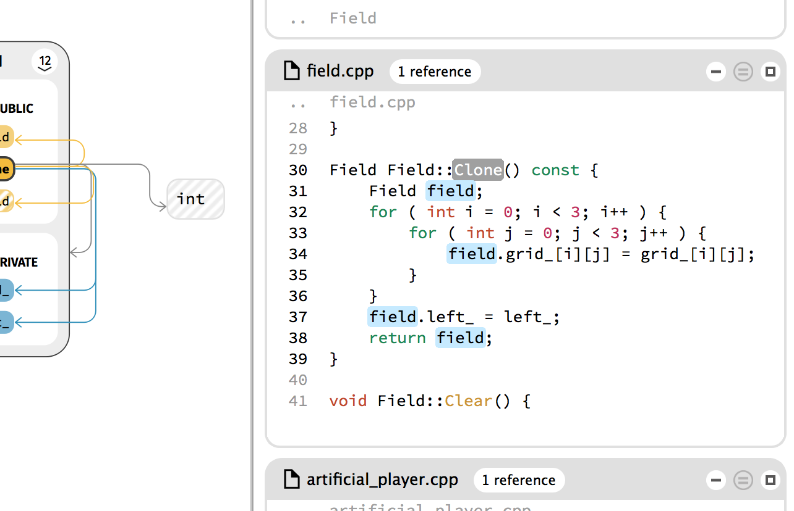
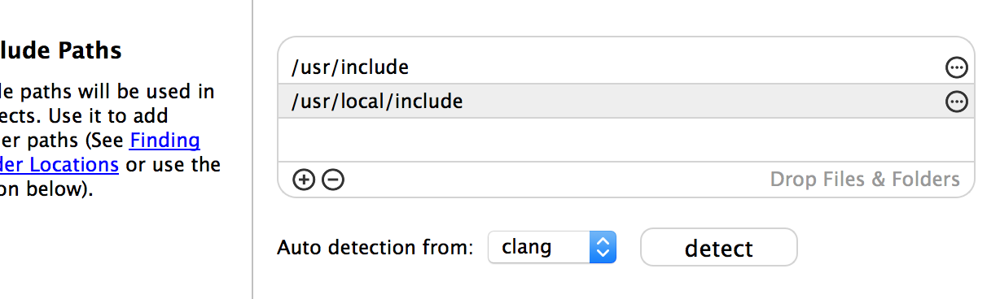
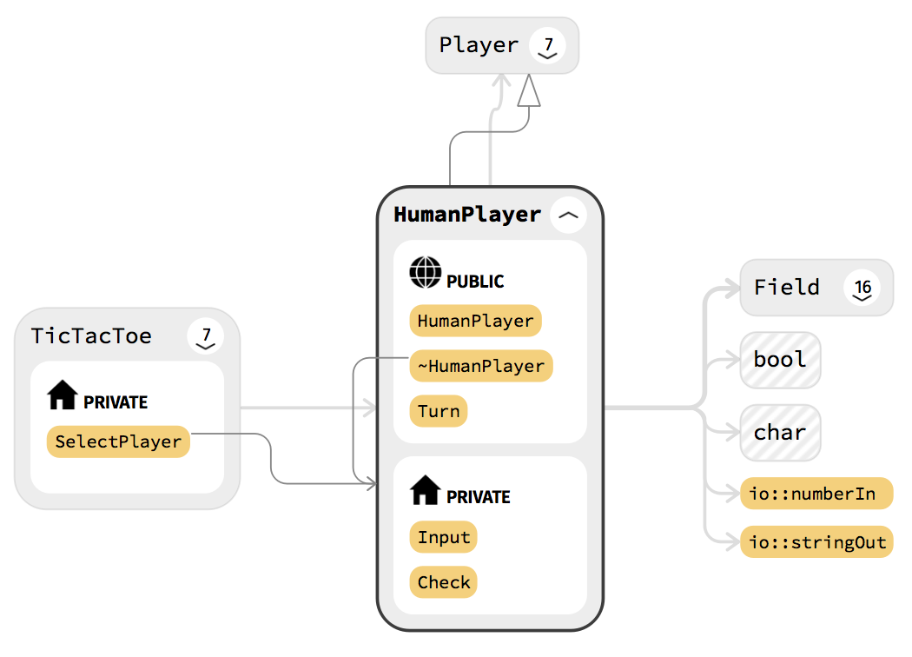

We spent a lot of time developing the last couple weeks and made some major improvements to [Coati](https://www.coati.io/)'s performance and user interface. With this release we hit another big milestone on our journey to create a simple source explorer that can handle even the biggest code bases.

This post shows what changed with our new release and gives a small roadmap towards the next release.

<figure>
	
	<figcaption>Screenshot of the current user interface.</figcaption>
</figure>

### New in this Release:

* Greatly increased search autocompletion speed
* Reduced duration of: project loading, file clearing, overview display, graph drawing
* Added analysis for local variables
* Added auto detection for global include paths for gcc, clang and VS
* Support temporary test licenses
* Many improvements on the UI

You can download Release 0.6 [here](https://www.coati.io/downloads/). The full changelog is available [here](https://github.com/CoatiSoftware/CoatiBugTracker). We will outline a few features new to this release below.

### Test Licenses

Starting with this release, we also support temporary test licenses. If you want to test Coati please write us an e-mail to support@coati.io

### Local Variables

We added local variables to our analysis and save all occurences of the variable in our database. The user can see where a local variable is used within the function or method scope by hovering or clicking the variable. The variable can be deselected by clicking into empty space.

<figure class="bordered">
	
	<figcaption>Local variable selected with a blue highlight.</figcaption>
</figure>

### System Include Path detection

So far it was necessary for users to manually find the system include paths their compiler is using and add them to the preferences in Coati. Now Coati will automatically detect if one of the compilers clang, gcc or VS is available via commandline. When the user presses detect the system include paths will be retrieved from the compiler output and added to the list.

<figure class="bordered">
	
	<figcaption>System include path detection within the project wizard.</figcaption>
</figure>

### Cleaner Design for Aggregation Edges

Aggregation edges bundle relationships between children of classes together. These edges used to show how many edges are bundled with a number displayed on the edge. This design turned out to be bad when the graph is big. The numbers where often occluded and the straight connections looked messy. The new design draws aggregation edges similar to other edges. Their thickness increases with each power of 10 in number of bundled edges. The number of bundled edges is shown in the tooltip when hovering the aggregation edge.

<figure class="half bordered">
	
	
	<figcaption>Old aggregation edge design left, new design right.</figcaption>
</figure>

## Roadmap

We will release new Coati versions approximately every 5-6 weeks. Following features are planned for our next release:

* Further increasing analysis and UI performance
* Proper analysis dialog
* Full text search in the search field

Besides that we already make first steps towards supporting Java.

