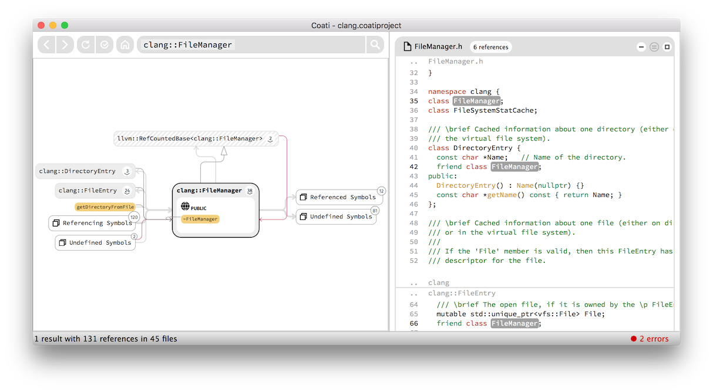
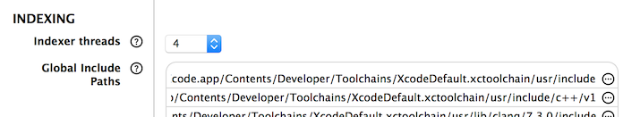
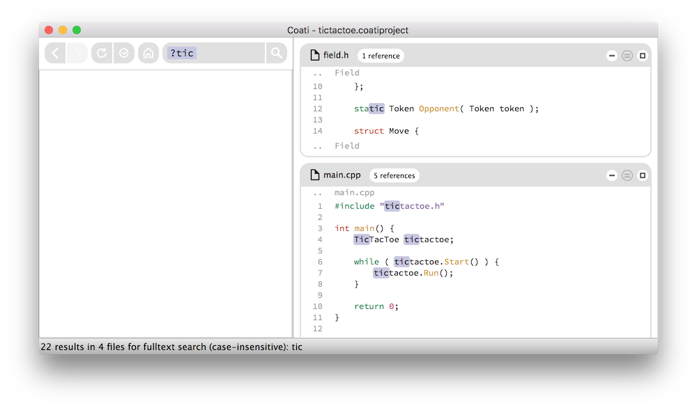
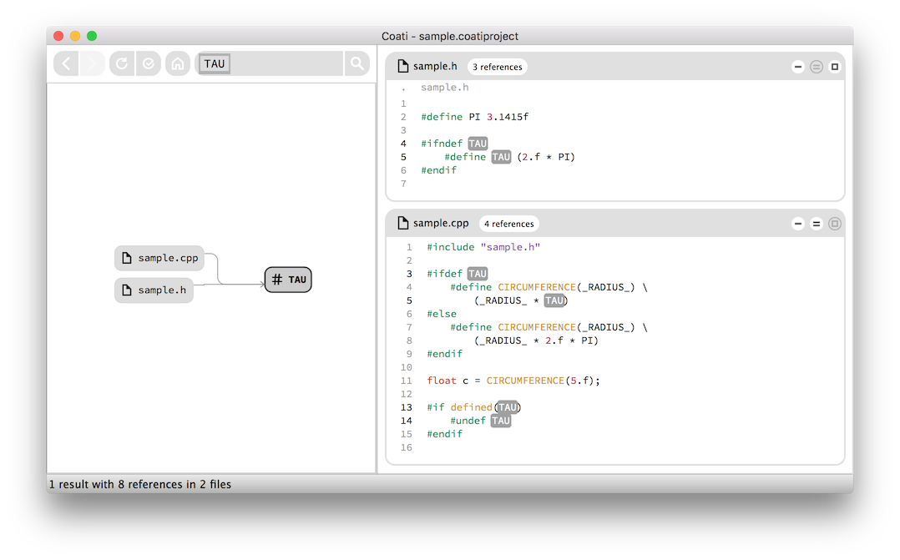

[Coati](https://www.coati.io/) Release 0.7 is a big step forward in shortening project indexing time. We finally introduced multi-threaded indexing, which resulted in a speed-up of about 300% on our systems. Besides some bigger features like full text search and a VIM plugin, we also worked on easier project setup and increased UI performance.

You can download Release 0.7 [here](https://www.coati.io/downloads/). The full changelog is available [here](https://github.com/CoatiSoftware/CoatiBugTracker). We will outline a few features new to this release below and give a roadmap towards the next release at the end.

<figure>
	
	<figcaption>Simpler graph node bundling shown on `clang::FileManager`.</figcaption>
</figure>

### New in this Release:

* Added multi-threaded indexing
* Updated to [Clang 3.8](http://clang.llvm.org/)
* Added full text search to search bar
* VIM plugin
* Better macro handling
* Improved UI performance of graph and code views
* Improved graph node bundling
* Updated project setup: added Exclude Paths, removed Header File Extensions

### Multi-threaded Indexing

Coati now supports multi-threaded indexing, which speeds up indexing by about 300% on our systems. The number of threads is set to 4 per default and can be changed with the setting "Indexer Threads" in the [Preferences](https://www.coati.io/documentation/#PreferencesWindow). Please note that the number of threads can't be changed while indexing.

<figure class="bordered">
	
	<figcaption>Indexer Threads setting in the Preferences window.</figcaption>
</figure>

### Full Text Search

The search bar supports case-sensitive and case-insensitive [full text search](https://coati.io/documentation/#Fulltextsearch) in all analyzed source files now. To start a full text search begin your query with the a `?` character. This defaults to a case-insensitive search. Use `??` for a case-sensitive search.

<figure>
	
	<figcaption>Case-insensitive full text search.</figcaption>
</figure>

Please note that we are initializing the full text search index when executing the first full text search. This might take a couple seconds for big projects, but greatly reduces search time afterwards.

### VIM plugin

We extended our integration into widely used code editing tools by providing a VIM plugin. It's available in our open-source [vim-coati](https://github.com/CoatiSoftware/vim-coati) repository on GitHub. For the future we plan to put our other plugins into public repositories as well.

### Improved Macro Handling

We extended our macro handling to show all places a macro is used in all indexed files. This includes uses in any of the directives `#define`, `#undef`, `#ifdef`, `#ifndef`, and `#if defined()`, as well as expansions within other macros.

<figure>
	
	<figcaption>Different types of macro occurences.</figcaption>
</figure>

### Updated Project Setup

Our project setup has seen a couple changes due to feedback gathered from our users and OpenSource projects we tested Coati on:

* Now header files are only indexed when included in a source file.
* The **Header File Extensions** setting was removed. Now any file that is within the Project Paths and included by a source file is indexed.
* An **Exclude Paths** setting was added to avoid indexing of files or directories, although they are within the Project Paths. The setting is located in the Advanced Settings of the [Edit Project Window](https://coati.io/documentation/#EditProjectWindow).
* We extended the UI for [**project setup from Compilation Database**](https://coati.io/documentation/#CreateAProjectFromCompilationDatabase) by adding a separate step for project name and location. We explain that the project stays up-to-date with the `compile_commands.json` file on refresh. Additional settings, like Include Paths, were moved to the Advanced Settings, so they can still be used when necessary.

## Roadmap

We will release new Coati versions approximately every 5-6 weeks. For the next release we mainly plan to fix known issues in the UI:

* Fix font size and window size issues on different platforms.
* Fix UI for HighDPI screens.
* Show overlay on graph and code view for slow queries.
* Proper indexing dialog.

If you have any questions or ideas please leave a comment below.

