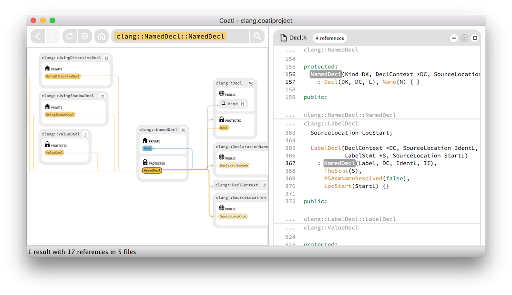
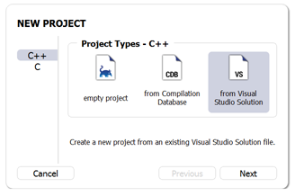
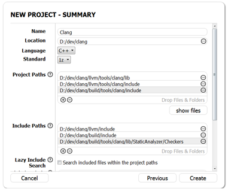
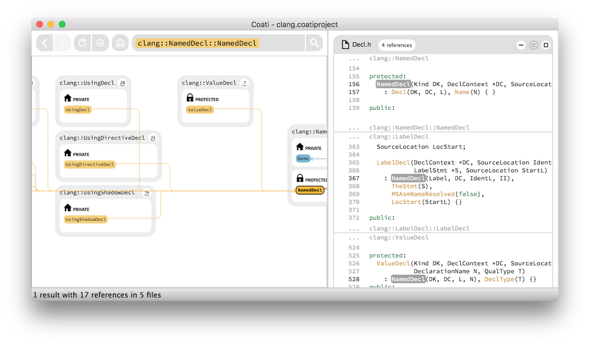
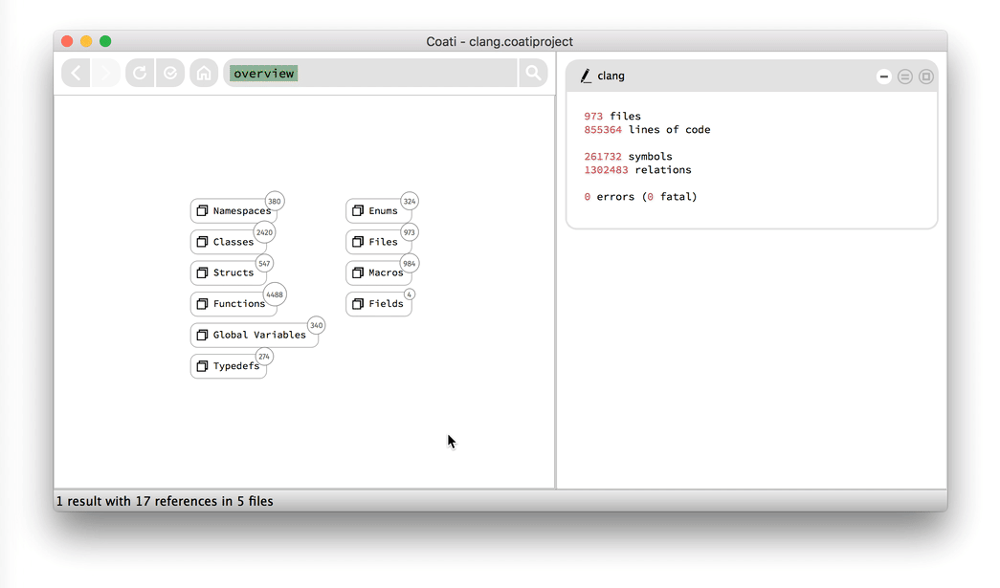

In this post I'm gonna use [Clang](http://clang.llvm.org/) as a sample project for [Coati](https://www.coati.io) to chew on. Clang is an open source compiler front-end for the LLVM compiler. Clang is responsible for all the lexing and parsing related tasks, but does not perform any code optimizations or bytecode generation in the compiler context. Clang's current version is 3.8 which roughly consists of a million lines of code.

<figure style="text-align:center;">
	<a href="../images/indexing_clang_with_coati_using_clang/clang_named_decl.png">
		
	</a>
	<figcaption>The clang::NamedDecl constructor displayed in Coati.</figcaption>
</figure>

We publicly launched Coati, a Clang-based interactive source explorer for C/C++, in February 2016 and have received a lot of positive feedback from our early customers since. Some software developers were sceptical though and one question remained the most prominent:

> Does Coati really work on a **large** code base?

Four months ago the honest answer to this question used to be: not quite. But with the [release 0.6](https://www.coati.io/blog/release_0_6/) and our latest [release 0.7](https://www.coati.io/blog/release_0_7/) we heavily improved on indexing and UI performance and scale to much larger projects now. I'm writing this blog post to illustrate what it's like to unleash Coati on a large code base.

### The problem with Software Documentation
Clang has a *really* good [documentation](http://clang.llvm.org/doxygen/) (really as in "really really"). Generated by [Doxygen](http://www.stack.nl/~dimitri/doxygen/) it provides useful descriptions for most of the methods you will ever encounter while working with Clang. But sometimes everyone has a question that even a really good documentation cannot answer that easily.

While researching for this post I encounterd [this question](http://stackoverflow.com/questions/37305054/how-should-i-create-a-clang-nameddecl-instance/37306326#37306326) on StackOverflow. A user asked how to create an instance of the `clang::NamedDecl` class. When looking for the classes' constructor in the [documentation](http://clang.llvm.org/doxygen/classclang_1_1NamedDecl.html#pro-methods) I found it listed as a protected member function --- which means that the constructor cannot be called from just everywhere throughout the code base. But this class would be quite useless if it wouldn't be instantiated anywhere. So I was wondering *where* the constructor actually gets called. This is something I couldn't find out by just looking at the documentation. I needed to look at references in the source code instead. So lets use this question as an excuse to throw Coati at Clang and get an answer once and for all.

### Project Setup for Clang
If you want to tag along, please note that first of all you will need to setup the Clang & LLVM repository for building on your system. Just follow the [Getting Started Guide](http://clang.llvm.org/get_started.html).

Fortunately setting up the Coati project for indexing Clang is quite simple, because Clang is using [CMake](https://cmake.org/). Good news for all the lazy programmers out there: we can let Coati create the project automatically. There are several ways to do this. All it needs are the project's build instructions. Clang is part of LLVM which also contains a CMakeLists file. This is a meta format that can generate these build instructions (e.g. a [Visual Studio](https://www.visualstudio.com/) solution or a [makefile](https://www.gnu.org/software/make/)). So how does it work with Coati?

#### On Windows
I'm working on a Windows machine where the setup process is very straight forward: I can just use the CMakeLists file to generate a Visual Studio solution (this does even work if there is no Visual Studio installed). After clicking the *New Project* button in Coati I select *from Visual Studio Solution* and after quickly checking the prefilled summary screen I'm done.

<figure style="text-align:center;">
	<a href="../images/indexing_clang_with_coati_using_clang/llvm_setup_from_vs_1.png">
		
	</a>
	<figcaption>Choosing to create a project from Visual Studio Solution.</figcaption>
</figure>

#### On Mac / Linux
My co-workers are working on a Mac and Linux. They can use that same CMakeLists file to generate a *Compilation Database* file as described [here](https://www.coati.io/documentation/#CreateAProjectFromCompilationDatabase), by setting the `CMAKE_EXPORT_COMPILE_COMMANDS` flag for CMake. The Compilation Database knows which source files need to be compiled, where to look for all the included headers and the necessary compiler flags. After the `compile_commands.json` file was generated, they can select the *from Compilation Database* option in Coati's project setup. Everyone who doesn't use CMake might still be able to successfully create a Compilation Database by using [Bear](https://github.com/rizsotto/Bear).

#### Manual setup
For the sake of this post I decided not to use any of the automated approaches. Instead I wanted to setup the project manually. As I only needed to look at Clang and leave the rest of LLVW untouched this was rather simple. First I added all the *Project Paths* I wanted Coati to analyze:

```
Project Paths:
  <clang-llvm-dir>/llvm/tools/clang/lib
  <clang-llvm-dir>/llvm/tools/clang/include
  <clang-llvm-dir>/build/tools/clang/include
```

Please note that I also added some paths called *include* to the project paths above. Even though these paths only contain header files I still wanted Coati to know that once it encounters a header file located in one of these folders it should index it. Furthermore we need to add the following rows to the *Include Paths*. This tells Coati where to look for additional includes that should not be indexed.

```
Include Paths:
  <clang-llvm-dir>/llvm/include
  <clang-llvm-dir>/build/include
  <clang-llvm-dir>/build/tools/clang/lib/StaticAnalyzer/Checkers
```

Hint: You can use these settings when setting up your own Coati project for Clang if you don't have a Compilation Database or a Visual Studio solution at hand right now.

<figure style="text-align:center;">
	<a href="../images/indexing_clang_with_coati_using_clang/clang_manual_setup.png">
		
	</a>
	<figcaption>Summary of manual Clang project setup in Coati.</figcaption>
</figure>

### Using Coati on Clang
After Coati completes indexing (taking about 1 hour on my three year old notebook) I am able to freely browse the code base of Clang. So let's get back to that stackoverflow [question](http://stackoverflow.com/questions/37305054/how-should-i-create-a-clang-nameddecl-instance/37306326#37306326) mentioned before.

<figure style="text-align:center; cursor: pointer;">
	<div class="content-toggle">
		<div style="position:relative;">
			
			<div style="background-image:url(../images/play_button.png); width:100px; height:100px; position:absolute; left:50%; top:50%; margin: -50px 0 0 -50px;"></div>
		</div>
		<div>
			
		</div>
	</div>
	<figcaption>Finding all calls to clang::NamedDecl constructor.</figcaption>
</figure>

When looking at the constructor of `clang::NamedDecl` I can actually see that there are calls to this member function. These calls originate from the constructors of derived and more specific classes. So specifying a protected access for the constructor seems to be part of a greater plan --- this mechanism prevents the user (i.e. the programmer that wants to use this class) from instantiating `clang::NamedDecl` directly. This means that everyone is forced to instantiate a more specialized derivation (with a public constructor) instead. With this greater picture on screen I was able to answer the question quite easily.

This is where Coati proves to be a very powerful tool. Once a project is indexed, you can quickly find any symbol in the search field. The graph visualization then provides an overview of how the symbol relates to other symbols in the context of the **whole code base**. The code view finally shows all source locations of that symbol, providing all details of the implementation.

### Tribute to Clang
This is a shout-out to all the contributors of the Clang project. You are doing an amazing job! Allowing everyone to use your code has greatly helped us starting and developing Coati. As a thank you we want to hand out a **free license key** to every contributor of the Clang project. Just give us a quick note by writing to **support@coati.io**.

### Remarks
For everyone else: If this article hasn't convinced you yet and you want to test Coati on your own projects, write us an e-mail to **support@coati.io** and ask for a test license.
