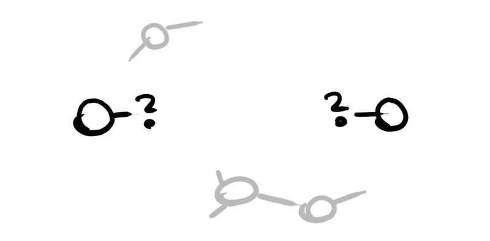
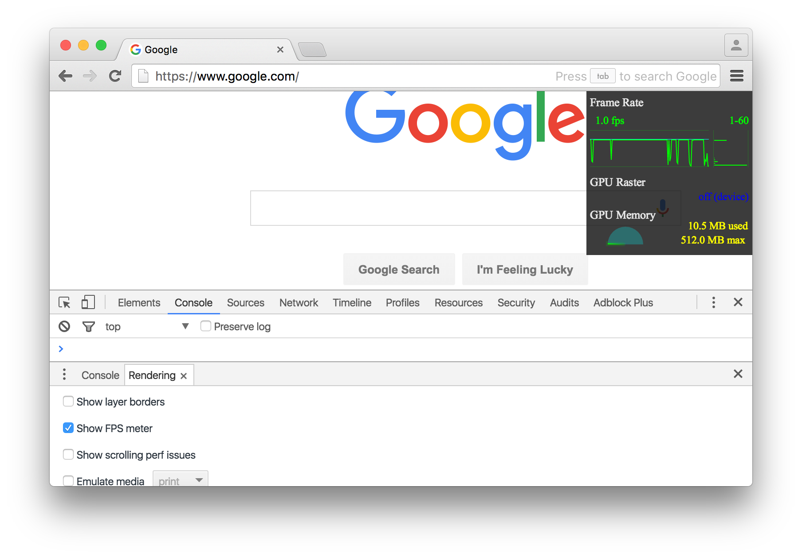
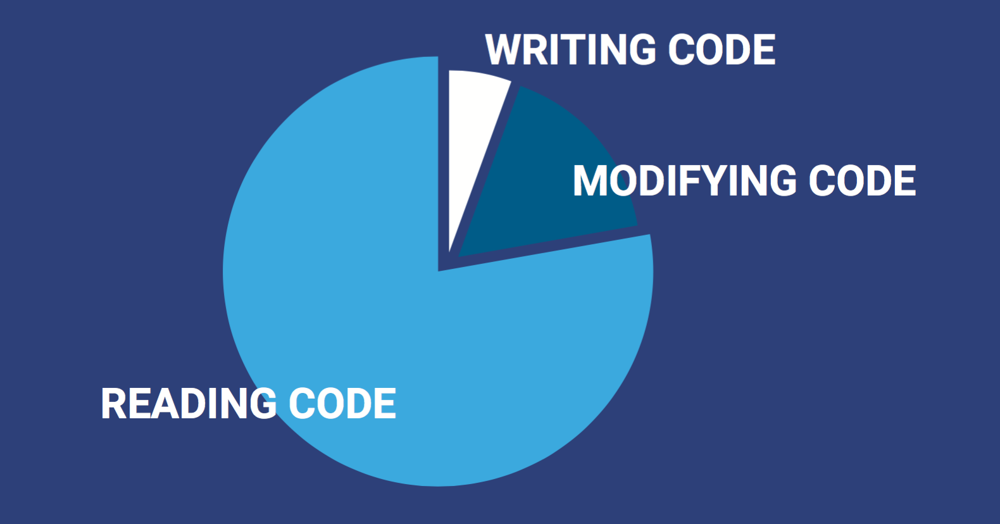
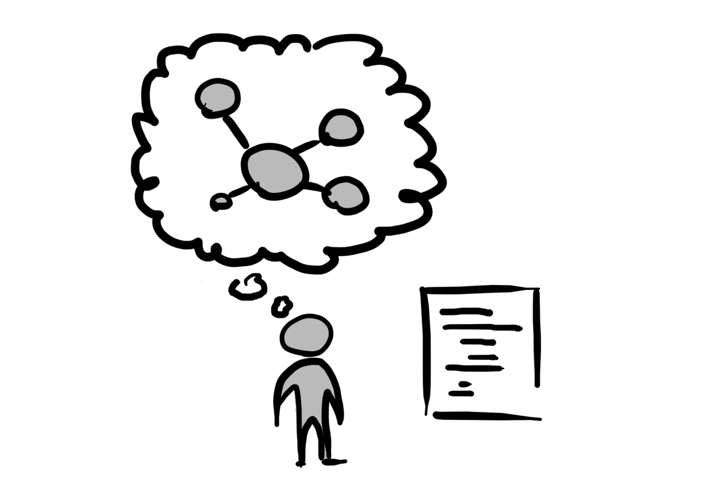
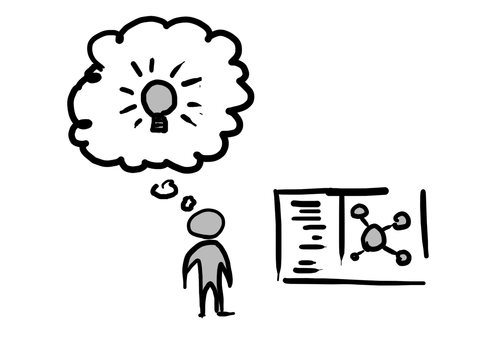
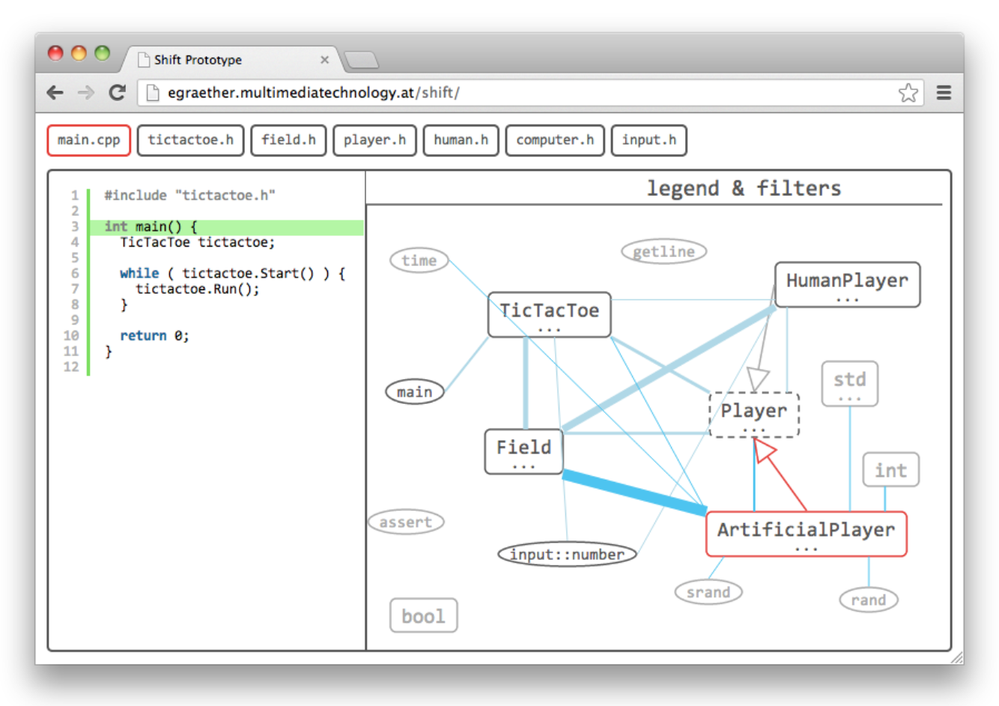
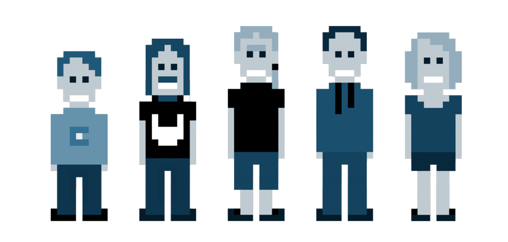
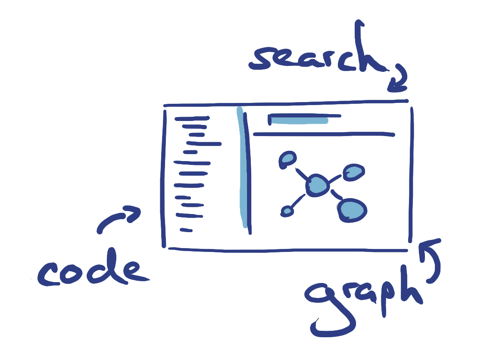
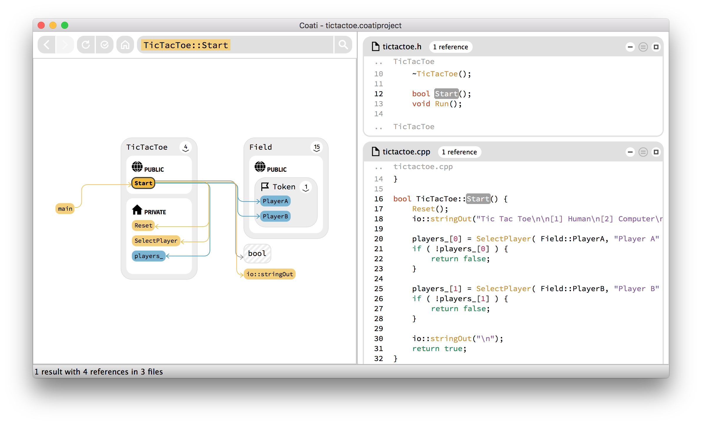

[Coati](https://coati.io) is a developer tool for fast and efficient source code navigation and exploration. This is the story of how an internship at Google inspired me to start working on a tool for reading source code. I will show early prototypes and explain how the user-centered design process contributed in improving and refining the user interface. This is a rather detailed report. If you prefer a shorter summary, please visit our [front page](https://coati.io).

# Interning in the Google Chrome Graphics Team

In fall 2012, after a tedious application process, I turned out to be one of the lucky students to get an internship at Google Mountain View, California. It was the last year of my undergraduate degree at [Salzburg University of Applied Sciences](http://www.fh-salzburg.ac.at/en), where I majored in [game development](https://multimediatechnology.at/). I had worked a lot with computer graphics, was interested in Human Computer Interaction, I knew C++ and JavaScript pretty well, so this internship at the Google Chrome Graphics Team was the perfect fit.

<figure>
	
	<figcaption>Chrome logo on the wall in front of the office in Mountain View.</figcaption>
</figure>

The first task I got assigned seemed very simple, I almost felt like getting [FizzBuzzed](http://c2.com/cgi/wiki?FizzBuzzTest), but my supervisor assured me that this won't be easy. The graphics team had implemented a frame rate meter for Chromium that shows how often the webpage is repainted. At the time the only way for displaying it was via the command line flag [`--show-fps-counter`](http://peter.sh/experiments/chromium-command-line-switches/#show-fps-counter). My task was adding a checkbox to the settings of the [Chrome DevTools](https://developer.chrome.com/devtools), to make the FPS meter easier to access and also adjustable per tab. I figured	 out pretty fast in which file I had to add the checkbox and I also knew where in the compositor's HUD-Layer the FPS meter got displayed. All I really needed to do was send a boolean from one place to the other. How hard can it be? I should get this to work in 1-2 hours tops and have it finished within a good workday.

# Being a Chromium developer

As you might have already guessed, this took me much longer than I expected. The Chromium codebase is huge and while my supervisor knew a lot about Chromium's compositor, which was the main part the team was working on, he couldn't really tell me much about the DevTools and the relevant parts in-between. He showed me the tools he uses for searching within the code base: [grep](https://www.gnu.org/software/grep/manual/grep.html), [git-grep](https://git-scm.com/docs/git-grep) and [Chromium Code Search](https://cs.chromium.org/), an online source explorer where the whole Chromium codebase is indexed.

<figure>
	
</figure>

I realized pretty quickly that I had not the slightest chance of comprehending Chromium's massive architecture. The documentation was not really helpful, as most of it was too high-level for my usecase. I also learned that although the developers of the team were very friendly, they are not too excited about constantly getting interrupted by some intern asking about the codebase. So I spent most of my time on reading source code and drawing scribbles of how classes are composed and where certain methods get called.

After around 2-3 days I finally had a very hacky implementation working. I didn't bother about thread synchronisation, removed const at a couple places and didn't know that I actually worked on two code bases at once, being [Chromium](https://www.chromium.org/Home) and [WebKit](https://webkit.org/) (now [Blink](http://www.chromium.org/blink)). After some initial feedback from my supervisor, the code review process started and after I rewrote the whole implementation twice, I could finally land the two patches ([1](https://codereview.chromium.org/11189037/), [2](https://bugs.webkit.org/show_bug.cgi?id=99660)) and finish my task. In the end the whole process lasted about one month.

<figure>
	
	<figcaption>The checkbox in Chrome's DevTools for toggling the FPS meter.</figcaption>
</figure>

# Software developers spend more time reading than writing source code

In the next meeting my supervisor congratulated me for my great work. I was baffled. To me this whole task took way too long. I spent roughly 95% of my time reading source code. That's not productive I said and asked him how I could improve. He calmed me down and told me that I was actually much faster than he expected. He assumed this task would take up my whole three month internship. I was surprised to hear that. Technically I wrote less than one line of code per hour of work time, which did not sound very productive. "Look around" he said, "everyone in here is reading source code most of their time. That's part of the job on such a big software project. It takes about two months for a new developer to actually become productive here."

<figure>
	
	<figcaption>What developers spend their time on (chart based on <a href="https://blog.codinghorror.com/when-understanding-means-rewriting/">"When Understanding means Rewriting"</a>)</figcaption>
</figure>

This was completely new to me at the time, but it turns out that it's a common known fact among software developers, that more time is spent reading than actually writing source code. Peter Hallam wrote a [blog post](https://blogs.msdn.microsoft.com/peterhal/2006/01/04/what-do-programmers-really-do-anyway-aka-part-2-of-the-yardstick-saga/) about this and argues that roughly 70-78% of a software developer's time is spent on understanding the existing implementation. This inspired Jeff Atwood to write a [post on Coding Horror](https://blog.codinghorror.com/when-understanding-means-rewriting/) that further questions whether a developer should read source code at all, or just start rewriting from scratch. Since rewriting is not really an option for new developers on Chromium, the only option is reading source code.

# How do you read source code?

If so much time is spent on reading source code, what tools are available for this task? I started asking developers on the team and friends from university how they read code (There are also threads on [Hacker News](https://news.ycombinator.com/) once in a while regarding this topic: [1](https://news.ycombinator.com/item?id=9784008), [2](https://news.ycombinator.com/item?id=8263402)). It turns out there is no common strategy for exploring source code. Some developers use grep, some a debugger, others draw diagrams. Most of them just use their source code editor and whatever features it offers. But while source code editors are great for efficiently writing source code, they are not made for quickly retrieving information about the implementation.

Chromium Code Search is a big step in the right direction. By showing all occurences of a certain symbol, it already offers more functionality than most developer tools. But you still need to figure out what relationships a symbol has to other symbols by reading each line where the symbol appears. Programming languages are designed to be dense and expressive, which makes it hard to detect information at a glance. As a software developer you always have to deal with all the details of the source code. You spend your time with going from file to file searching for small pieces of information and slowly build up the mental model of a code path.

<figure>
	
	<figcaption>Building up a mental model while reading source code takes time.</figcaption>
</figure>

I started to observe myself while reading source code. What are the things I'm usually interested in when looking at a class or a function? Most of the time I just wanted to know very simple things. Where is a class instantiated? Which classes implement a certain interface? Where is this method called? Finding this information by reading lines and lines of source code takes a lot of time. The computer knows how the programming language works and thereby already knows where and how all symbols are used within the whole codebase. Why can't I just ask it those questions? Why can't I just enter a search query for whatever I wanted to know and have everything laid out in front of me?

# Visual Navigation through Static Analysis

After a couple of weeks I came up with an idea to address this problem: interactive visualization of the source code's structure. This idea was not really new, I later even learned it was almost as old as programming. I imagined a tool that statically analyzes the source code and thereby figures out which symbols exist and how they relate to each other. This semantic information is then used to create a graph visualization with symbols as nodes and relationships as edges. The visualization is placed next to the source code like a map. By clicking on any node or edge you could instantly see to which line in the source code it belongs. This would allow you to quickly get an overview of all existing symbols, while still being able to access all the details of the implementation. Super simple!

<figure>
	
	<figcaption>A visual representation of the source code's structure offloads your brain.</figcaption>
</figure>

I kept this idea in mind and talked to some people about it, which produced mixed results. During my internship I continued to work on Chromium's developer tools, I got to know the DevTools and DevRel teams, and also authored an article on the [developer blog](https://developers.google.com/web/updates/2013/02/Profiling-Long-Paint-Times-with-DevTools-Continuous-Painting-Mode). I am very happy that I had this opportunity to work in a highly professional environment at Google, where I learned a lot about writing robust and maintainable code.

# Research on Software Visualization

I returned to Salzburg in order to finish my undergraduate degree. Part of it was writing a thesis. I was free to choose any topic, so I decided to work on my idea. I wanted to create a prototype and test it on a few participants in a small qualitative user study. At the time I had already some experience in the field of Human Computer Interaction due to an earlier internship at the [RMIT Exertion Games Lab](http://exertiongameslab.org/), so I was well prepared for doing some research.

I started by reading a couple of books and papers on visualization methods, human visual perception and the history of software visualization. I still remember how I came across one paragraph, that I found especially intriguing. It gives a pretty simple explanation on why software visualization is not widely used within computer science yet:

> "Visualization is heavily used in mechanical engineering, chemistry, physics, and medicine. Computer scientists have developed sophisticated systems to produce visualizations for these disciplines. Astonishingly enough, computer scientists have only made little use of visualization as a tool for designing, implementing and maintaining software. Even worse, many consider themselves as theoreticians and disregard visualization – an etymologically wrong dichotomy. Programmers tend to adapt to the level of representation provided by the computer, instead of adapting the computers representations to their perceptive abilities."
([Dhiel 2007, 2](http://www.springer.com/in/book/9783540465041))

# A first interactive prototype

I didn't actually implement any static source code analysis for my first prototype. I just created a simple Tic-Tac-Toe game in C++ and analyzed it manually. The prototype was built in JavaScript with [Raphaël](https://dmitrybaranovskiy.github.io/raphael/) and [Syntax Highlighter](http://alexgorbatchev.com/SyntaxHighlighter/). It featured an interactive graph visualization next to a simple code view. The graph visualization was more or less designed after the renown Visual Information Seeking Mantra, which stayed a guiding principle for the user interface design of Coati:

> “Overview first, zoom and filter, then details-on-demand”
([Shneiderman 1996](http://ieeexplore.ieee.org/xpl/articleDetails.jsp?arnumber=545307))

The graph visualization showed all the symbols of the project and their relationships. When clicking any node the corresponding declaration of that symbol is shown in the code view. Same for edges and their corresponding statements. Class nodes initially hide their members and can be expanded by clicking the ellipsis (...).

<figure>
	
	<figcaption>Image of the first prototype. Different node and edge types were displayed with different shapes.</figcaption>
</figure>

The prototype had some obvious flaws, but it was good enough for fulfilling its one purpose: To test whether an interactive visualization can help in understanding source code. After three years of iterating and polishing, this original prototype has almost nothing to do with how Coati works today. However, if you want to take a look, I made it available [here](../media/prototype_one/).

# Most important: Talk to your Users

My user study had twelve participants, all more or less experienced software developers. I started by asking them about their workflow and what tools they use. After I explained them how to use my prototype, the main part of the study began. Participants had to retrieve information from the Tic-Tac-Toe game's source code by picking questions like:

* Which classes derive from the class Player?
* What is the purpose of the member Field::grid_?
* Why does the game restart after a round is finished?

(We still use these questions in our [Coati trial challenge](https://www.coati.io/trial) and the Tic-Tac-Toe source code comes with every download.)

Some of these questions were easy to solve with the prototype, others were hard. The participants could only use the limited functionality the prototype offered. I urged them to [think aloud](https://en.wikipedia.org/wiki/Think_aloud_protocol) while solving the questions. The study ended with a short open interview to gather feedback, which resulted in some very important insights:

* Participants reported that the graph visualization did indeed help in answering some questions, but it got very confusing as soon as there were too many classes expanded.
* I noticed that some participants tried clicking symbols in the code view as well, others suggested it during the feedback interview.
* Some participants were looking for a search feature or later proposed that it should be possible to somehow find every symbol.
* Most participants had experienced being lost in source code themselves at one point and stated that they would be happy about a properly working tool of that kind.

# Finding the team and a place to work

Alright, this was getting interesting. How can I create this tool properly? The master's degree that continues my undergraduate degree allows students to work on a big two year project. This was perfect. I had some friends that also continued with a master's degree, so it was not to hard to get a team of four software engineers together. Eventually we also found a graphic designer. The university even gave us a small project room, that we could use for working between our courses.

<figure>
	
	<figcaption>Team Coati.</figcaption>
</figure>

# The next iteration: Search, Graph, Code

Drawing from the feedback of the first user study we went back to the whiteboard and rethought the concept. We designed and developed another prototype, with some key improvements to the first one:

* Symbols could be activated to show all relevant information in each view.
* Every symbol could be found and activated via a small search field with auto completions.
* The graph visualization only showed the active symbol and all relationships it has to other symbols.
* Lines in the code view could be clicked to activate symbols.

<figure>
	
	<figcaption>Image of the second prototype. It had a search field with autocompletions and an interactive code view.</figcaption>
</figure>

If you want to test the second prototype, I also made it available [here](../media/prototype_two/).

We conducted another user study with this refined prototype and yielded much better feedback. This time the participants really saw a big benefit in a tool like this. They still demanded more features, but we had our proof of concept. Our tool will consist of three main components:

* **search field** for finding symbols
* **graph visualization** for exploring the relationships
* **code view** for all the details of the implementation

<figure>
	
	<figcaption>Coati concept scribble showing the three main components: search, code, graph.</figcaption>
</figure>

# Developing with C++ and Clang

Before we could actually start working, we had to take a careful look around and check whether our conceptualized tool did not exist already. We looked into all kinds of developer tools like IDEs, UML tools, documentation software, plugins, extensions and even visual programming languages. We found a lot of tools based on static analysis, some using visualization, some having autocompletions, but nothing that really put all these great features together into one simple user interface. We defined key aspects that were important to us and also set Coati apart from other tools:

* **simple**: Every developer should be able to pick it up and start using in a couple of minutes.
* **independent**: It shouldn't matter what platform or tools a developer already uses.
* **fast**: It should be highly responsive without waiting times for results.
* **offline**: There shouldn't be a need to upload source code or having a constant connection to the internet.
* **companion**: It should expand the tool chain of a developer, without replacing any tool. There are already lots of great source code editors out there, there is no need of building another one. Instead we allowed Coati to communicate with source code editors, please have a look at our [plugins](https://www.coati.io/documentation/#CODEEDITORPLUGINS).

One of the bigger open questions was which programming language to write our tool in and which ones to support. Since static analysis doesn't work equally well on every language, we had to choose a typed language. We decided in favor of C++. C++ is fast, works well on cross-platform, has good cross-platform libraries, is widely used in application development and we knew it pretty well ourselves. We used [Clang LibTooling](http://clang.llvm.org/docs/LibTooling.html) for our static analysis, which also allowed us to easily support both C and C++. If you are Clang developer and you want to use Coati on Clang, please read our [recent blog post](https://www.coati.io/blog/indexing_clang_with_coati_using_clang/).

We are already expanding our language support and will soon also offer Java. We should have a build for testing available soon. If you want to become a Coati tester for Java, please write an e-mail at [mail@coati.io](mailto:mail@coati.io?Subject=Java%20tester) with subject "Java tester".

# Making Coati available to developers

Fast forward two years. We didn't want our project to go to waste after our master's degree finished, so we decided to keep at it. By now Coati has become a small startup and we are working on making a living with our tool. We are a happy member of the [FH-Startup center](http://www.fh-salzburg.ac.at/fhstartup/ziele-mission/), received funding by the [Austria Wirtschaftsservice](http://awsg.at/Content.Node/en/index.en.php) and were recently accepted to the new [Startup Salzburg Factory](http://www.startup-salzburg.at/en/startup-services/startup-salzburg-factory/) incubator.

Our website launched in spring, which marked the start of our public beta. We currently offer Coati as pre-release version Coati 0. Licences are still available at an [early-bird rate](https://coati.io/buy-license), but won't be for much longer. During the last weeks, our first customers have helped us a lot in adapting Coati to the requirements of real world software development. They have also demanded lots of new UI features, more than we currently find time to implement.

<figure>
	
	<figcaption>Coati's current user interface displaying the Tic-Tac-Toe game from the prototypes.</figcaption>
</figure>

By now, I have been using Coati for my development work for more than half a year and it greatly influenced my workflow. At first I only used it occasionally, when I really had trouble understanding what one of my colleagues wrote. Now I have Coati constantly open on my second screen and use it for most quick look-ups on the codebase. I guess I already crossed the point of no return.

Among other things I use Coati for:

* Inspecting the implementation when I start a new task.
* Exploring dependencies between types and functions.
* Finding where an interface is implemented and which methods get overridden.
* Following code paths from method to method.
* Figuring out what can be simplified or removed when refactoring.

Read more about Coati's features on our [front page](https://www.coati.io/#how-it-works).

Coati has also simplified the communication within our development team. Before Coati, we often spent lots of time arguing about what side-effects changing a certain implementation might have. Now we just look at the problem with Coati and immediately see if problems arise. Coati allows us to see our code base from a bird's-eye view, which makes it easy to explore all symbols and their dependencies.

Over the past months Coati has become a big [time saver](https://xkcd.com/1205/) for us. I'm proud of what we have accomplished already and I'm excited for some great features just waiting to be implemented. That was my story on Coati, I hope you enjoyed it!

If you want to take a look at Coati's user interface now, go ahead and download our [trial](https://www.coati.io/trial). We are happy if you leave a comment!
