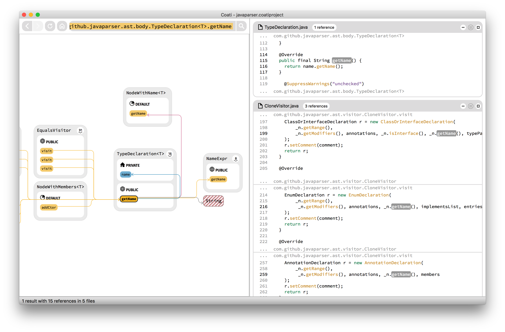
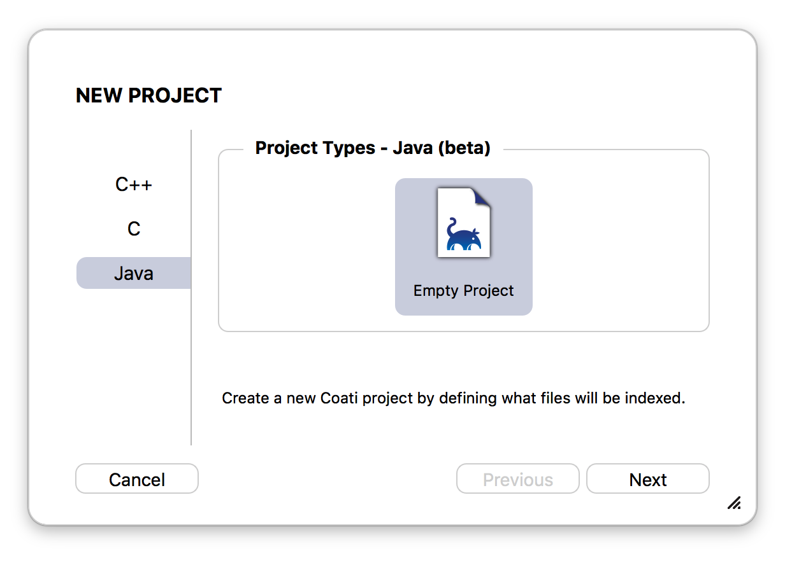
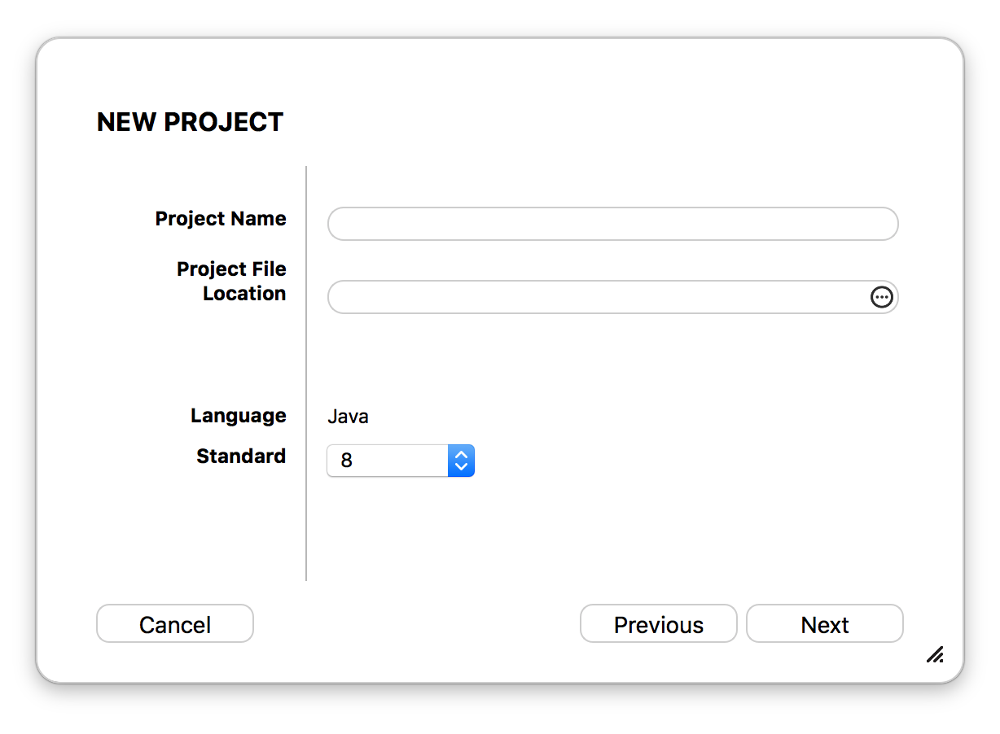
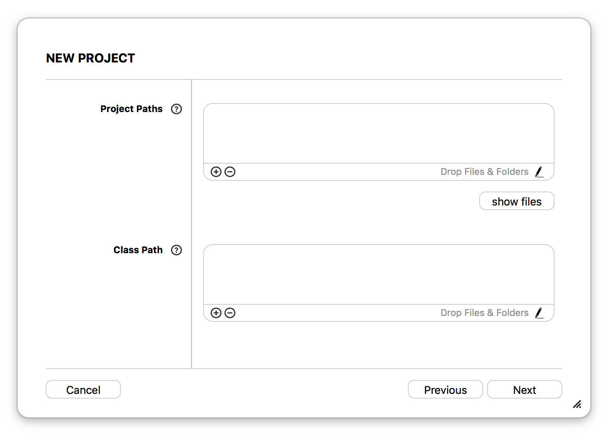
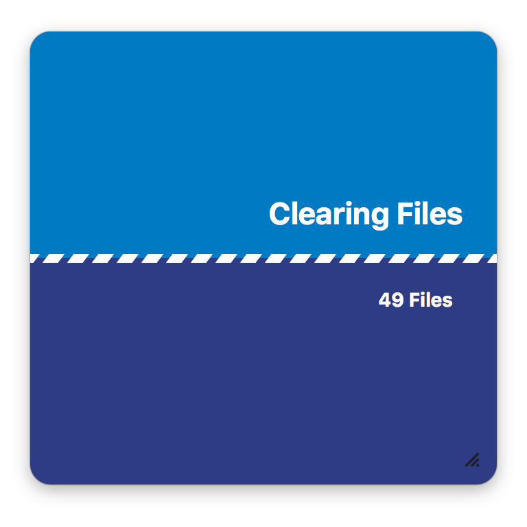
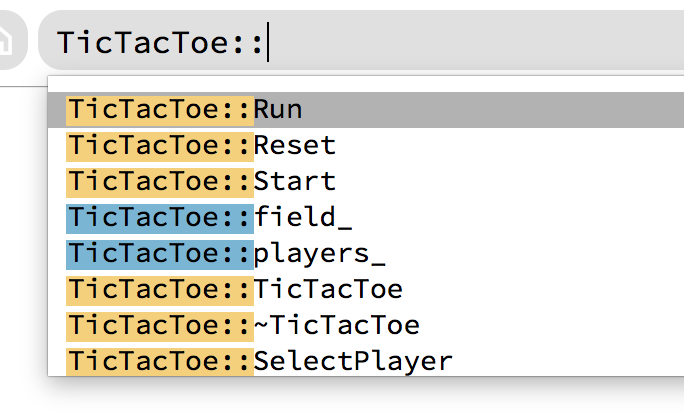
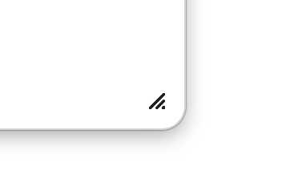
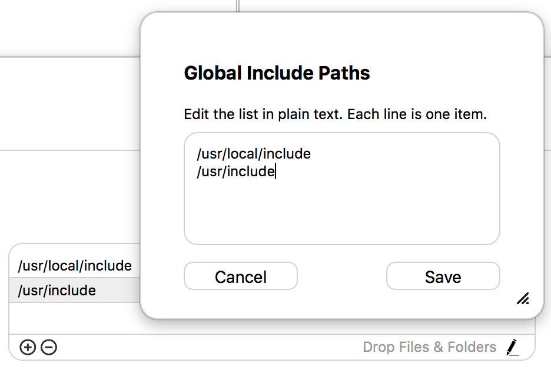
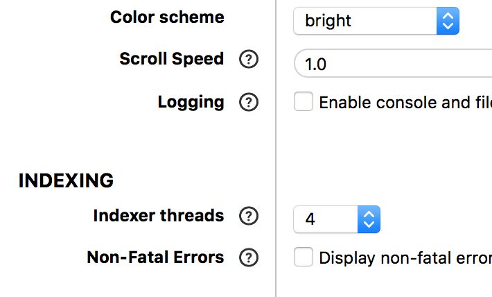

[Coati](https://www.coati.io/) 0.8 is our first release offering a beta for Java support. Please read below for more detail. We also increased our number of plugins for communicating between Coati and source code editors. The UI feedback during indexing was improved with new dialogs. Apart from that, we also made some nice usability changes to the UI, revised project setup and extended the preferences. A lot of these improvements were made because of your feedback, thank you!

You can download Release 0.8 [here](https://www.coati.io/downloads/). The full changelog is available [here](https://github.com/CoatiSoftware/CoatiBugTracker). We will outline a few features new to this release below and give a roadmap towards the next release at the end.

<figure>
	
	<figcaption>Coati's Java Support shown on the <a href="http://javaparser.org/">JavaParser</a> sample project.</figcaption>
</figure>

### New in this Release:

* Java support beta
* More source editor plugins
* Indexing dialogs
* Revised project setup dialogs
* Improved graph and code view navigation

### Java Support beta

Coati 0.8 offers a first beta for working with Java projects. The indexing is based on [JavaParser](http://javaparser.org/) and [JavaSymbolSolver](https://github.com/ftomassetti/java-symbol-solver). Again, we want offer free licenses to all contributers of these projects, please let us know.

If you want to become one of our first Java testers, please write to [mail@coati.io](mailto:mail@coati.io?Subject=Java%20tester) with subject "Java tester". The first 50 applicants will receive a free Coati 0 Private/Academic license.

Coati will use your local Java Runtime Environment install for indexing. You will need an install of Java 8 built for the same platform as your Coati install (download [here](http://www.oracle.com/technetwork/java/javase/downloads/jre8-downloads-2133155.html)). Then you need to set the Java Path in Coati's Preferences to the location of the Java Runtime Environment on your system (more information in our [documentation](https://coati.io/documentation/#FindingJavaRuntimeLibraryLocation)).

<figure class="third">
	
	
	
	<figcaption>Project setup UI for Java projects.</figcaption>
</figure>

### New Plugins

We extended our plugin support to new source code editors and IDEs and also open-sourced existing ones:

* [Atom](https://github.com/CoatiSoftware/atom-coati)
* [CLion/IntelliJ](https://github.com/CoatiSoftware/idea-coati)
* [Eclipse](https://github.com/CoatiSoftware/eCoati)
* [Emacs](https://github.com/CoatiSoftware/emacs-coati)
* [Sublime Text](https://github.com/CoatiSoftware/sublime-coati)
* [Vim](https://github.com/CoatiSoftware/vim-coati)

Please have a look at our [plugin documentation](https://staging.coati.io/documentation/#ToCoati) for more details.

### Indexing Dialogs

In order to give the user better feedback during indexing and prevent accidental refreshing, we indroduced a set of dialogs shown during indexing. They give information about file counts, errors and current progress. The user interface is also locked while indexing now.

As a follow-up we also removed the "automatic refresh on window focus" button next to the refresh button. Since reindexing usually takes more than just a second, the feature didn't turn out to be as useful as originally thought and no one in the team was using it. If you miss the feature, please let us know.

<figure class="third">
	
	
	
	
	<figcaption>Dialogs shown during indexing offering better feedback on the progress.</figcaption>
</figure>

### UI updates

We made improvements to the user interface based on your feedback. Please have a look at the [changelog](https://github.com/CoatiSoftware/CoatiBugTracker) for more information.

* The graph view will now center on the active symbol after activation.
* The code view will stay at the original line when expanding scopes.
* Added shortcuts for navigating references in the code view.
* Pressing Tab in the search bar will now complete up to the highlighted entry and show subnodes if available.
* All dialog windows have a resize handle now.
* Added a plain text editing mode for path list boxes.

<figure class="third bordered">
	
	
	
	<figcaption>Tab in search bar, size handle in dialogs and plain text editing of path list boxes.</figcaption>
</figure>

### New Preferences

The following settings have been added to the Preferences dialog:

* File and console logging is now disabled by default, with checkbox to enable.
* Added scroll speed multiplier setting for the code view.
* Added plugin port setting.
* Non-fatal errors in unindexed files are not shown any more, with checkbox to enable.
* Colorschemes can now be switched via a dropdown.

<figure class="half bordered">
	
	<figcaption>Some new preferences.</figcaption>
</figure>

## Roadmap

We will release new Coati versions approximately every 5-6 weeks. For the next release we plan to fix known issues:

* Fix font size issues on different platforms.
* Better solution for project setup from Visual Studio solution.
* Improve error display UI
* Improve Java Support
* Increase indexing performance

If you have any questions or ideas please leave a comment below.

