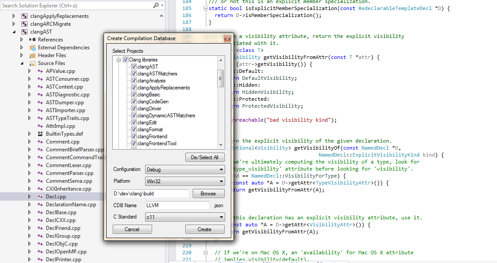
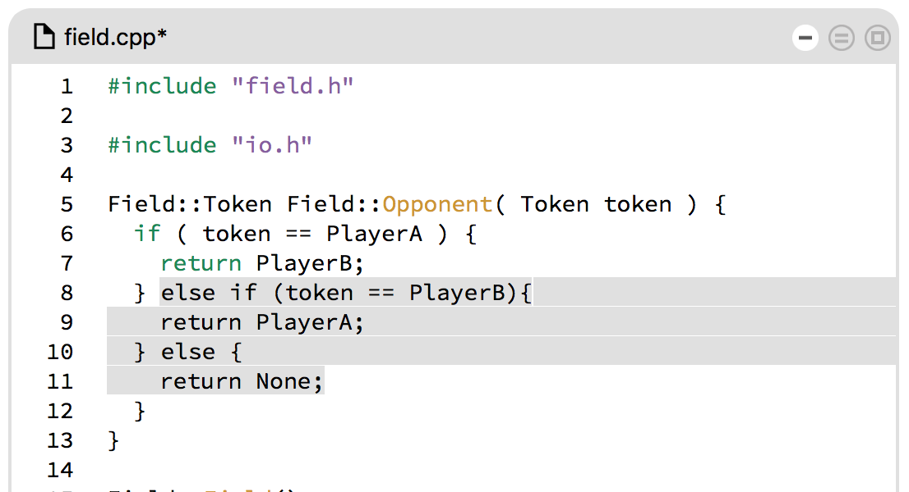
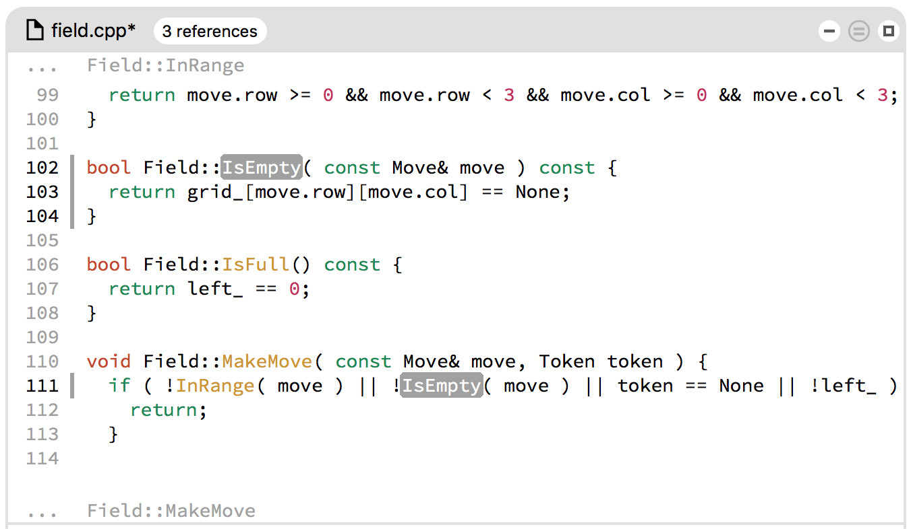
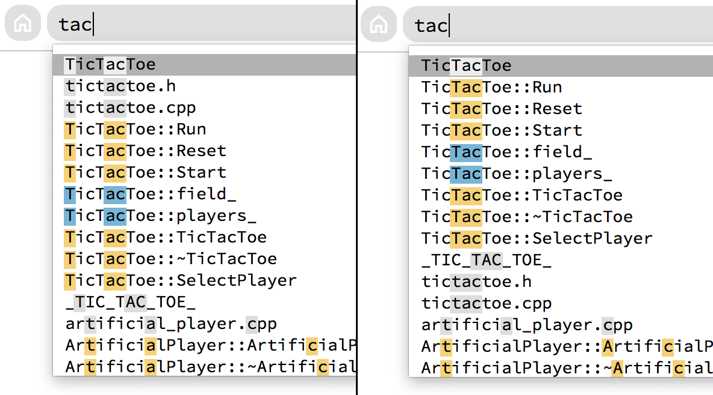
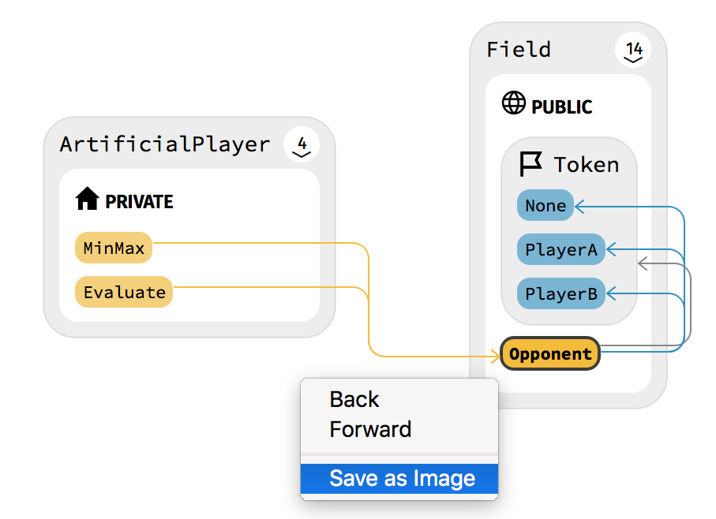

[Coati](https://www.coati.io/) 0.9 brings some big features. With our new Visual Studio plugin we offer a better way for setting up Visual Studio projects by exporting a clang Compilation Database directly from Visual Studio. We finally implemented a proper table showing all errors during indexing for easier navigation and filtering. Our Java language support was greatly extended, partly thanks to some contributions to [JavaSymbolSolver](https://github.com/ftomassetti/java-symbol-solver). And we managed to improve font size and rendering issues on certain platforms.

You can download Release 0.9 [here](https://www.coati.io/downloads/). The full changelog is available [here](https://github.com/CoatiSoftware/CoatiBugTracker). We will outline a few features new to this release below and give a roadmap towards the next release at the end.

<figure class="half bordered">
	<a href="../images/release_0_9/plugin_exporter.png">
		
	</a>
	<a href="../images/release_0_9/error.png">
		
	</a>
	<figcaption>The Compilation Database exporter in the new Visual Studio plugin and the new Log Window with Errors Table.</figcaption>
</figure>

### New in this Release:

* New [Visual Studio plugin](https://www.coati.io/documentation/#VisualStudio) with clang Compilation Database exporter
* Log Window with Error Table
* Extended Java language support
* New installer for Windows
* Fixed font sizes in UI and use smoother font rendering on Windows
* Improved indexer parallelization for faster indexing
* New UI features: Code selection, Graph saving, better Search match scoring


### New Visual Studio Plugin with clang Compilation Database exporter

We have had lots of reports that our current project setup from Visual Studio solution failed for some setups. The original implementation parsed the Visual Studio .sln file and retrieved the necessary information for Coati's project indexing. This approach turned out to be quite fragile, since Microsoft is not transparent on the format of the .sln files and their structure can vary depending of how the setup was done.

To tackle this problem we decided to make direct use of the [Visual Studio SDK](https://msdn.microsoft.com/en-us/library/bb166441.aspx) and extend our [Visual Studio plugin](https://www.coati.io/documentation/#VisualStudio) to export all build information in a format that Coati can understand. Since we already supported the [clang Compilation Database specification](http://clang.llvm.org/docs/JSONCompilationDatabase.html) for project setup, it seemed like the perfect fit. That way users that need a Compilation Database from Visual Studio can also make use of our plugin. The plugin is currently included with each download, also the trial download.

<figure>
	<a href="../images/release_0_9/plugin_menu.png">
		
	</a>
	<figcaption>Select the "Create CDB" option in the Coati Plugin menu to open the exporter.</figcaption>
</figure>

The Compilation Database exporter also offers better features than our old project setup solution. You can select configuration, platform and the projects to index. As a next step we want to connect the Compilation Database exporter directly to Coati, so that all information in Coati's project setup is already prefilled. Please have a look at our [documentation](https://www.coati.io/documentation/#VisualStudio) for more information on the plugin.

<figure>
	<a href="../images/release_0_9/plugin_exporter.png">
		
	</a>
	<figcaption>The Compilation Database exporter of the new Visual Studio plugin.</figcaption>
</figure>


### Log Window with Error Table

Coati 0.9 now offers a new Log Window in addition to our well-known Search, Graph and Code Window combination. The Log Window makes more information available to the user about Coati's current tasks. As first component we a added a table showing all errors encountered during indexing.

The table shows some information about the errors: message, filepath, line and type. By clicking on an error line the Code View will show its location. The checkboxes below the table allow for filtering the errors by certain criteria. If you want to hide the Log Window you can do this in the menu by toggling the ```View -> Log Window``` option.

<figure>
	<a href="../images/release_0_9/error.png">
		
	</a>
	<figcaption>The new Log Window with the Error Table for inspecting errors during indexing.</figcaption>
</figure>


### UI updates

We also made improvements to the user interface.

* Select and copy code from the code view with SHIFT + mouse drag.
* Markers next to the line numbers of the code view show active lines and scopes better.
* Matches in the search autocompletion list will now use the best score within the name.
* Save graph as PNG image via context menu.
* Fixed font sizes to look the same on all platforms.
* Use smoother font rendering on Windows by using the FreeType font engine via ```qt.conf```.

<figure class="half bordered">
	<a href="../images/release_0_9/select.png">
		
	</a>
	<a href="../images/release_0_9/marker.png">
		
	</a>
	<a href="../images/release_0_9/autocompletion.png">
		
	</a>
	<a href="../images/release_0_9/save.png">
		
	</a>
	<figcaption>Selection and markers in code view, search match scoring before and after, graph image saving.</figcaption>
</figure>

## Roadmap

We will release new Coati versions approximately every 5-6 weeks. For the next release we plan working on:

* Better logging system and displaying log information within the Log Window.
* Change how namespace and package information is displayed in Search and Graph Windows.
* Connect Compilation Database exporter of new Visual Studio plugin to Coati's project setup.
* Reduce database file size.

If you have any questions or ideas please leave a comment below.

