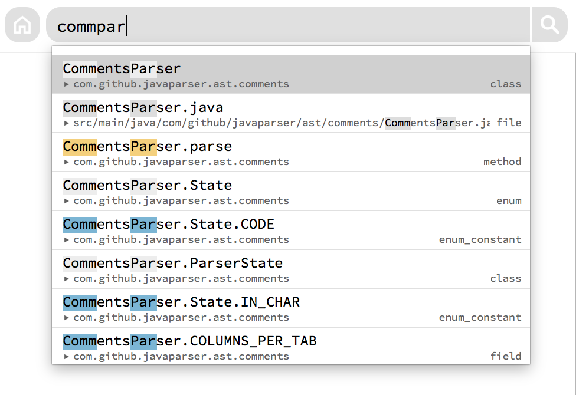
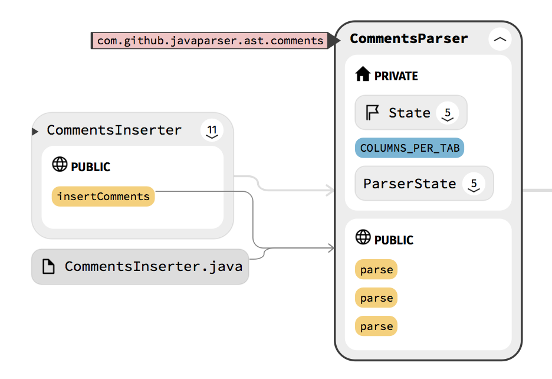
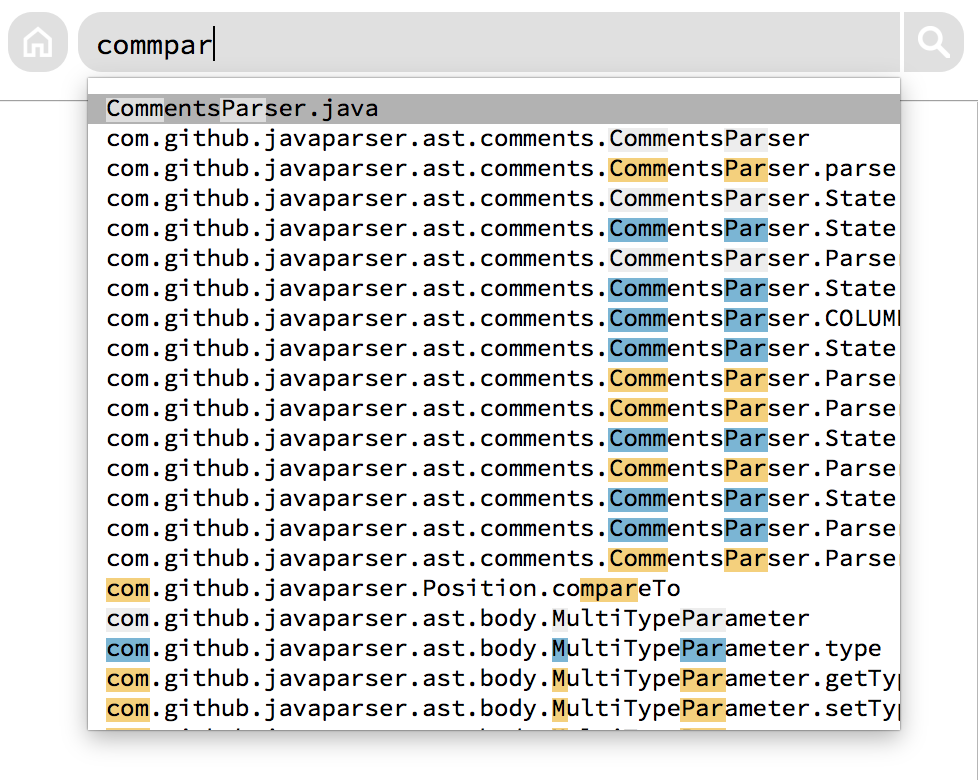
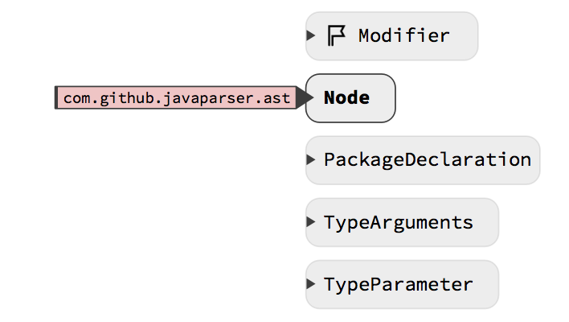
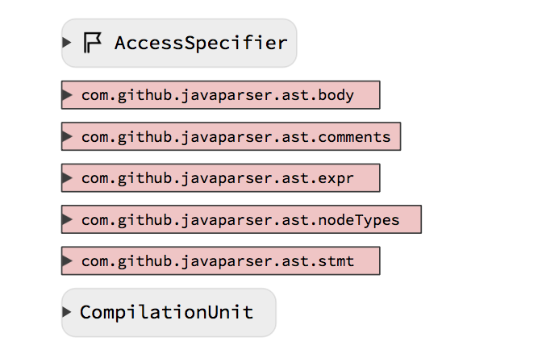
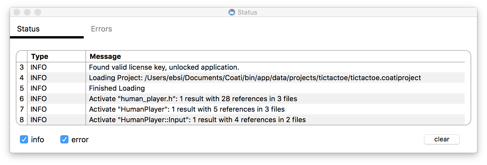

[Coati](https://www.coati.io/) 0.10 brings polishing to user interface and indexer. Namespace and package information is now displayed within a second line in the search autocompletion list and within an extra label at graph nodes. C/C++ indexer coverage was extended and the size of the '.coatidb' file was substantially decreased. The project setup "From Visual Studio Solution" is now fully integrated with our new Visual Studio plugin to allow for easier project creation.

You can download Release 0.10 [here](https://www.coati.io/downloads/). The full changelog is available [here](https://github.com/CoatiSoftware/CoatiBugTracker). We will outline a few features new to this release below and give a roadmap towards the next release at the end.

<figure class="half bordered">
	<a href="../images/release_0_10/two_line_search.png">
		
	</a>
	<a href="../images/release_0_10/namespace_label.png">
		
	</a>
	<figcaption>Left: Two lined search autocompletion list; right: namespace/package label for graph nodes.</figcaption>
</figure>


### New in this Release:

* Added second line to search autocompletion list for namespace, package or file path
* Added namespace/package indicator and label to graph nodes
* New icons for graph nodes and project types
* Better integration of the [Visual Studio plugin](https://www.coati.io/documentation/#VisualStudio) into Project setup with Coati
* New Status tab in Status Window showing history of status information
* Extended C/C++ indexer coverage: using decls, using directives, auto keyword, lambda signatures, symbol references inside lambda captures
* Reduced ```.coatidb``` file size by about 20-50% for large projects
* Increased file clearing speed on project refresh


### Second line in search autocompletion list

The search autocompletion list got confusing when the codebase made use of nested namespaces and packages, which is very common for Java projects. The names in the autocompletion list were really long and it was hard to spot class and function names.

The new search autocompletion list shows namespace and package information within a second line below the element names. This puts a better focus on matched classes and functions, without removing information. Matched characters will have the same highlights as in the upper line. The second line is also used for files to show their full file path, which gets also matched with search queries now.

<figure class="half bordered">
	<a href="../images/release_0_10/two_line_search_before.png">
		
	</a>
	<a href="../images/release_0_10/two_line_search.png">
		
	</a>
	<figcaption>Two lined search autocompletion list before and after.</figcaption>
</figure>


### Namespace and package labels on graph nodes

Just like the search autocompletion list, namespace qualifiers also cluttered the graph. Graph nodes displayed their full name with all namespace or package qualifiers in front, which made the nodes appear unnecessary wide and class names were hard to spot.

With the new release we removed namespace/package qualifiers from nodes and added little arrows to their left side. These arrows indicate that this node is nested within a namespace or package. When hovering the arrow will expand to a label, showing the full name of the qualifier. Clicking on the label will activate the namespace/package and show all its other child nodes. We also adjusted the general design of namespace/package nodes in the graph to make them look similar to the new labels.

<figure class="half bordered">
	<a href="../images/release_0_10/namespace.png">
		
	</a>
	<a href="../images/release_0_10/namespace_list.png">
		
	</a>
	<figcaption>Left: Namespace/package labels on graph nodes; right: New look of namespace/package nodes</figcaption>
</figure>


### Status table in Status Window

We renamed the Log Window to Status Window and as a next addition after the errors table, we added a Status tab showing the history of status information. We also improved the quantity and quality of these status messages to make Coati's activities more transparent to the user.

The user interface does not differ much from the errors tab. The only major difference is the opportunity to clear the table by pressing the clear button at the bottom right of the table. To hide and show the Status Window you can use the ```View -> Status Window``` option in the menu. For fast access to the Status tab, you can also click the message in the status bar at the bottom.

<figure>
	<a href="../images/release_0_10/status_view.png">
		
	</a>
	<figcaption>The new Status Table in the Status Window showing Coati's recent activities.</figcaption>
</figure>


## Roadmap

We recently conducted an online survey asking our current users about their experiences with Coati. The overall feedback was overwhelmingly positive. Most users were satisfied with Coati and would recommend it to other users. Stability, UI performance and indexer coverage turned out to be the key areas for further improvement. While we already made some progress with this release, we will continue to put a focus on these areas for our next release in approximately 8 weeks.

If you have any questions or ideas please leave a comment below.
Happy Holidays!

