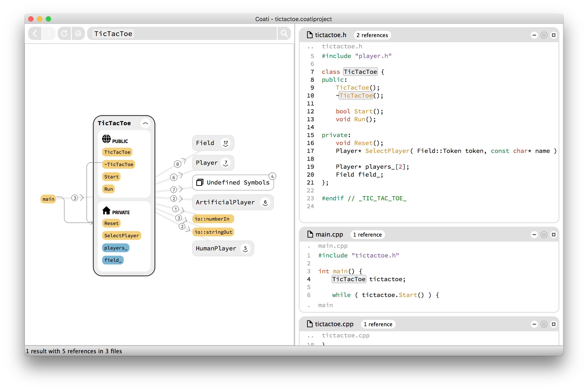
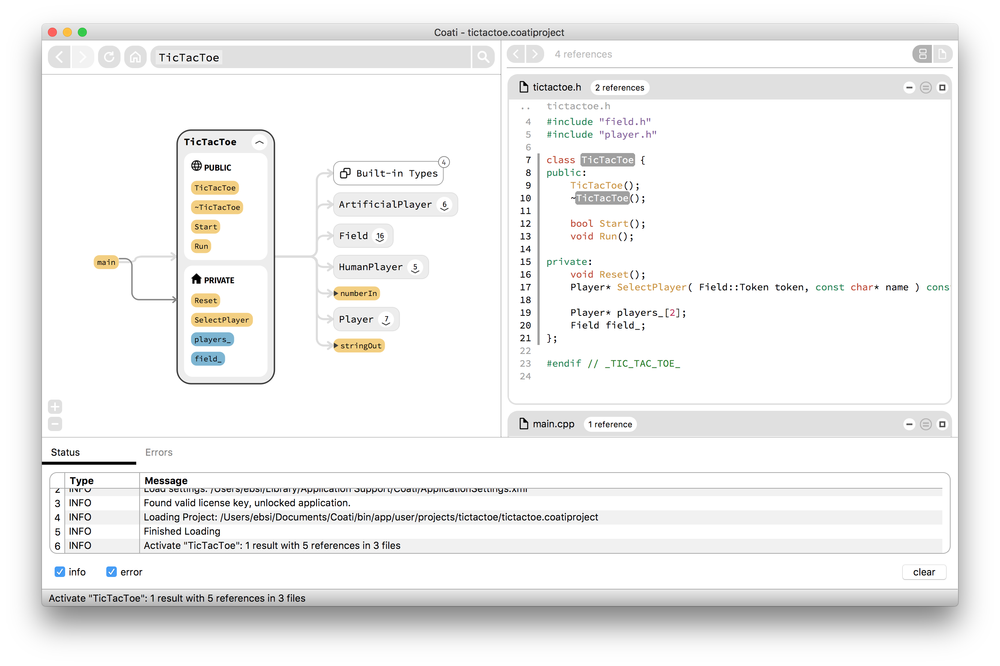
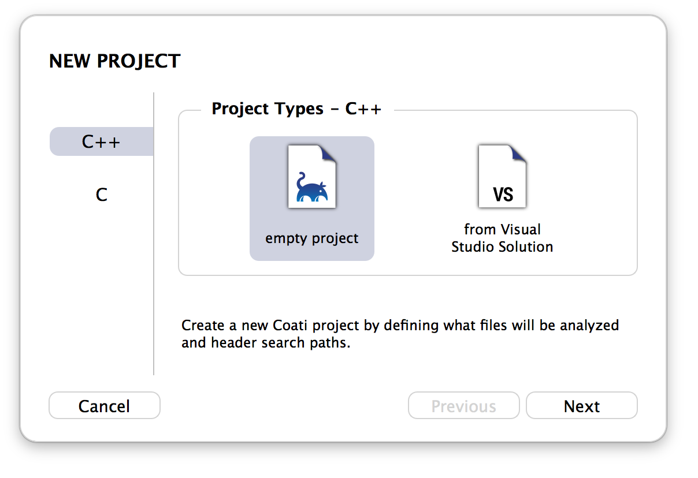
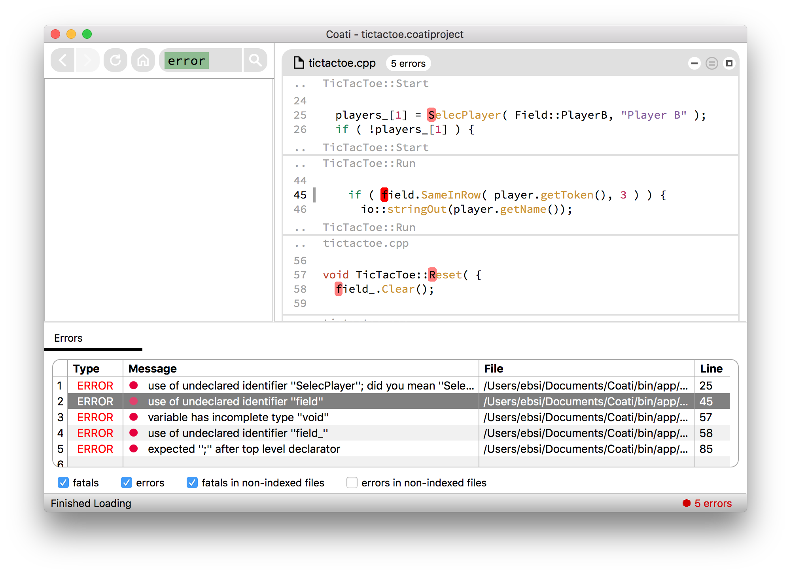
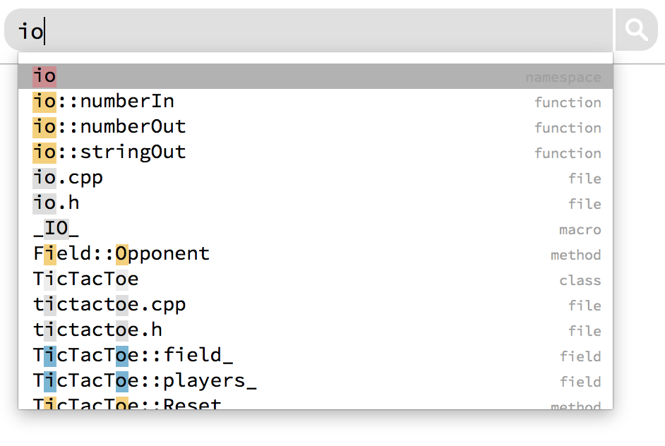
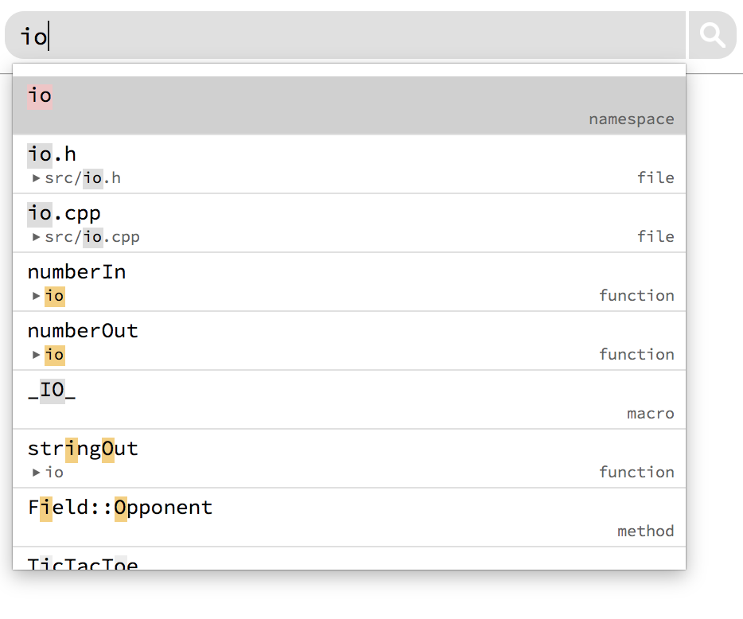

## Happy Birthday Coati!

Coati is 3 years old today. But wait, how can a software even have a birthday? Well, 3 years ago, on February 24th, we started developing on Coati and commited the first implementation of our `main()` function to our git repository. And exactly 1 year ago we launched our website [coati.io](http://coati.io) to the public. So I guess it's fair to call it a birthday.

It's been an incredibly busy year since our launch. We have had developers from all over the world testing Coati, buying licenses and providing us [their feedback](https://github.com/CoatiSoftware/CoatiBugTracker/issues). With this post I will give some retrospective and give you a short summary on our biggest milestones throughout the last year. Afterwards, I will give a short look ahead as we are slowly approaching our first release version Coati 1.0.

### Launching a first build to the public

Looking at it retrospectively, we didn't really know what we were doing when we launched Coati to the public one year ago. There were so many things we hadn't really thought through at the time. But I'm happy we chose to do it that way, we could benefit a lot from the feedback of our early adopters.

<figure class="half">
	
	
	<figcaption>Comparison of the main interfaces.</figcaption>
</figure>

The images above shows the interface of our first build compared to our current one. It still looks quite similar on the surface, but under the hood nearly everything changed. What stayed the same was our 3 component interface concept, consisting of search, graph and code, which has proven work really well.

### Test License for evaluation

One of the first things people criticised was the lack of test licenses for evaluating Coati before purchasing a license. Indexing your own source code was not possible with the trial build and we thought it was sufficient for developers to test Coati's user interface on our sample projects. We started offering test licenses via e-mail, which also turned out to be a great way of starting a conversation with our users and collect feedback.

### Show references to local variables

To better support understanding of source code within the function scope, we added highlighting for local variables. Before that we only provided information above function scope level.

<figure class="half bordered">
	
</figure>

### Introduced multi-threaded indexing

Decreasing indexing time was probably one of the main goals during last year. There have been numerous improvements, he biggest among them was our move to a multithreaded indexer, which indexes multiple files at once. I'm not totally sure on the numbers, but I estimate we **cut down indexing time by about 70 - 80%** over the last year.

### Launched a developer blog

Shortly after our launch we quickly realized that we don't really have a good way of telling what we are currently working on and what's new in each build. So it didn't take much time, until we started a blog for our website. We post about every new release and also some related topics. My post about the [idea to Coati](http://www.coati.io/blog/why_working_on_chrom_made_me_develop_a_tool_for_reading_source_code/) was probably our most successful one and got us a lot of attention and new users.

### Extended project setup capabilities

With more and more people using Coati on more and more source projects we also got a lot of feature requests regarding project setup. There were a lot of configurations we didn't support at that time. Here are some features that were introduced to our project setup:

* Project setup from compilation database
* Project setup from Visual Studio via plugin
* Defining compiler flags
* Excluding source files from indexing
* Support for environment variables
* Defining source file extensions

<figure class="half">
	
	
	<figcaption>Comparison of the project setup dialogs.</figcaption>
</figure>

### Added more code editor plugins

We greatly increased the number of source code editors for communicating with Coati. We now have plugins for:

* Atom
* CLion
* Eclipse
* Emacs
* Sublime Text
* VIM
* Visual Studio
* IntelliJ

Please visit our [documentation](http://www.coati.io/documentation/#CODEEDITORPLUGINS) to find out how to use them.

### Added table listing indexing errors

Similar to the indexing dialogs, we didn't show errors during indexing that well. We just showed a list of all errors within the source code. Error messages were only available on hover. We added a new log view with an error table listing all error messages to tackle this issue.

<figure>
	
</figure>

### Increased search speed

The implementation of our fuzzy search algorithm turned out to perform pretty bad as soon as the indexed project reached a certain size. We rewrote the algorithm and also improved the design of the autocompletion popup, to show namespace information and file paths in a second line.

<figure class="half">
	
	
	<figcaption>Comparison of the autocompletion popup.</figcaption>
</figure>

### Added dialogs shown during indexing

Our user feedback during indexing was very basic at first. We only showed some progress information within the status bar at the bottom of the screen. We designed and implemented dialogs for the different steps to provide a better user experience.

<figure class="third">
	
	
	
	<figcaption>Dialogs shown during indexing.</figcaption>
</figure>

### Introduced support for Java

Since fall of last year we are also offering support for Java. The indexing is done via [JavaParser](http://javaparser.org/) and [JavaSymbolSolver](https://github.com/javaparser/javasymbolsolver). We have constantly improved our language coverage and look into easier project setup from Java build systems now.

<figure>
	
	<figcaption>Coati Java support illustrated with the JavaParser sample project.</figcaption>
</figure>

## Roadmap

As you can see, we spent a lot of time on feature development during the last year and we are proud of what we achieved. We could fill the biggest gaps in terms of functionality and we are slowly approaching our first release version Coati 1.0. However, there are still a couple of features on the list, that we plan on implementing until then:

* Bookmarking
* Better indexer crash handling via indexer processes
* Java project setup from Maven
* Faster UI

And one more thing...

There's a major change about our product coming in a couple weeks. We will change our product name. Please stay tuned for our announcement.

Thanks for reading and please share if you liked it!

Follow us: [mail](http://eepurl.com/bRSSFf) - [Twitter](https://twitter.com/CoatiSoftware) - [Facebook](https://www.facebook.com/Coati-1529980600658370) - [Google+](https://plus.google.com/u/0/108949374849112775331)

