[Coati](https://www.coati.io/) 0.11 brings a lot of new features to the user interface. The code view was extended with a navigation bar and a new single file mode. The overview screen was greatly improved by imitating node styles and showing contents in a vertical list. There have been numerous improvements to project setup and graph display. We are also finally offering a Windows 64bit build and you can [download clang](https://www.coati.io/downloads#extra) as pre-indexed sample.

You can download Release 0.11 [here](https://www.coati.io/downloads/). The full changelog is available [here](https://github.com/CoatiSoftware/CoatiBugTracker). We will outline a few features new to this release below and give a roadmap towards the next release at the end.

<figure>
	<a href="../images/release_0_11/interface.png">
		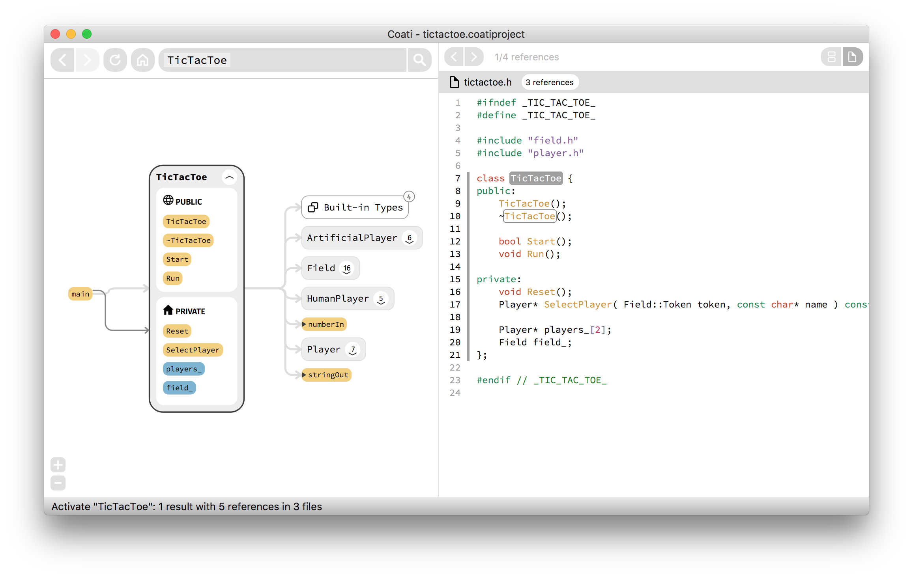
	</a>
	<figcaption>Interface of Coati showing a cleaner graph on the left and our code view with navigation bar and in single file mode on the right.</figcaption>
</figure>

### New in this Release:

* Added single file mode and navigation bar to code view
* Improved UX of overview screen
* Revised project setup to user feedback
* Improved Java language coverage
* Offer Windows 64bit build
* Updated to clang/llvm 3.9 and Qt 5.8
* Offer [clang sample project](https://www.coati.io/downloads#extra) for download

### Single file mode for code view

While the snippets list of our code view is great for getting a good overview of where a certain symbol is used throughout the code base, it can get cumbersome to explore the context of specific snippets. So far you had to manually expand the scope shown by the snippet, sometimes more than once, to finally see all the lines of code you were interested in. This can get tiresome when doing it a lot.

Our new release contains a second mode for the code view now, showing only one complete file at once instead. The mode can be activated by clicking the button with the file icon in the upper right corner of the code view.

<figure class="half bordered">
	<a href="../images/release_0_11/list.png">
		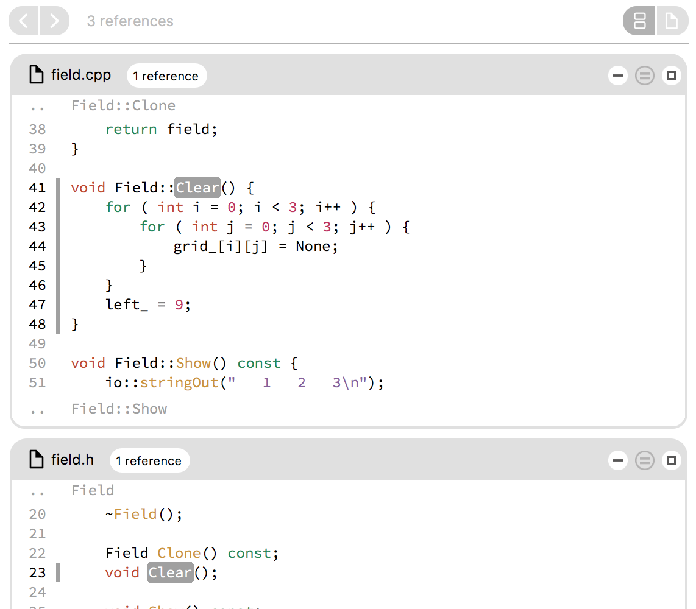
	</a>
	<a href="../images/release_0_11/single.png">
		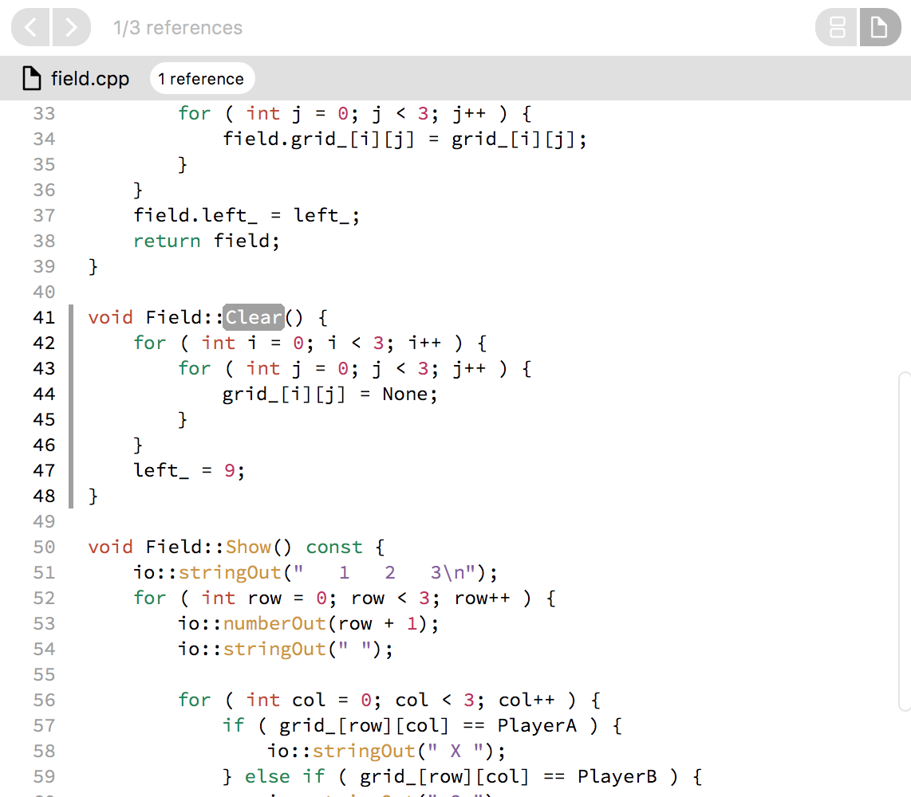
	</a>
	<figcaption>The two modes of the code view: Snippet list on the left, single file on the right. Switch mode and code references in the navigation bar on top.</figcaption>
</figure>

When in single file mode, Coati will show you the file holding the definition of the symbol you activated. To see all places where the symbol is referenced, either navigate via clicking edges in the graph view, or use the buttons in the upper left corner of the code view.

We believe that this additional mode will better fit users who prefer investigating only specific source locations and who want all surrounding information visible.

### Better UX for overview screen in graph

Our overview screen shown right after project opening had a pretty bad user experience so far. The bundles of the different node types looked all the same and exploring the contents of these bundles was terrible. All nodes were laid out horizontally, which could result in a very wide view for big projects, and it was hard to find certain nodes.

We improved the design and interaction with these overview nodes. First we imitated the style of the bundled node types. This way it's easier to find the bundle you are looking for and new users can already see how different node types are displayed.

<figure class="half bordered">
	<a href="../images/release_0_11/bundle_before.png">
		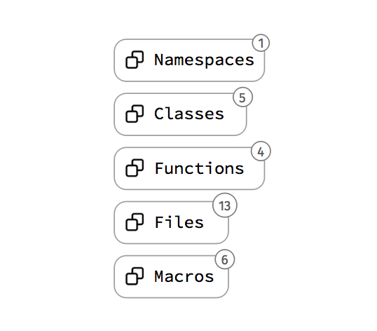
	</a>
	<a href="../images/release_0_11/bundle_after.png">
		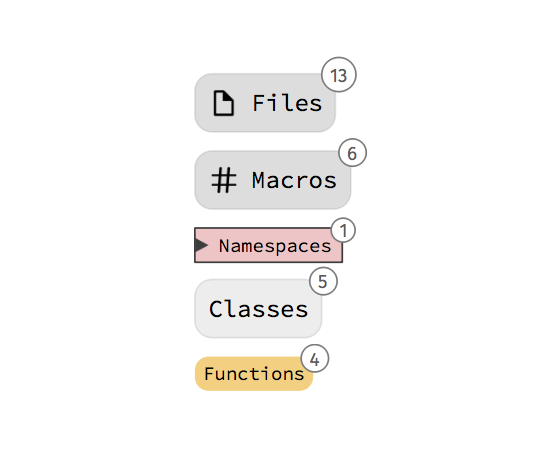
	</a>
	<figcaption>Old bundle styles for graph overview on the left, new on the right.</figcaption>
</figure>

Next we improved the user experience when exploring the contents of a bundle. Instead of showing all nodes horizontally, we switched to a vertical layout which is easier to scroll. In addition we grouped the nodes by first character and show the character as big letter at the start of the group. You can jump directly to the start of a group by pressing that letter on you keyboard.

<figure class="half bordered">
	<a href="../images/release_0_11/list_before.png">
		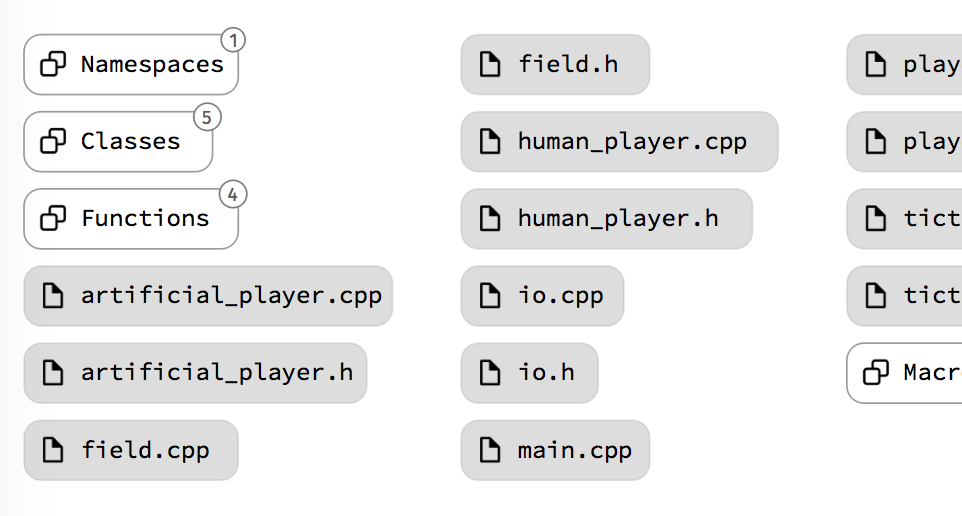
	</a>
	<a href="../images/release_0_11/list_after.png">
		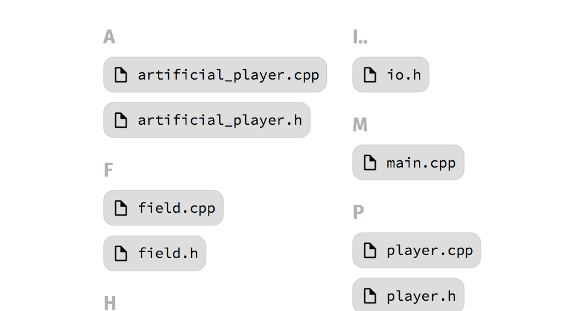
	</a>
	<figcaption>Old list layout on the left, new layout with starting characters on the right.</figcaption>
</figure>

### Other UI updates

We also added numerous improvements to the user interface.

* Made selection the default mouse drag behavior in the code view.
* Added zoom buttons to graph with tooltips hinting the shortcuts
* Added new node type for built-in types like int, bool.
* Added shortcut reference dialog to the help menu.
* Added more options to context menu.

<figure class="third bordered">
	<a href="../images/release_0_11/selection.png">
		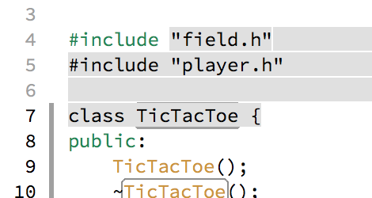
	</a>
	<a href="../images/release_0_11/zoom.png">
		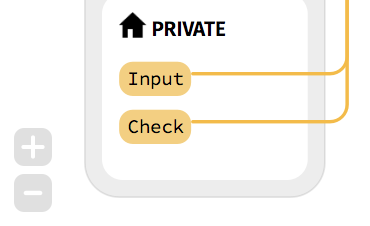
	</a>
	<a href="../images/release_0_11/builtin.png">
		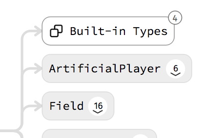
	</a>
	<a href="../images/release_0_11/shortcuts.png">
		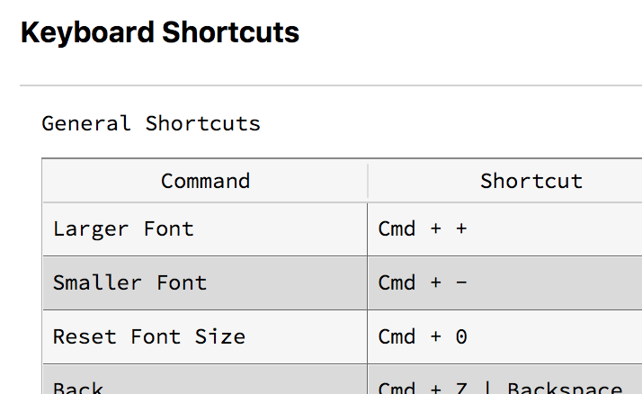
	</a>
	<a href="../images/release_0_11/context_menu.png">
		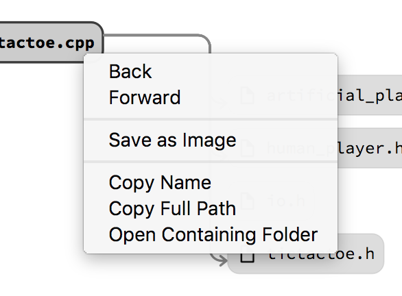
	</a>
</figure>

## Roadmap

We are slowly approaching our Release of Coati 1.0. A few things we plan on working until then are:

* Multi language projects
* Bookmarking of symbols with comments and categories
* Better crash handling and user feedback in the indexer
* Setup Java projects from Maven
* Faster UI

There's also a major change about our product coming in a couple weeks. We will change our product name. Please stay tuned for our announcement.

Thanks for reading and please share if you liked it!

Follow us: [mail](http://eepurl.com/bRSSFf) - [Twitter](https://twitter.com/CoatiSoftware) - [Facebook](https://www.facebook.com/Coati-1529980600658370) - [Google+](https://plus.google.com/u/0/108949374849112775331)

