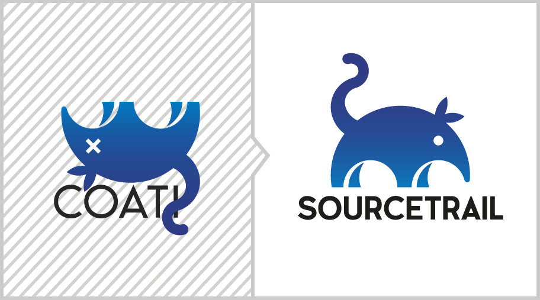

<figure>
	
</figure>

Today we renamed our product from **Coati** to **Sourcetrail**. Here is why:

* **Trademark** - The trademark is already registered by now and we don't want to waste our energy fighting about it.
* **Google Rank** - a [coati](https://en.wikipedia.org/wiki/Coati) is a real world animal, so becoming the #1 search result for "Coati" is nearly impossible.
* **Connotation** - "Sourcetrail" can be associated to software development and code navigation much more easily than "Coati".
* **Pronunciation** - There are several different opinions on how to pronounce "Coati".

 

And even more important for you, here's what changed and how it affects you:

* We still keep our beloved coati shaped logo, but with the new **Sourcetrail** lettering.
* We moved our domain from [http://coati.io](http://coati.io) to [https://sourcetrail.com](https://sourcetrail.com). All existing URLs will be redirected.
* All existing license keys for Coati 0 will keep working with our new Sourcetrail releases and are eligible for a free upgrade to our first stable release Sourcetrail 1.0.
* Our company name stays Coati Software OG and all existing legal agreements stay in place.
* Our bug tracker on GitHub was renamed and is now available [here](https://github.com/CoatiSoftware/SourcetrailBugTracker/issues), all old URLs to issues are still working.
* We added the additional e-mail addresses **mail@sourcetrail.com** and **support@sourcetrail.com**. All old e-mail addresses keep working.
* Our old [downloads](https://sourcetrail.com/downloads) still use the name Coati, but all new releases will be named Sourcetrail, starting today.
* All existing `.coatiproject` and `.coatidb` files keep working, but new projects will use the file endings `.srctrlprj` and `.srctrldb`.
* Already installed editor/IDE plugins will still work with our new Sourcetrail releases, but will also be renamed and their respective repositories moved. Please have a look at our [documentation](https://sourcetrail.com/documentation/#CODEEDITORPLUGINS) for more information on each plugin.

We hope that all of our existing users are happy with the new name and will get used to it soon. Please let us know what you think and/or if we unintentionally broke something.

*No animals were harmed in the process of renaming.*
