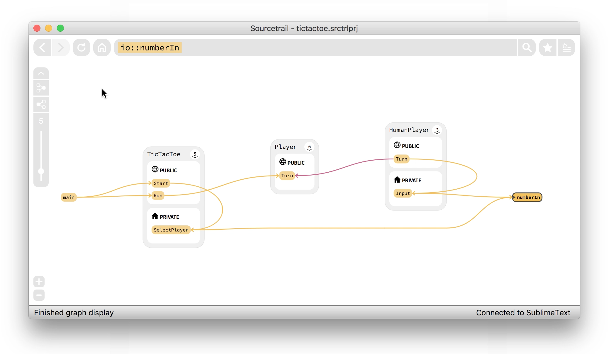
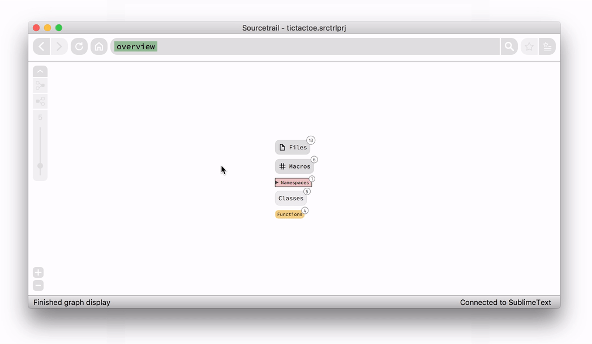
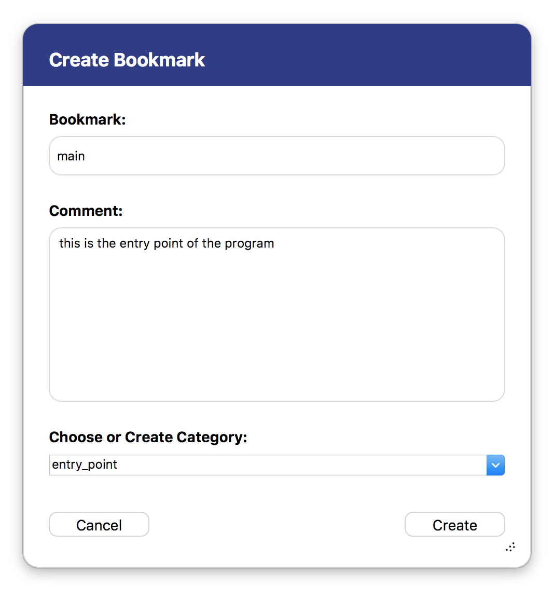
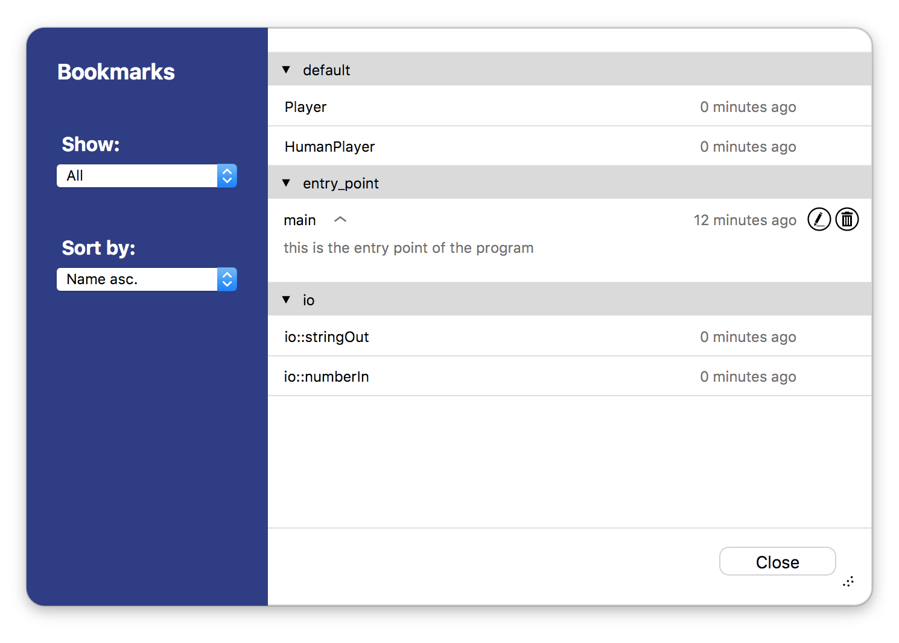
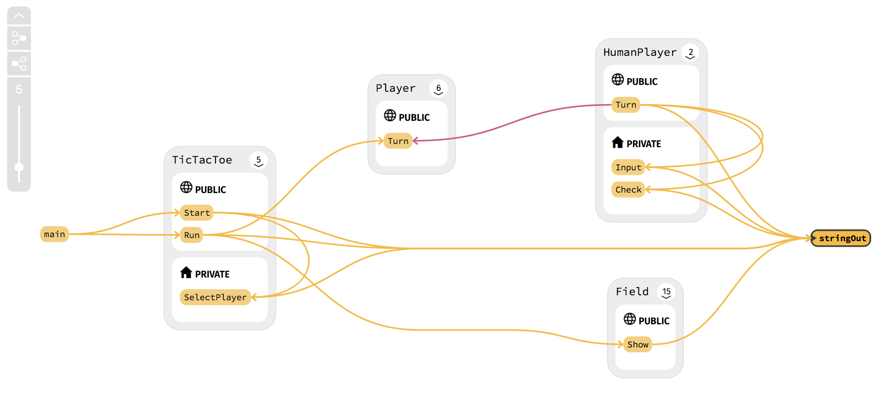
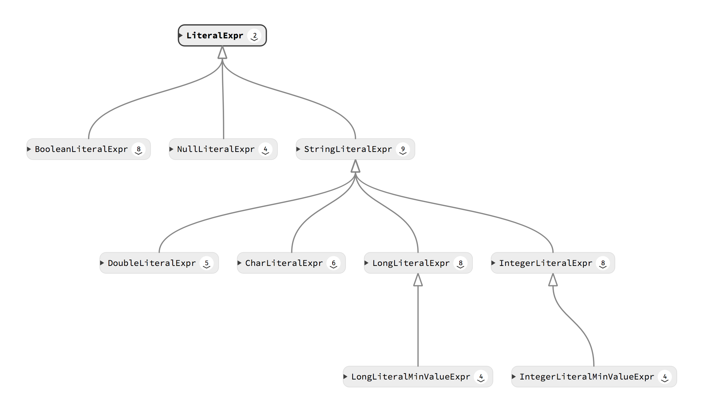
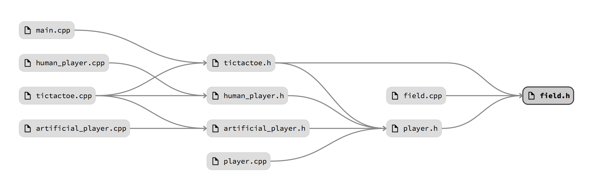
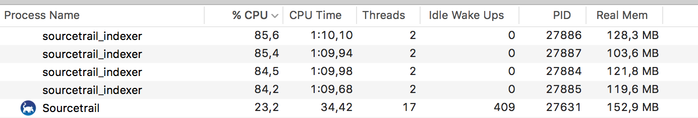
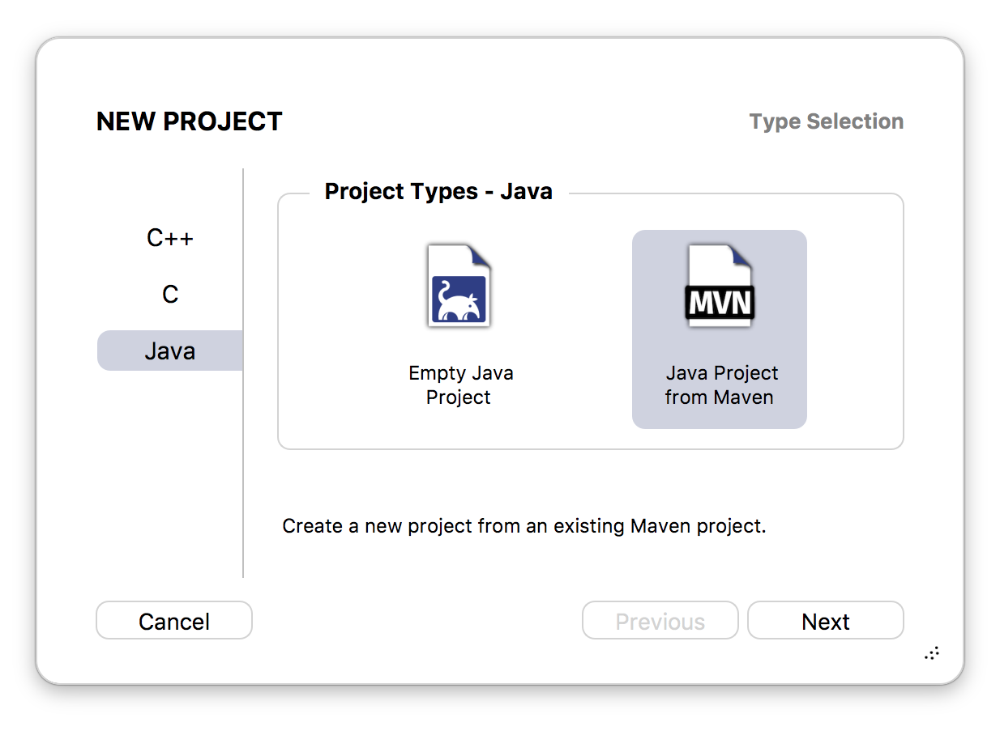
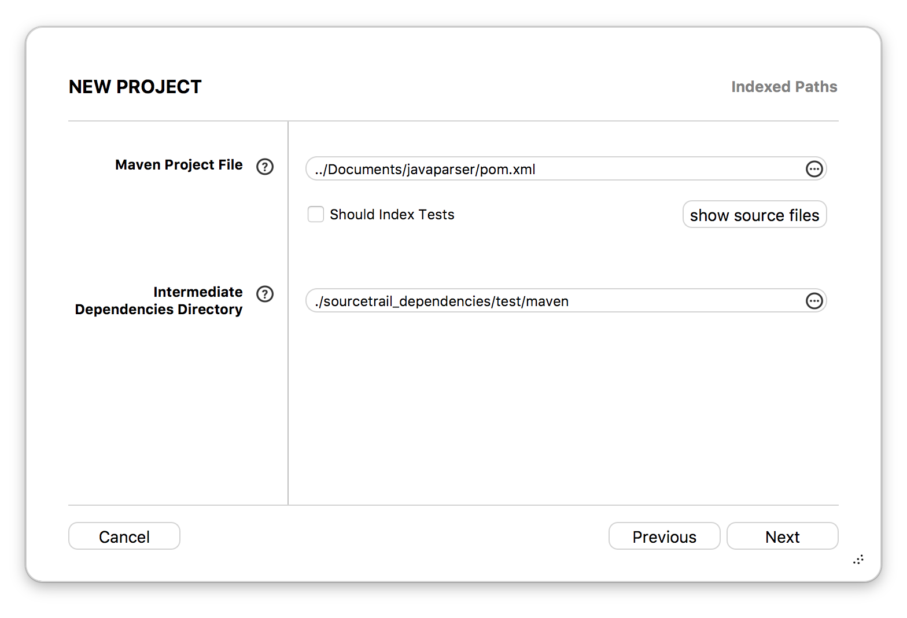

[Sourcetrail](https://www.sourcetrail.com/) 0.12 brings a few long awaited features. We finally generate whole call graphs, inheritance chains and include trees in our graph view. It's now possible to create and manage bookmarks for nodes and edges. We switched our indexer to a multi-process architecture to better handle issues during indexing and offer Java project setup from Maven.

You can download Release 0.12 [here](https://www.sourcetrail.com/downloads/). The full changelog is available [here](https://github.com/CoatiSoftware/SourcetrailBugTracker). We will outline a few features new to this release below and give a roadmap towards our official 1.0 release at the end.

<figure style="text-align:center; cursor: pointer;">
	

		

			
			

		

		

			
		

	

	<figcaption>Generating the call graph of the function io::numberIn from our TicTacToe sample project.</figcaption>
</figure>

### New in this Release:

* Bookmarking for nodes and edges
* Call graphs, inheritance chains and include trees
* Multi process indexing for C/C++
* Java project setup from Maven

### Bookmarking of Nodes and Edges

Bookmarking was a highly demanded feature by our current users. We decided to design the user experience similar to that of modern web browsers. But instead of webpages you can bookmark nodes and edges. The bookmark information gets stored in the `.srctrlbm` file next to your `.srctrlprj` file. We decided to use a separate file so it can be ignored from version control when sharing your project setup among the team.

<figure style="text-align:center;" class="half">
	
	<figcaption>Create a new bookmark by specifying name, comment and category.</figcaption>
</figure>

You can create a bookmark for the currently active node or edge by:

* clicking the star icon in the search bar
* using the Bookmarks menu action
* using the shortcut
* choosing "Bookmark Node" from the context menu in the graph.

Bookmarks can have a custom name and a comment. By specifying a category you can also group them together.

<figure>
	
	<figcaption style="text-align:center;">Use the bookmark manager to view, activate and edit your bookmarks.</figcaption>
</figure>

Use the Bookmark Manager to view, activate and edit your current bookmarks. Bookmarks are activated when clicking on their name. The visibility of the comment can be toggled separately. Additionally you can also collapse whole bookmark categories. If a bookmark has no category it will be placed in category *default*.

### Call graphs, inheritance chains and include trees

Yes, we finally offer visualization of whole call graphs and inheritance chains! Some users were wondering why this obvious feature was not present right from the start. The reason is, that although it can be very powerful and supportive, it also has it's limits. Especially call graphs can grow to an incomprehensible size. That's why we still stick to our tested one level of dependency graph visualiation by default, but also offer generating call graphs, inheritance chains and include trees via a little toolbar in the top left corner of the graph view now.

<figure>
	
	<figcaption style="text-align:center;">Call graph of the function io::stringOut from our TicTacToe sample project with the toolbar in the top left.</figcaption>
</figure>

The toolbar can be collapsed by clicking the arrow at the top. The two buttons with the graph icon are used to generate the graph in a certain direction of dependency. The type of the graph depends on your currently active symbol. The slider at the bottom is used to set the maximum depth level. Moving the slider to the top will result in an infinite depth level, meaning you can see all dependent symbols (**Warning:** This can result in huge graphs with thousands of nodes and edges.)

<figure>
	
	<figcaption style="text-align:center;">Inheritance chain of the class LiteralExpr from our JavaParser sample project.</figcaption>
</figure>

The layout of the graphs are computed with a [Sugiyama-style graph drawing](https://en.wikipedia.org/wiki/Layered_graph_drawing) algorithm. Instead of our usual tilted edge style, we decided to use bezier curves for these graphs to better show, which dependencies exist between the nodes and to make it easier to follow them. When hovering a node, all connected edges will be highlighted as well. Clicking a node will activate it and switch back to our usual graph layout. Clicking an edge will show it's source location in the code view.

<figure>
	
	<figcaption style="text-align:center;">Include tree of the file field.h from our TicTacToe sample project.</figcaption>
</figure>

The current implementation offers the generation of call graphs, inheritance chains and include trees. A planned addition for the future is generating graphs between two specific points, e.g. to inspect all ways in which one function causes another one to be called. We might also extend this feature to allow for specifying custom node and edge types.

### Multi process indexing for C/C++

When trying to setup a new C/C++ project some of our users experienced exceptions and crashes during indexing, which in most cases resulted in a crash of the whole application. In most cases these crashes were happening during parsing within [clang libTooling](https://clang.llvm.org/docs/LibTooling.html), because the project was not configured properly e.g. missing flags, using the wrong standard, containing some non-standard C/C++ code or not specifying the correct target platform.

In our previous multi-threaded architecture we couldn't deal with those issues, since the process just terminated right away. The only way of solving this problem for real, was switching to a multi-process model, where we use separate processes instead of threads.

<figure class="bordered">
	
	<figcaption style="text-align:center;">The MacOS Activity Monitor shows the separate indexer processes during indexing.</figcaption>
</figure>

Multi-process indexing is now the default method for C/C++ projects. It can be disabled in the preferences by unchecking *Multi process C/C++ indexing*. The processes exchange data via shared memory, a garbage collector is taking care of memory that is not properly released. Overall the performance penalty for this change was lower than we expected, only around 1-3% in our measurements.

### Java project setup from Maven

This was another highly demanded feature by our Java users. We now offer Java project setup from Maven. This feature was already available in our recent maintenance release together with our [name switch](https://www.sourcetrail.com/blog/coati_is_dead_long_live_sourcetrail/). We also wrote about our experiences on integrating Maven in this [blog post](https://www.sourcetrail.com/blog/how_to_integrate_maven_into_your_own_java_tool/), in case you are ever interested in doing something similar.

<figure class="half">
	
	
	<figcaption style="text-align:center;">New Java project setup option Maven on the left, choosing the pom.xml file on the right.</figcaption>
</figure>

When creating a Java project from Maven you first need to choose the new option in our project type selection. After entering project name and location you just need to specify where the top-level `pom.xml` file of your project is located and that's pretty much it.

## Roadmap

This is the last release before Sourcetrail 1.0. There are just a few things left on our schedule now:

* Multi language project setup
* Better access to active symbol history
* More information in tooltips
* As many performance improvements as we find time to

Thanks for reading and please share if you like our progress! And don't forget to [download](https://www.sourcetrail.com/downloads/) the new build.

Follow us: [mail](http://eepurl.com/bRSSFf) - [Twitter](https://twitter.com/Sourcetrail) - [Facebook](https://www.facebook.com/Sourcetrail) - [Google+](https://plus.google.com/u/0/108949374849112775331)

