Today we are finally ending our Beta with the release of [Sourcetrail](https://www.sourcetrail.com/) 1.0 (officially called v2017.2). In case you are new, Sourcetrail is a cross-platform source explorer for C/C++ and Java that saves you time on navigating and understanding source code. This post explains what changes with the new release and outlines how we will continue from now on. I will also take a short look back on how we progressed over the past year and what features have been added that make Sourcetrail an even better tool for exploring and understanding source code.

**I want to start off by thanking everyone who supported us during our Beta. Your feedback has been invaluable for the advancement of our tool. Thank you!**

You can download Sourcetrail [here](https://www.sourcetrail.com/downloads/). The full changelog is available [here](https://github.com/CoatiSoftware/SourcetrailBugTracker). If you have purchased a license for Sourcetrail/Coati 0, you may remember that we have promised you an **upgrade to Sourcetrail 1.0** free of charge. Go ahead now and [upgrade your license](https://www.sourcetrail.com/upgrade) in order to use the new build. If you are new to Sourcetrail please watch our quick tour, which gives you a headstart on what Sourcetrail has to offer for software engineers.

&nbsp;

<iframe width="560" height="315" src="https://www.youtube.com/embed/ST1AmwUN6rw?ecver=2&cc_load_policy=1" frameborder="0" allowfullscreen></iframe>

&nbsp;

# Changes with our new Release

## New Versioning Scheme

**With the end of our Beta we are also updating our versioning scheme.** Originally we planned to release one major version per year, which is why we thought that this release would be called 1.0. We quickly decided to abandon this plan. It felt like it would be slowing down our software development cycles. We would be tempted to hold back important updates and features until the next major release in order to justify that increment in the version number. Instead we decided to release new features as soon as they are integrated and gather as much feedback as possible. That's why we switched to a per quarter of the year versioning scheme. Our new major version number is the current year and the minor version number is the current quarter. This results in `2017.2` for this release. We think this will make it easier to figure out when a certain version was released. The third number will stay the current revision number.

## Free License for Students and Open Source developers

If you are an **active student** or **contributor to an Open Source project**, you can now apply for a **free Private/Academic license**. Please visit our [store](http://sourcetrail.com/buy-license) and scroll down to the discount section. We also provide discounts for **start-ups** and **free-lancers** now. Just click on *Apply* on the desired discount field and fill in the e-mail form.

## Roadmap

**In short, we will continue pretty much the same way.** According to our new versioning model we will release a new major build approximately every 3 months. A Beta build will be made available about 2-3 weeks in advance. In case of critical fixes there will be minor maintenance releases in-between. To stay up to date with release announcements please sign up to our [mailing-list](http://eepurl.com/bRSSFf) or follow us on [Twitter](https://twitter.com/Sourcetrail).

If you are having issues or desire a certain feature please file a bug report or open a feature request on our [bugtracker](https://github.com/CoatiSoftware/SourcetrailBugTracker/issues), or send an e-mail directly to [mail@sourcetrail.com](mailto:mail@sourcetrail.com). Highly demanded features we will get picked up quicker, so please upvote!

# A Year in Retrospect

<blockquote style="font-size:1.3em">
	
"Sourcetrail is the tool I wish I had for the last twenty years. Making sense
	of a large source base of C and C++ has never been easier.”

	
<a href="https://www.linkedin.com/in/johnrmccormick/">John McCormick</a>

</blockquote>

**The past year has been pretty challenging for our team.** After launching our public Beta in February '16 we received lots of feedback from our early users. We had to fix installation and runtime issues on all platforms, greatly extend the options within our project setup, improve both indexing and UI performance and add many highly demanded new UI features to our tool.

Today we are ending our Beta, proud of what we have accomplished during this year. Sourcetrail has not only become an invaluable tool to our team internally, but also to lots of developers all over the globe.

## The Objective of Sourcetrail

<blockquote style="font-size:1.3em">
	
“I was struggling to understand a huge legacy system my team was tasked with supporting. Sourcetrail (then Coati) helped us untangle the spaghetti code and its dependencies, letting us see what would be affected when we touched each function.”

	
Nelson Ferrari

</blockquote>

**Sourcetrail is made to help software developers save time on understanding existing source code.** Just like many other developers we experienced first hand how hard it is to start working on a big unfamiliar software project. It constantly takes time to figure out how the current implementation works before you can extend it. We realized that there was a lack in proper software tools that support developers at this task, so we started building one ourselves.

If you are interested in the full story of how Sourcetrail started, from conception and first prototypes up to our current release, please have a look at my post from July '16, where I explained in detail ["Why working on Chrome made me develop a tool for reading source code"](https://www.sourcetrail.com/blog/why_working_on_chrom_made_me_develop_a_tool_for_reading_source_code/).

We set ourselves a huge goal. It was not clear for quite some time whether or not our software would really be an improvement over existing developer tools. In November '16 we conducted a first online survey asking our Beta users how they apply Sourcetrail (then Coati) in their daily development work and if it really benefits them. We were positively surprised that about 90% of the participants confirmed that Sourcetrail does indeed save them time on **"Familiarizing with unknown code"**, followed by **"Refactoring"**. Our tool has improved a lot since.

## From Coati to Sourcetrail

As some of you might have noticed, we did not start with the name **Sourcetrail** originally. Until two months ago we used the name **Coati** for our tool. There have been multiple reasons for the name change, like existing trademarks, search engine ranking and so forth. You can read more about it in [our blog post](https://www.sourcetrail.com/blog/coati_is_dead_long_live_sourcetrail/) from April. The switch has not been easy to manage both internally and externally, but everything worked out pretty nicely.

<figure>
	
</figure>

# Features

In the time of our Beta we greatly improved our three component user interface concept consisting of search bar, graph visualization and code view. Complementing this concept there have been huge improvements including more options in project setup, more IDE/Editor plugins and new UI features.

We will quickly look into the most notable parts:

* Exploring with Graph Visualization and Code View
* Fuzzy Matched Search
* Multi-language Project Setup
* IDE/Editor Plugins
* History and Bookmarks
* Call Graphs, Inheritance Chains and Include Trees

## Exploring with Graph Visualization and Code View

The combination of graph visualization and code snippets has always been the core feature of Sourcetrail. It allows for both getting an overview of a symbols' relationships with the rest of the code base, as well as giving immediate access to all details of the implementation.

<figure style="text-align:center; cursor: pointer;" class="bordered">
	

		

			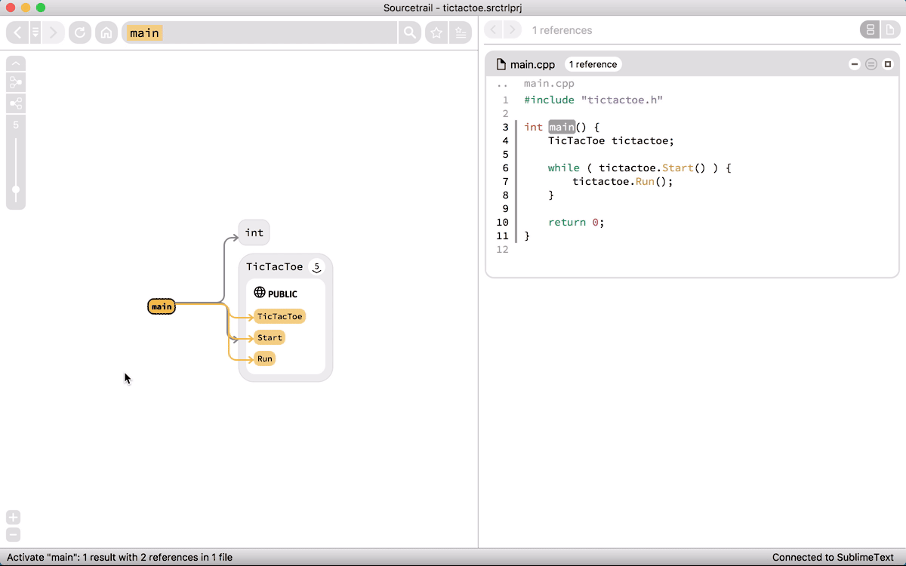
			

		

		

			
		

	

	<figcaption>Following function calls in Graph Visualization and Code View.</figcaption>
</figure>

We have made numerous improvements to both of these components over the past couple months, with lots of extra features. Here are just some that come to mind:

* Zoom buttons for graph
* Saving the graph as image
* Improved bundling of referenced/referencing/undefined nodes
* Improved node and edge style and more icons
* Single file mode for code view
* Reference navigation at the top of code view
* Improved scrolling to active code location
* Highlight local symbols in code view
* Copying of selected code

## Fuzzy Matched Search Autocompletions

The search feature is the third core element of the Sourcetrail user interface. The fuzzy matched autocompletions make finding symbols throughout the whole code base very easy. During our Beta we greatly improved the speed of our search algorithm and also added full text search matching within every indexed source file.

<figure style="text-align:center; cursor: pointer;" class="bordered">
	

		

			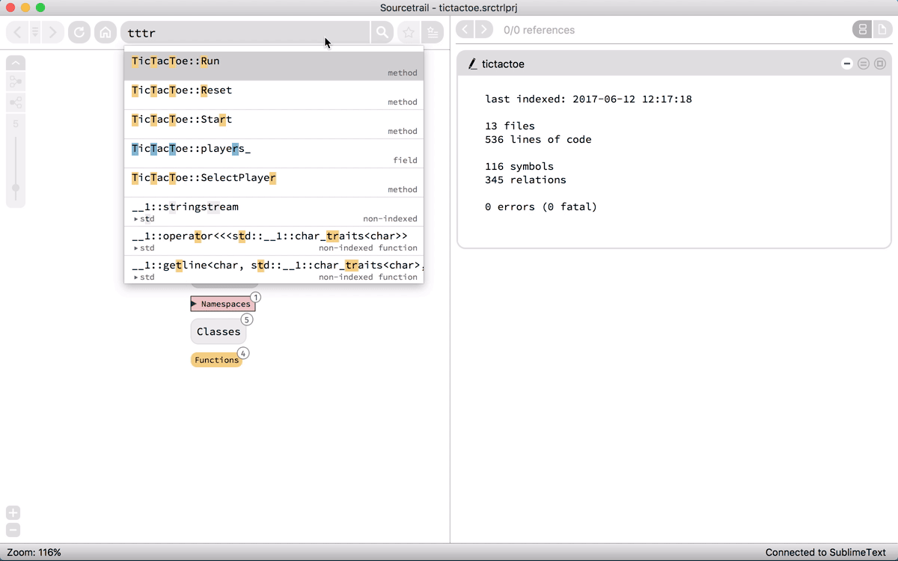
			

		

		

			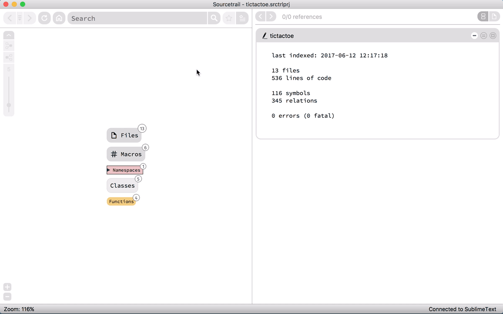
		

	

	<figcaption>The fuzzy matched search autocompletion makes finding symbols easy.</figcaption>
</figure>

## Multi-language Project Setup

As one of our most recent changes we updated our Sourcetrail project structure to allow for creating projects with multiple language types. So far we support the languages C and C++ via [clang libTooling](https://clang.llvm.org/docs/LibTooling.html) and Java via [JavaParser](http://javaparser.org/) and [JavaSymbolSolver](https://github.com/javaparser/javasymbolsolver). A Sourcetrail project may now consists of multiple "Source Groups", each one specifying programming language and source files.

<figure style="text-align:center;">
	<a href="../images/release_2017_2/source_group_list.png">
		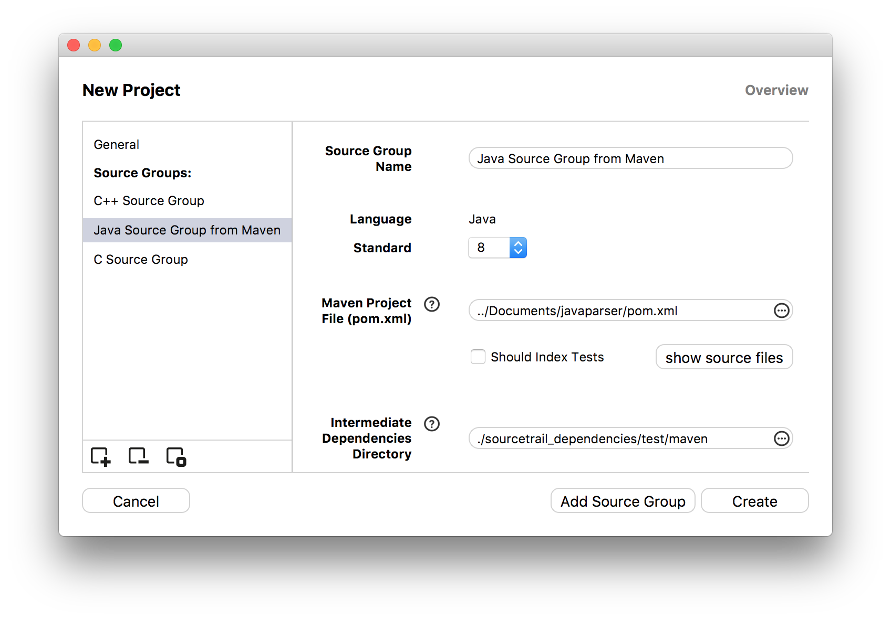
	</a>
	<figcaption>Project setup dialog with Source Group list on the left.</figcaption>
</figure>

When we first released our Beta of Sourcetrail we only supported manual project setup. You had to specify all of the indexed source directories, dependencies and compiler flags manually. With Sourcetrail 1.0 all C/C++ Source Groups can also be created automatically by using a [clang Compilation Database](https://clang.llvm.org/docs/JSONCompilationDatabase.html) or an existing Visual Studio solution (via our Visual Studio plugin). We also added support for creating Java Source Groups from existing [Maven](https://maven.apache.org/) configurations. If you are interested in setting up your own Sourcetrail project, please take a look at our [QUICK START GUIDE](https://www.sourcetrail.com/documentation/#QUICKSTARTGUIDE).

<figure style="text-align:center;">
	<a href="../images/release_2017_2/source_group_type.png">
		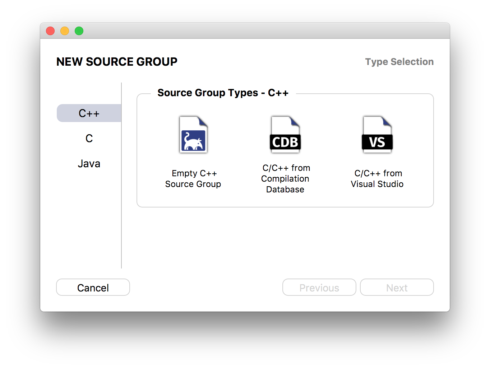
	</a>
	<figcaption>The Source Group type selection dialog shows all different ways of creating a new Source Group.</figcaption>
</figure>

## IDE/Editor Plugins

<figure style="text-align:center; cursor: pointer;" class="bordered">
	

		

			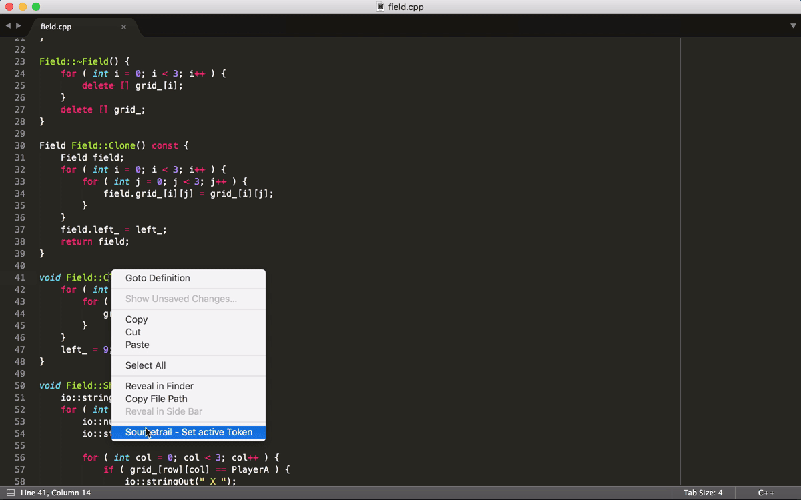
			

		

		

			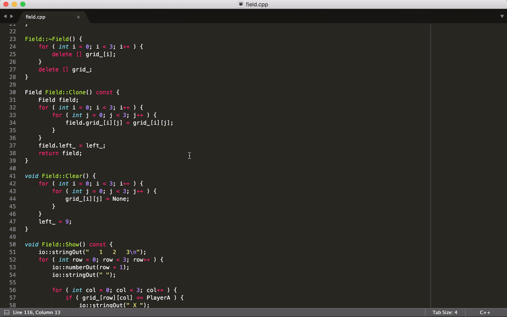
		

	

	<figcaption>Activating a symbol within Sumblime Text via plugin.</figcaption>
</figure>

Right from the beginning of our Beta it was our goal that once you found a piece of source code that you wanted to edit you should be able to do so using the tools you know best. So connecting Sourcetrail to your code editor or IDE was a big priority for us. Since then we developed a whole bunch of plugins that help you integrate Sourcetrail into your daily coding workflow. The plugins allow you to activate Sourcetrail symbols from within your editor and open files in your editor from within Sourcetrail. Right now we support the following code editors and IDEs:

* Atom
* CLion
* Eclipse
* Emacs
* IntelliJ
* Qt Creator
* Sublime Text 2 & 3
* Vim
* Visual Studio 2012 - 2017

Please have a look at our [documentation](https://www.sourcetrail.com/documentation/#CODEEDITORPLUGINS) for more information on installation and usage of each plugin. If you favorite editor is not listed yet, please let us know by filing a feature request on our [issue tracker](https://github.com/CoatiSoftware/SourcetrailBugTracker/issues).

## History and Bookmarks

The back and forward buttons were part of our user interface since the first Alpha version of our tool. However, sometimes you want to go back multiple steps at a time, which can get quite tiresome if the stack is big. For that reason we created a history dropdown list to view and select recently active symbols. The history button is located in-between the back and forward button. We also added a history menu which lists the recently activated symbols in chronological order.

<figure style="text-align:center; cursor: pointer;" class="bordered">
	

		

			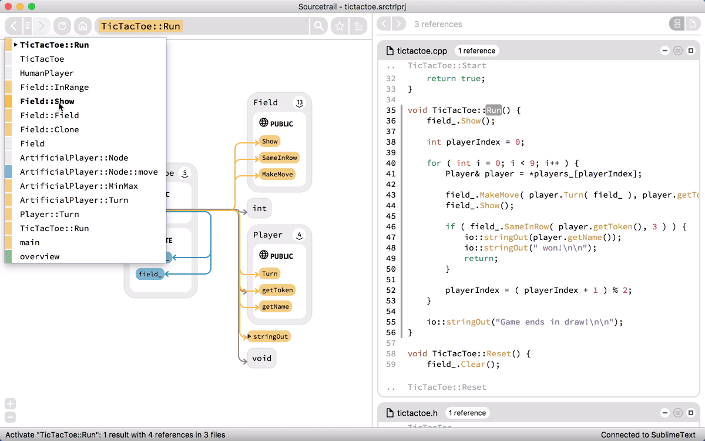
			

		

		

			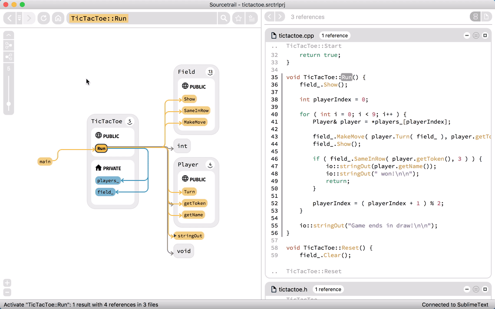
		

	

	<figcaption>Activating a symbol from the history drop-down list and then creating a bookmark for it.</figcaption>
</figure>

Bookmarking was a highly demanded feature by our current users. We decided to design the user experience similar to that of modern web browsers. But instead of webpages you can bookmark nodes and edges. The bookmark information gets stored in the `.srctrlbm` file next to your `.srctrlprj` file. We decided to use a separate file so it can be ignored from version control when sharing your project setup among the team.

<figure class="half">
	
	
	<figcaption style="text-align:center;">Bookmark creation dialog on the left, Bookmark Manager on the right.</figcaption>
</figure>

## Call Graphs, Inheritance Chains and Include Trees

With the release of Sourcetrail 0.12 we also generate multi-level call graphs, inheritance chains and include trees via a little tool bar in the top left corner of the graph view. The layout of the graphs are computed with a [Sugiyama-style graph drawing](https://en.wikipedia.org/wiki/Layered_graph_drawing) algorithm. Instead of our usual tilted edge style, we decided to use Bezier curves for these graphs to better show, which dependencies exist between the nodes and to make it easier to follow them. When hovering a node, all connected edges will be highlighted as well. Clicking a node will activate it and switch back to our usual graph layout. Clicking an edge will show it's source location in the code view.

<figure style="text-align:center; cursor: pointer;" class="bordered">
	

		

			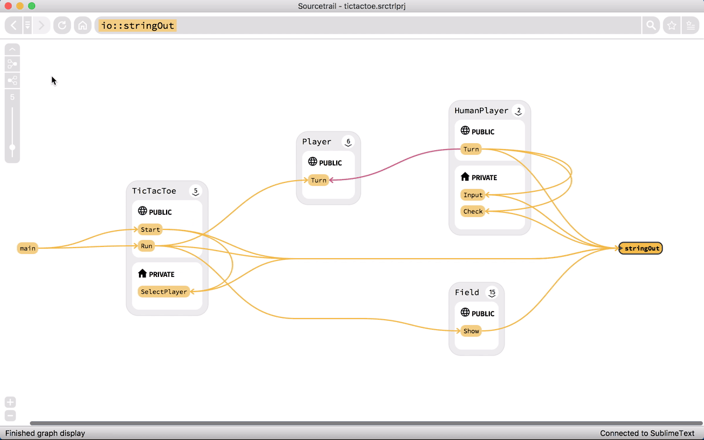
			

		

		

			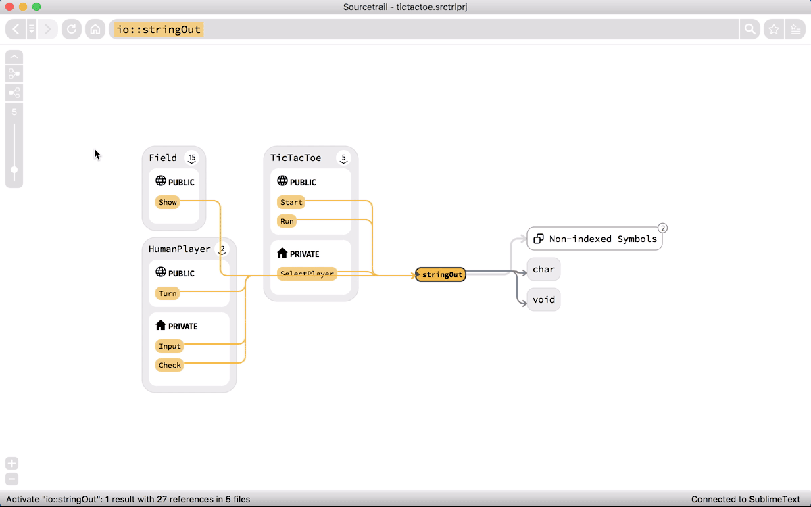
		

	

	<figcaption>Generating the call graph of the function io::numberIn and the inheritance chain for GameObject from our TicTacToe sample project.</figcaption>
</figure>

&nbsp;

If you are interested in giving Sourcetrail a go then please [download](https://www.sourcetrail.com/downloads/) our new build and grab a [Test License](https://www.sourcetrail.com/test-license).

Thanks for reading! Please share if you like what we are doing and leave a comment.

Follow us: [mail](http://eepurl.com/bRSSFf) - [Twitter](https://twitter.com/Sourcetrail) - [Facebook](https://www.facebook.com/Sourcetrail) - [Google+](https://plus.google.com/u/0/108949374849112775331)
