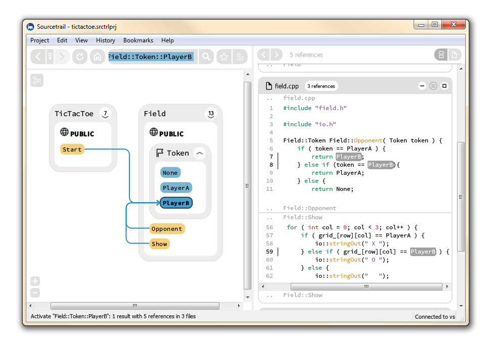
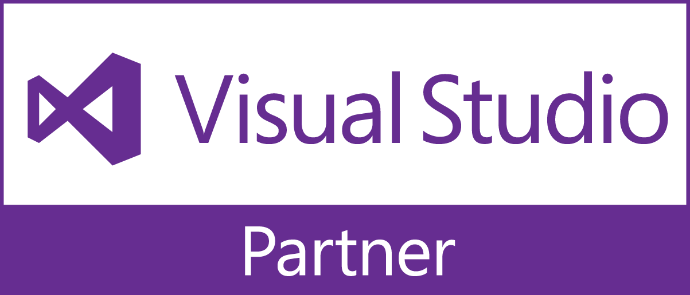
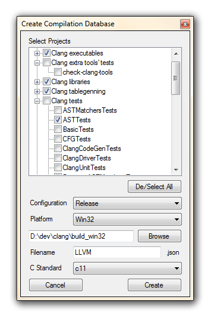

Our [Sourcetrail Extension](https://marketplace.visualstudio.com/items?itemName=vs-publisher-1208751.SourcetrailExtension) for Visual Studio allows everyone to generate a [Clang Compilation Database](https://clang.llvm.org/docs/JSONCompilationDatabase.html) from an existing Visual Studio Solution.

## So, what is a Clang Compilation Database?
If you are working with a programming language like C or C++, your compiler is probably among the most important tools you'll use every day. Basically you hand it a list of source files and it just goes off to generate the according object files. But handing source files alone usually isn't enough. In addition the compiler needs some more information, like information on the places it should look when resolving `#include` directives, values for `#define` directives that it needs to set before compiling or the target architecture you want your object files to match.

So the [JSON Compilation Database](https://clang.llvm.org/docs/JSONCompilationDatabase.html) is a JSON based data format that is used by the Clang compiler in order to store that kind of information. As the compiler processes each source file independently from all other source files, the Compilation Database also maintains a separate entry (called a "Command Object") for each of those source file. The snippet below shows an example for a Compilation Database that contains a single Command Object (the compiler that reads this JSON file would process just a single source file).

```
[
  {
    "directory": "/home/user/my_project/build",
    "command": "/usr/bin/clang++ -isystem '/home/user/my_project/include' -D WIN32 -c -o my_source_file.o my_source_file.c",
    "file": "my_source_file.c"
  }
]
```

As you can see, the "command" entry stores all the flags relevant to compile the "file". If you have a project that contains multiple source files your Compilation Database will have multiple Command Objects. And if all of your source files are compiled with the same set of compiler flags, all the "command" entries will probably look the same (except for the trailing file name). This leads to a lot of duplicate information which makes this data format very flexible (you can customize the compiler flags for every single source file) but also hard to maintain (changing the same flag for all source files requires your to touch every Command Object).

That's why a Compilation Database is usually just used as an intermediate format to talk to the compiler. The actual build configuration happens on a different level. So in practice you can [export a Compilation Database from a CMake configuration](https://clang.llvm.org/docs/HowToSetupToolingForLLVM.html) (or generate it from a Visual Studio Solution, but more on that later).

The __main advantage__ of having a JSON Compilation Database is that __it is just one single file__. And this file stores everything the compiler ever needs to know - no additional external settings or complicated configuration options required.

<figure style="text-align:center;">
	<a href="../images/export_clang_compilation_database_from_visual_studio_solution/sourcetrail_ui.png">
		
	</a>
	<figcaption>The Sourcetrail UI.</figcaption>
</figure>

__And here it's getting even better__: The Clang compiler front-end is an open source project which is being used by other tools like [Clang-Tidy](http://clang.llvm.org/extra/clang-tidy/) or the Clang based [Include What You Use (IWYU)](https://include-what-you-use.org/) that go beyond compilation alone. We are using Clang as the foundation for our static code analysis in [Sourcetrail](https://sourcetrail.com), a tool that displays source code relations to help software developers wrapping their head around unfamiliar source code. All of these tools provide the option of running based on the information provided by a JSON Compilation Database which allows you to skip the WTF part when configuring the tool to work for your own source code.

## Why a Visual Studio Extension?
Even though Sourcetrail is a cross platform tool which runs on Mac, Windows and Linux it quickly turned out that roughly half of our users (which are C, C++ and Java programmers) are working on Windows. And what is the most commonly used C/C++ IDE for Windows? You name it - it is Visual Studio! Unfortunately Visual Studio uses its own data format to store a project's build configuration without offering a way to generate a JSON Compilation Database. This makes it very hard for any Visual Studio user to apply any of the Clang based tools available.

<figure style="text-align:center;" class="third">
	<a href="../images/export_clang_compilation_database_from_visual_studio_solution/vs_partner_logo.png">
		
	</a>
	<figcaption>We offer the Sourcetrail Extension as Visual Studio Partner.</figcaption>
</figure>

Aiming to make the life of our Windows based users a little bit easier, we created the [Sourcetrail Extension](https://marketplace.visualstudio.com/items?itemName=vs-publisher-1208751.SourcetrailExtension) for Visual Studio which lets you export a JSON Compilation Database for a Visual Studio Solution with just a few clicks!

## How does it work?
In order to generate a JSON Compilation Database for your Visual Studio projects you first need to open the respective Solution inside Visual Studio. With the Sourcetrail Extension installed choose `Sourcetrail` -> `Create Compilation Database` from the menu bar. Now the following dialog lets you pick the projects you want to be included in the Compilation Database (maybe you have a unit test project in your Solution that you don't want the Clang based tools to know about).

<figure style="text-align:center;">
	<a href="../images/export_clang_compilation_database_from_visual_studio_solution/visual_studio_create_compilation_database.png">
		
	</a>
	<figcaption>Create a JSON Compilation Database from inside Visual Studio.</figcaption>
</figure>

After clicking `Create` the Sourcetrail Extension will use the Visual Studio API to gather all the relevant information of your Visual Studio projects, convert them to the equivalent Clang compiler options and save this data to a file in the JSON format displayed above.

## Making it Open Source
Implementing this feature as a single extension that works with multiple versions of Visual Studio (currently we support VS 2012 - VS 2017) has been quite tricky. If you want to know more about how it is actually implemented, please take a look at the project's Open Source [GitHub repository](https://github.com/CoatiSoftware/vs-sourcetrail). We decided to make this an Open Source project so that everyone benefits from our efforts and learnings, some might even help us make this extension better.

## Where do I get it?
To use the extension you can either head to our [page at the Visual Studio Marketplace](https://marketplace.visualstudio.com/items?itemName=vs-publisher-1208751.SourcetrailExtension) and hit the `Download` button (it's for free) or use the `Extensions and Updates` dialog from inside Visual Studio to find and install the "Sourcetrail Extension" under the "Online" tab.

## Final Thoughts
We've started out creating an extension aiming to help the users of Sourcetrail skip the annoying part of the project setup. But the extension we created doesn't stop there. It brings everyone who is using the Visual Studio IDE much closer to effectively apply other Clang based tools as well! Maybe you ever wanted to try [IWYU](https://include-what-you-use.org/) on your own source code to get rid of unused includes that slow down your compile times? Here is your chance!

If you liked this article, please share it. If you want contribute to the project, reach out to us on [GitHub](https://github.com/CoatiSoftware/vs-sourcetrail)!